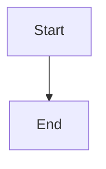

# Doc Reader

便携式 Markdown 文档阅读器。渲染 `docs/` 目录为可浏览的文档站点，支持数学公式、Mermaid 图表、代码高亮。

---

## 快速开始

```bash
npm install   # 仅一次
npm link      # 注册全局命令 doc-reader
```

然后任意目录：

```bash
doc-reader              # 渲染 ./docs/
doc-reader my-docs/     # 渲染 my-docs/
```

---

## 用法

```
doc-reader [path] [...] [-n name] [-p port] [--fresh] [--remove name]
```

### 基础

| 命令 | 效果 |
|---|---|
| `doc-reader` | 渲染当前目录 `docs/` 文件夹 |
| `doc-reader my-docs/` | 渲染 `my-docs/` |
| `doc-reader . -p 8080` | 渲染当前目录，端口 8080 |
| `doc-reader api-docs/ guide-docs/` | 同时渲染两个文件夹，名称取目录名 |

### 命名（`-n`）

| 命令 | 效果 |
|---|---|
| `doc-reader my-docs/ -n "API 文档"` | 渲染 `my-docs/`，侧边栏显示为 "API 文档" |
| `doc-reader -n "API" api/ -n "指南" guide/` | 多库，各带自定义名称 |
| `doc-reader a/ b/ -n "项目"` | `a/` 取目录名，`b/` 命名为 "项目" |

### 端口（`-p`）

| 命令 | 效果 |
|---|---|
| `doc-reader -p 4000` | 端口 4000 |
| `doc-reader docs/ -p 8080` | 渲染 `docs/` 在 8080 |

### 挂载（`--add`，默认行为）

已有 server 在运行时，后续命令会自动挂载（而非启动新 server）。

| 命令 | 效果 |
|---|---|
| `doc-reader extra/` | 自动探测 3000 端口 ← 有 server → 挂载后退出 |
| `doc-reader -p 4000 extra/` | 探测 4000 端口 |
| `doc-reader --fresh extra/` | 强制启动新 server（不探测） |

### 移除（`--remove` / `-r`）

| 命令 | 效果 |
|---|---|
| `doc-reader --remove "API 文档"` | 从已运行的 server 卸载 "API 文档" |
| `doc-reader -r API -p 4000` | 从 4000 端口卸载 "API" |

### 列表（`--list` / `-l`）

| 命令 | 效果 |
|---|---|
| `doc-reader --list` | 列出 3000 端口所有已挂载的文档库 |
| `doc-reader -l -p 4000` | 列出 4000 端口所有文档库 |

### 组合

```bash
# 一次挂载多个
doc-reader -n "前端" frontend/ -n "后端" backend/

# 卸载后重新挂载
doc-reader -r "旧文档" && doc-reader -n "新文档" new-docs/

# 全新启动，两个库，自定义端口
doc-reader --fresh -n "API" api/ -n "Guide" guide/ -p 8080
```

---

## 文档目录结构

```
my-docs/
├── index.md               # 首页（始终排第一）
├── any-file.md            # 任意 .md 文件
├── guide/
│   ├── index.md
│   ├── setup.md
│   └── advanced.md
└── api/
    └── reference.md
```

- 文件夹 → 可折叠分组
- 文件按字母排序，`index.md` 优先
- 文件名转标题：`getting-started` → "Getting Started"
- `_` 或 `.` 开头的文件/文件夹会被忽略

---

## Markdown 特性

### 内部链接
```markdown
[Setup Guide](./guide/setup.md)
```
相对 `.md` 链接自动解析。

### 数学公式（KaTeX）
```markdown
行内：$E = mc^2$
块级：$$\int_0^\infty e^{-x^2}dx = \frac{\sqrt{\pi}}{2}$$
```
支持所有 KaTeX 命令（`\mathbf`, `\rho`, `\sum` 等）。

### Mermaid 图表
````markdown

````
支持 `flowchart`, `sequenceDiagram`, `classDiagram`, `gantt`, `pie` 等。

### 代码块
````markdown
```python
def hello():
    print("Hello")
```
````
语法高亮，支持所有主流语言。

### 图片
```markdown

```

---

## 界面特性

- **Draggable 面板**：侧边栏和目录都可拖拽调整宽度，拖到极限自动折叠
- **宽度切换**：右上角齿轮 → 展开 → 窄/宽/超宽三档
- **明暗主题**：Editorial Dark（暖色） / Warm Cream（护眼）
- **响应式**：窄屏自动切换侧滑面板 + 边缘按钮
- **阅读优化**：17px 字号，1.8 行高，1100px 居中宽度

---

## 给 Agent 的指引

见 `docs/AGENTS.md` — 描述了 Agent 应该如何组织输出 `.md` 文件。
