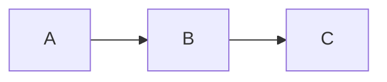

# Getting Started

## Prerequisites

- **Node.js** 18 or later
- **npm** (comes with Node.js)

## Installation

```bash
npm install
```

## Running

```bash
npm start
```

Open [http://localhost:3000](http://localhost:3000) in your browser.

## Adding Documents

Drop `.md` files into the `docs/` directory. The sidebar updates automatically.

### Directory Structure

```
docs/
├── index.md            # Home page
├── guide/
│   ├── getting-started.md
│   └── configuration.md
└── api/
    └── reference.md
```

Folders become collapsible sections in the sidebar. Files are sorted alphabetically, with `index.md` always first.

## Math Syntax

Use `$...$` for inline math and `$$...$$` for block math:

```
$$ \frac{-b \pm \sqrt{b^2 - 4ac}}{2a} $$
```

## Mermaid Syntax

Use a fenced code block with the `mermaid` language tag:

````

````

## Custom Port

```bash
PORT=8080 npm start
```

## Custom Docs Directory

```bash
DOCS_DIR=/path/to/your/docs npm start
```

---

[← Back to Home](#index)
