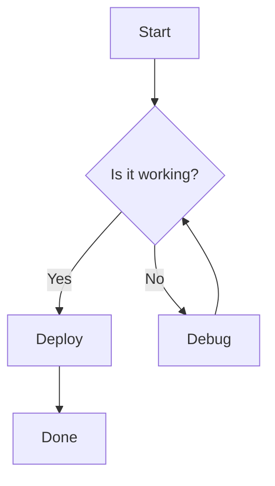

# Doc Reader

A lightweight, portable Markdown documentation reader.

---

## Features

- **Markdown** rendering with GFM support
- **Math** via KaTeX: inline $E = mc^2$ and block formulas
- **Mermaid** diagrams
- **Code** syntax highlighting
- **Light / Dark** theme
- **Responsive** layout
- **Auto TOC** from headings

---

## Math Example

The Gaussian integral:

$$
\int_{-\infty}^{\infty} e^{-x^2} \, dx = \sqrt{\pi}
$$

Inline math: $\sum_{n=1}^{\infty} \frac{1}{n^2} = \frac{\pi^2}{6}$

---

## Mermaid Example



---

## Code Block

```javascript
function fibonacci(n) {
  if (n <= 1) return n;
  let a = 0, b = 1;
  for (let i = 2; i <= n; i++) {
    [a, b] = [b, a + b];
  }
  return b;
}

console.log(fibonacci(10)); // 55
```

```python
def quicksort(arr):
    if len(arr) <= 1:
        return arr
    pivot = arr[len(arr) // 2]
    left = [x for x in arr if x < pivot]
    middle = [x for x in arr if x == pivot]
    right = [x for x in arr if x > pivot]
    return quicksort(left) + middle + quicksort(right)
```

---

## Tables

| Feature | Status |
|---|---|
| Markdown | Done |
| Math | Done |
| Mermaid | Done |
| Code highlighting | Done |
| Dark mode | Done |
| Responsive | Done |
| TOC | Done |

---

## Blockquote

> The best way to predict the future is to invent it.
>
> — Alan Kay

---

## Lists

1. First item
2. Second item
   - Nested bullet
   - Another bullet
3. Third item

---

[Next: Getting Started →](#guide/getting-started)
