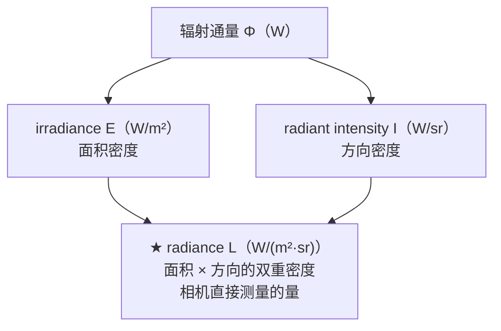

# 第8章 光与颜色

> RTR4 第8章。建立渲染的度量衡基础——没有单位和语言，就无法谈论光照。

---

## 本章在全书中的位置

Ch8 是地基——后面三章所有的公式、单位、颜色计算，都建立在本章定义的 radiance 和 RGB 体系上。

---

## 8.1 三大度量学

| 学科 | 关注什么 | 核心单位 | 与人眼的关系 |
|------|---------|---------|------------|
| **辐射度量学** | 纯粹物理量 | radiance $L$（$W/m^2 \cdot sr$） | 不考虑 |
| **光度学** | 辐射量 × 人眼敏感度曲线 | luminance（$cd/m^2$，即 nit） | 加权 |
| **色度学** | SPD → 三刺激值 | XYZ / xyY 坐标 | 匹配实验 |

### 为什么 radiance 是渲染中最核心的量？

相机/眼睛的传感器直接测量 radiance——"沿着一条光线流动的能量密度"。
radiance 有一个关键性质：**不随传播距离衰减**（大气效应除外）。所以 Ch9-11 的渲染方程计算的是 radiance。

### 辐射度量学的物理量层级

irradiance 和 radiance 的关系：
$$E = \int_{\Omega} L(\mathbf{l}) (\mathbf{n} \cdot \mathbf{l}) d\mathbf{l}$$

——余弦加权积分，因为斜射的光在表面上被"稀释"了。整个半球的积分结果是 $\pi$，这个 $\pi$ 会在 Ch9 的 BRDF 和光照公式中反复出现。

立体角：$4\pi$ sr = 整个球体，$2\pi$ sr = 半球。

---

## 8.1.3 色度学：RGB 渲染的理论基础

### 核心事实

SPD（光谱功率分布）是光的完整物理描述。但人眼只有**三种视锥细胞**，所以：

> **不同的 SPD 可以产生完全相同的颜色感知**（同色异谱）。这就是 RGB 渲染可行的原因——三个数就能近似表示光。

### CIE XYZ 颜色空间

任意 SPD $s(\lambda)$ → 三刺激值 $X,Y,Z$ = $s(\lambda)$ 与颜色匹配函数
$\bar{x}(\lambda), \bar{y}(\lambda), \bar{z}(\lambda)$ 的乘积积分。
$\bar{y}$ 等于光度曲线，所以 **$Y$ 同时就是 luminance**。

消去亮度维度可得 $xy$ 色度坐标（CIE 1931 马蹄形图）。色度图解释了显示器的色域——三角形是三种原色围出的可显示颜色范围。

### 常用 RGB 色域

| 色域 | 使用场景 | 宽度 |
|------|---------|------|
| sRGB / Rec.709 | PC 显示器、高清电视 | 最窄 |
| DCI-P3 | 电影、苹果设备 | 比 sRGB 宽约 25% |
| Rec.2020 | UHD 理论规格 | 极宽 |
| ACEScg | 电影 CG 工作空间（非显示用） | 最宽 |

灰度转换（sRGB）：$Y = 0.2126R + 0.7152G + 0.0722B$ ——绿光权重最高，因为人眼对绿色最敏感。

### 正确做法 vs 工程实践

严格来说用 RGB 做 PBR 是"分类错误"——正确做法是在光谱域计算。但在实践中，
大多数光源 SPD 和表面反射率比较平滑，RGB 误差在交互式应用中通常不可感知。
极端反例：激光投影屏的反射峰极窄，RGB 渲染会严重出错。

---

## 8.2 从场景 radiance 到屏幕像素

这是渲染管线的"最后一公里"——很多人只关注了 BRDF 和光照计算，但计算出的
radiance 距离屏幕像素还有好几步。

两个关键概念：
- **场景参考（scene-referred）**：与场景中的实际 radiance 成正比
- **显示参考（display-referred）**：与显示器发出的 radiance 成正比

### 色调映射的本质

色调映射不是"把 HDR 塞进 LDR"的压缩，而是**图像再现**——让显示器图像
给人相同的感知印象。这之所以可能，是因为人眼有**适应性**，同时也不完美：

| 效应 | 影响 | 对色调映射的启示 |
|------|------|----------------|
| Stevens 效应 | 暗处感知对比度下降 | 需要提高暗部对比度 |
| Hunt 效应 | 暗处感知色彩度下降 | 需要提高饱和度 |
| Bartleson-Breneman | 房间亮度影响屏幕感知 | 取决于观看环境 |
| 显示耀斑 | 屏幕反射降低实际对比度 | 需要更多对比度补偿 |

这些效应叠加 → 显示参考图像必须**提高对比度和饱和度**才能接近原始场景
的感知印象 → S 形（filmic）曲线：

- **暗部**：柔和抬升，保留阴影细节
- **中间调**：增强对比度
- **亮部**：柔和压缩，保留高光细节

色调映射的演进：Reinhard → Duiker → Hable filmic → **ACES**（行业标准）。
ACES 将转换分为两部分：RRT（场景→标准输出空间）+ ODT（标准输出→具体显示器）。

### 曝光

计算曝光的方法：
- **亮度直方图求中位数**：最常用，比对数平均更稳健
- **入射光法**：基于光源强度（而非像素亮度），最符合摄影的 18% 灰卡原理，越来越流行

### 颜色分级

核心工具：**3D LUT**（颜色查找表）。创建恒等 LUT → 切片为 2D 图像 → 在
Photoshop 中编辑 → 烘焙回 3D 纹理 → 运行时每像素查表。

| 类型 | 时机 | 质量 |
|------|------|------|
| 显示参考 | 色调映射后调像素 | 简单，质量较低 |
| **场景参考** | 色调映射前调 radiance | 质量更高（《神秘海域4》） |

### HDR 显示编码

| 格式 | 编码 | 普及度 |
|------|------|--------|
| **HDR10** | PQ 非线性 + Rec.2020，每通道 10 bit | 最普及 |
| scRGB | 线性 sRGB（可超越 0-1），每通道 16 bit | Windows 专属 |
| 杜比视界 | PQ + Rec.2020，每通道 12 bit | 专有格式 |

HDR 的色调映射比 SDR 更保守——显示器本身有更大的动态范围。

---

## 关键记忆点

- **radiance $L$** ——不随距离衰减，相机直接测量它
- **RGB 渲染可行**——人眼三种视锥细胞 + 多数材质光谱反射率平滑
- **色调映射 = 图像再现**（不是压缩），S 形曲线源于人眼适应性缺陷
- $Y = 0.2126R + 0.7152G + 0.0722B$ ——绿光最亮
- ACES 是行业标准色调映射方案；场景参考颜色分级优于显示参考

---

## 前后章衔接

- Ch9 BRDF 的输出是本节的场景参考 radiance
- Ch9 的 $F_0$ 值由本节折射率→RGB 转换而来
- Ch10-11 所有计算都使用 radiance 作单位
- 最终渲染结果必经本节的"场景→屏幕"管线
