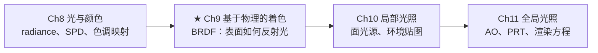
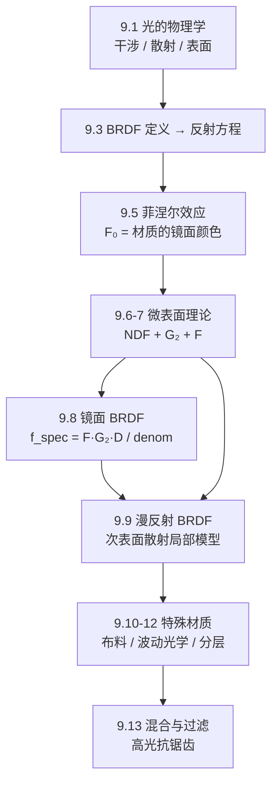

# 第9章 基于物理的着色

> RTR4 第9章，全书最核心的一章。回答着色最根本的问题：光打到表面上，怎么反射？

---

## 本章在全书中的位置

Ch9 回答了"$f(\mathbf{l}, \mathbf{v})$ 是什么"——后续两章把它代入反射方程
做积分时，Ch9 的 BRDF 是被积函数的核心。

---

## 知识结构

---

## 9.1 光的物理学：三幅核心心理图像

### 干涉

- **相长干涉**：同相叠加，能量集中——$n$ 个波叠加，辐照度可达 $n^2$ 倍
- **相消干涉**：反相抵消，能量为零
- **不相干叠加**：相位随机，能量线性相加
- 能量不消失，只在空间上重新分布

### 均匀介质

均匀排列的分子 → 相消干涉**抑制了散射** → 光沿直线传播。一旦有不均匀
（气泡、杂质、密度涨落）→ 打破相消干涉 → 散射发生。

- 瑞利散射：粒子 < 波长，蓝光散射更强（天是蓝的）
- 米氏散射：粒子 ≥ 波长，所有波长均匀散射（云是白的）

### 表面 = 折射率不连续面

$n_1 \neq n_2$ → 必然反射 + 折射。Snell 定律：$\sin\theta_t = (n_1/n_2) \sin\theta_i$。
如果 $n_1 = n_2$？表面消失（图9.11 的珠子实验）。

金属：自由电子吸收透射光再重新发射 → 高反射率，无次表面散射。

---

## 9.3 BRDF = 表面的"身份证"

### 反射方程

$$L_o(\mathbf{p}, \mathbf{v}) = \int_{\Omega} f(\mathbf{l}, \mathbf{v}) L_i(\mathbf{l}) (\mathbf{n} \cdot \mathbf{l}) d\mathbf{l}$$

这是 Ch9-11 的**主旋律**：

| 符号 | 含义 | 在哪章展开 |
|------|------|----------|
| $L_o$ | 向 $\mathbf{v}$ 方向发出的 radiance | Ch9-11 |
| $f(\mathbf{l}, \mathbf{v})$ | **BRDF**：表面反射特性 | ★ 本章核心 |
| $L_i(\mathbf{l})$ | 从 $\mathbf{l}$ 方向入射的 radiance | Ch10（面光源+环境贴图） |
| $(\mathbf{n} \cdot \mathbf{l})$ | 余弦因子 | 物理事实 |

两个物理约束：
1. **互易性**：$f(\mathbf{l}, \mathbf{v}) = f(\mathbf{v}, \mathbf{l})$
2. **能量守恒**：定向半球反射率 $R(\mathbf{l}) = \int f(\mathbf{l}, \mathbf{v})(\mathbf{n}\cdot\mathbf{v})d\mathbf{v} \leq 1$

### Lambertian：最简单也仍最常用的 BRDF

$$f(\mathbf{l}, \mathbf{v}) = \frac{\rho_{ss}}{\pi}$$

$1/\pi$ 来自 $\int_{\Omega} (\mathbf{n}\cdot\mathbf{l}) d\mathbf{l} = \pi$。
Ch9 的光照简化公式（方程9.12）中有一个 $\pi$，会与这个 $1/\pi$ 抵消。

---

## 9.5 菲涅尔效应：边缘更亮

$F_0$ = 光线垂直入射时的反射率 = **材质的"镜面颜色"**。

| 类型 | $F_0$ 范围 | 特点 |
|------|-----------|------|
| 电介质（玻璃、皮肤、塑料、木材） | 0.02~0.06 | 无色，菲涅尔效应非常明显 |
| 金属（金、银、铁、铝） | 0.5~1.0 | 常有颜色，吸收所有透射光 |
| 半导体（晶体硅） | 0.2~0.45 | 介于两者之间，罕见 |

> 不存在 0.02 < $F_0$ < 0.2 的常见材质（除半导体），设置了大概率是非物理的。

**电介质**：$F_0$ 低 → 大部分光进入内部 → $\rho_{ss}$（次表面反照率）主导漫反射颜色。
**金属**：$F_0$ 高 → 颜色全来自镜面反射 → $\rho_{ss}=0$，无次表面散射。

### Schlick 近似

$$F(\mathbf{n}, \mathbf{l}) \approx F_0 + (1-F_0)(1 - \mathbf{n}\cdot\mathbf{l})^5$$

在 $F_0$（正面）和 1（掠射角=白色）之间插值。极其高效，误差极小。

### 金属度参数化（Metalness Workflow）

用一个标量 $m$ + RGB 表面颜色 $\mathbf{c}_{surf}$ 同时编码 $F_0$ 和 $\rho_{ss}$：

| $m$ | 含义 | $F_0$ | $\rho_{ss}$ |
|-----|------|-------|------------|
| 1 | 金属 | $\mathbf{c}_{surf}$ | (0,0,0) |
| 0 | 非金属 | 默认值（如 0.04） | $\mathbf{c}_{surf}$ |

虚幻引擎、寒霜引擎的默认工作流。**缺点**：无法表示"金属上涂一层电介质"
（需要 Ch9.12 的分层材质补充）。

---

## 9.6-9.7 微观几何与微表面理论

### 核心思想

不显式建模每个微小凸起（太贵），而是**统计它们的法线分布**。

### 三种微观效应

| 效应 | 机制 | 后果 |
|------|------|------|
| **Shadowing** | 微表面对光源遮挡 | 光找不到某些区域 |
| **Masking** | 微表面对相机遮挡 | 相机看不到某些区域 |
| **相互反射** | 微表面间多次弹射 | 金属的漫反射主要来源 |

### 微表面 BRDF 的三支柱

| 符号 | 名称 | 通俗理解 |
|------|------|---------|
| $D(\mathbf{m})$ | **NDF** 法线分布函数 | "有多少微表面法线指向 $\mathbf{m}$" |
| $G_2(\mathbf{l}, \mathbf{v})$ | 遮蔽-遮挡函数 | "从光和眼方向同时可见的比例" |
| $F(\mathbf{h}, \mathbf{l})$ | 菲涅尔项 | "每个微表面反射了百分之几的光" |

### Smith G₂

Heitz（2014）系统比较后的结论：**Smith 函数是唯一既满足数学合法性、
又接近随机微表面表现的**。推荐使用**高度相关形式**：

$$G_2(\mathbf{l}, \mathbf{v}, \mathbf{m}) = \frac{\chi^+}{1 + \Lambda(\mathbf{v}) + \Lambda(\mathbf{l})}$$

不要用可分离形式 $G_1(\mathbf{v}) G_1(\mathbf{l})$——当 $\mathbf{l}=\mathbf{v}$ 时
它给出 $G_1^2$（正确值应为 $G_1$），会使同方向的入射和出射过暗。

### NDF 归一化约束

$$\int_{\Theta} D(\mathbf{m})(\mathbf{n} \cdot \mathbf{m}) d\mathbf{m} = 1$$

——投影到宏表面后的微表面面积之和 = 1。

---

## 9.8 镜面 BRDF：精确形式

当 micro-BRDF 是完美镜面时，只有 $\mathbf{m} = \mathbf{h}$ 的微表面能反射光。
半向量 $\mathbf{h} = (\mathbf{l}+\mathbf{v}) / \|\mathbf{l}+\mathbf{v}\|$。

积分退化为：

$$f_{spec}(\mathbf{l}, \mathbf{v}) = \frac{F(\mathbf{h}, \mathbf{l}) \; G_2(\mathbf{l}, \mathbf{v}, \mathbf{h}) \; D(\mathbf{h})}{4|\mathbf{n}\cdot\mathbf{l}||\mathbf{n}\cdot\mathbf{v}|}$$

### 9.8.1 NDF：高光的决定性因素

#### 三种主要 NDF 对比

| NDF | 粗糙度参数 | 尾部 | 形状不变 | 使用场景 |
|-----|-----------|------|---------|---------|
| Beckmann | $\alpha_b$（RMS 斜率） | 短（指数衰减） | ✅ | 学术/光学 |
| Blinn-Phong | $\alpha_p$（幂次，不直观） | 中等 | ❌ | 移动端 |
| **GGX** | $\alpha_g$（映射为 $r^2$） | **长（幂律衰减）** | ✅ | **所有现代引擎** |

**GGX 为什么统治？** MERL 数据库的测量表明：真实材质的高光核心周围总有一圈
微弱的模糊辉光。GGX 的尾部比 Beckmann 长得多，最接近测量数据（图9.37）。

**形状不变性（Shape Invariance）**：Beckmann 和 GGX 都有，Blinn-Phong 没有。
Shape-invariant NDF 的 Smith $\Lambda$ 函数只依赖一个变量 $a$（非常量 $(\alpha, \theta)$），
极大简化 masking-shadowing 计算和各向异性推广。GGX 的 $\Lambda$ 极简：
$\Lambda(a) = (-1 + \sqrt{1 + 1/a^2})/2$。

**各向异性 NDF**：用 $\alpha_x$、$\alpha_y$ 替代单一 $\alpha$。Disney 参数化：
$\alpha_x = r^2/k_{aspect}$, $\alpha_y = r^2 k_{aspect}$，$k_{aspect} = \sqrt{1-0.9k_{aniso}}$。

### 9.8.2 多次反弹修正

标准微表面 BRDF 只算单次反弹 → 能量损失，**粗糙金属尤其严重**。
Imageworks 方案（方程9.56）通过两个预计算量补偿：
$R_{sF1}$（$32\times32$ 的 2D 查找表）+ $\bar{F}$（菲涅尔余弦加权平均，有解析解）。

---

## 9.9 漫反射：光滑 vs 粗糙的关键区分

### 最重要的纠正

**不是"粗糙表面就用粗糙漫反射模型"**。而是看：

| 条件 | 选什么模型 | 原因 |
|------|-----------|------|
| 次表面散射距离 < 微观不规则性 | 粗糙表面漫反射模型 | 有逆反射效应 |
| 次表面散射距离 > 微观不规则性 | 光滑表面漫反射模型 | 无逆反射 |

月球为什么有逆反射？从地球上看，五英尺的石头也算"微观几何"——散射距离
远小于不规则性。塑料玩具则相反。

### 光滑表面模型（9.9.3）

从简单到完备：Lambertian（$\rho_{ss}/\pi$） → $(1-F)$ 简单耦合 → Shirley 耦合
（方程9.64，互易+能量守恒） → **Kelemen-Szirmay-Kalos**（方程9.65，最完备）：

$$f_{diff} = \rho_{ss} \frac{(1-R_{spec}(\mathbf{l}))(1-R_{spec}(\mathbf{v}))}{\pi(1-\overline{R_{spec}})}$$

$R_{spec}$ 是高光项的定向反照率（可预计算为查找表），与 Ch10 的 Split-Sum
BRDF LUT 是**同一张表**。$\overline{R_{spec}}$ 是其半球余弦加权平均。

### 粗糙表面模型（9.9.4）

- **Disney diffuse**（方程9.66）：最流行，$f_d$（粗糙漫反射）+ $f_{ss}$（次表面项），
  共享镜面粗糙度参数
- Oren-Nayar：Lambertian micro-BRDF + 高斯 NDF
- **Hammon 模型**（方程9.68）：GGX + 耦合漫反射 + 两次反弹，理论扎实、开销低

---

## 9.10-9.12：特殊材质

**布料**（9.10）：纤维织物不是随机微表面——经验模型（环绕光照）、微表面布料
（逆高斯 NDF 模拟天鹅绒）、微圆柱体（Kajiya-Kay，与头发渲染同源）。

**波动光学**（9.11）：1-100 倍波长的不规则性不能用几何光学。衍射（CD 表面
彩虹色）+ 薄膜干涉（<1μm 薄膜上下表面干涉，比想的更普遍——皮革微变色也来自它）。

**分层材质**（9.12）：最常见是透明涂层（清漆）→ 双重高光。
《使命召唤：无限战争》的多层系统支持任意层数、逐层独立法线、60FPS。

---

## 9.13 材质混合与过滤

**材质混合**两种策略：混合着色结果（精确但慢）vs 混合 BRDF 参数后一次着色
（快；线性参数如 $F_0$、$\rho_{ss}$ 精确，非线性参数如粗糙度在蒙版边界误差可接受）。

**高光抗锯齿**：不能只对法线和粗糙度分别 mipmap → NDF 过窄 → 高光锯齿。
正确做法：过滤整个 NDF。方法演进：Toksvig（利用法线长度）→ LEAN 映射
（协方差矩阵）→ **方差映射**（预计算方差存纹理，实时游戏最常用）。

---

## 关键记忆点

- **反射方程**——Ch9-11 的"主旋律"，每项在后续章节中逐一展开
- **$F_0$**：电介质≈0.04，金属≥0.5。中间值几乎不存在
- **GGX** 最主流：长拖尾 + 形状不变
- **微表面 BRDF = $F G_2 D / (4|\mathbf{n}\cdot\mathbf{l}||\mathbf{n}\cdot\mathbf{v}|)$**
- **G₂ 用高度相关形式**，不要用可分离形式
- 漫反射选模型看**散射距离 vs 不规则性**，不是表面粗糙度

---

## 后续章节衔接

- Ch10 IBL Split-Sum 依赖 $D$ 和 $R_{spec}$
- Ch10 面光源积分的被积函数 = 本节的微表面 BRDF
- Ch11 GI 需要与本节的 BRDF 做卷积
- Ch11 PRT 传输矩阵编码了对菲涅尔和 BRDF 形状的响应
