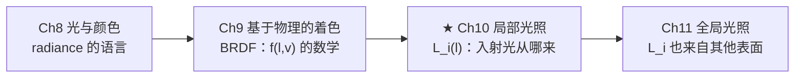
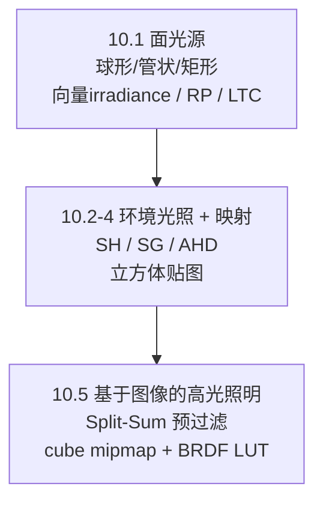
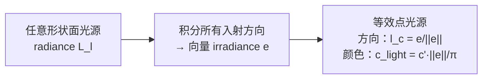
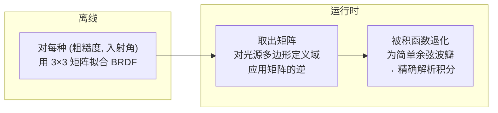
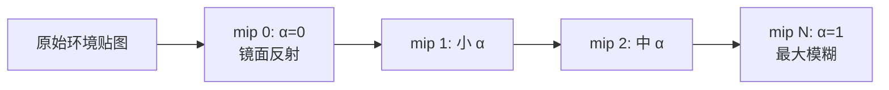

# 第10章 局部光照

> RTR4 第10章。给 Ch9 的 BRDF 配上真实的光源——面光源、环境光照、IBL。

---

## 本章在全书中的位置

Ch9 的反射方程需要一个 $L_i(\mathbf{l})$。Ch9 中只用的是过于简化的精确光源
（方向光/点光）。本章回答真正的问题：**真实光源什么样，怎么代入反射方程积分？**

---

## 知识结构

---

## 10.1 面光源

### 精确光源的局限

精确光源（点光/方向光）物理上不可能——立体角为 0，radiance 无穷大。
误差取决于**光源立体角**和**BRDF 波瓣宽度的比值**。大光源在光滑表面的
效果 ≈ 小光源在粗糙表面的效果——艺术家常调材质来"弥补"，但这把材质
耦合到了特定光照上。

### 向量 irradiance：一个优美的理论

**Lambertian 表面**上，任意形状的面光源可**精确**等效为点光源：

唯一误差来自"光源在表面背面"——这和面光源本身的遮挡差异等价。对于球形
光源，这个等效恰好是标准 $1/r^2$ 衰减的点光源（方程10.8）。

光泽材质无法这样精确转换。

### 光泽材质的面光源近似

**两种策略**：

| 策略 | 原理 | 代表 | 适用 |
|------|------|------|------|
| **粗糙度修正** | 光源扩散 → 等效粗糙度增加 | Karis, Mittring | 中等粗糙度 |
| **代表性点 (RP)** | 光源上贡献最大的单一方向 | Picott, Karis, Drobot | 所有粗糙度 |

RP 更受欢迎——它保留了锐利高光边缘（粗糙度修正无法让镜面"更光滑"来表示
面光源的锐利反射）。RP 方法把面光源转化为点光源的"语法"，着色器只需局部修改。

**球形光源的 Karis RP**（图10.10）：沿反射方向找离球心最近的点 → 取球面上
最近点 → 作为等效光方向，缩放强度保持能量。

**矩形光源的 Drobot RP**（图10.13）：在光源平面上寻找 $(\mathbf{n}\cdot\mathbf{l})^+ \cdot 1/r^2$
最大的点——在余弦项最大点和距离衰减最大点之间插值。

### LTC（线性变换余弦）

最准确的面光源解析方法：

LTC 的核心思想：用矩阵变换把复杂 BRDF 波瓣变成简单余弦 → 光源多边形的
球面投影也做相应的逆变换 → 就可以用 Lambert 的球面多边形精确积分公式。
擅长矩形/多边形光源，比 RP 更准确但略贵。

### 光源形状

| 形状 | 物理对应 | 漫反射解 | 镜面解 |
|------|---------|---------|--------|
| **球形** | 灯泡 | Snyder 解析公式 | Karis RP |
| 管状/胶囊 | 荧光灯 | Picott 闭式解（方程10.12） | RP 叠加 |
| 矩形/多边形 | 柔光箱、LED面板 | Drobot RP | **LTC 最擅长** |

---

## 10.2-10.3 环境光照与球面函数

### 为什么需要环境光照？

月球没有大气层 → 没有天光 → 阴影纯黑（图10.1）。环境光照代表了着色点
半球内所有非直接光源的入射 radiance——天空、云散射、远处物体的间接光照。
即使最简单的恒定环境光 $L_A$ 也能极大提升质量。

### 球面函数表示方法

| 方法 | 存储量 | 频率 | 关键特点 |
|------|-------|------|---------|
| 表格（立方体贴图） | 大 | 最高频 | GPU 硬件过滤 |
| **球谐函数 SH** | 9-16 系数/通道 | 低频 | 正交基、旋转不变、乘积积分=系数点积 |
| **球面高斯 SG** | N×3 参数 | 中频 | 乘积有解析解，卷积方便 |
| AHD | 8 参数 | 定向 | 极度紧凑，使命召唤系列 |
| 环境立方体/骰子 | 6-12 值 | | ≈ 二阶/三阶 SH 质量 |

**SH**：按频带排列（0 阶=常数, 1 阶=3 线性, 2 阶=5 二次...）。核心优势：
两个 SH 函数乘积的球面积分 = 系数向量的点积 → 光照积分瞬间计算。缺点：全局
支撑（重建需全部系数），高频信号会有振铃效应。

**SG**：$G(\mathbf{v}, \mathbf{d}, \lambda) = e^{\lambda(\mathbf{v}\cdot\mathbf{d} - 1)}$。
两 SG 乘积 → 另一 SG；SG 球面积分有闭式解。可推广到 ASG（各向异性）。
《教团：1886》的光照贴图用 SG 存储入射 radiance。

**AHD**（Ambient/Highlight/Direction）：8 参数（方向2+颜色6），极度紧凑。
缺点是投影困难（非线性需启发式），但对法线贴图的对比度增强效果很好——
这正是它流行的原因。

---

## 10.4 环境映射

| 映射方法 | 特点 |
|----------|------|
| 经纬度映射 | 最早，两极拉伸，有 arccos 超越函数 |
| 球面映射 | 依赖观察方向（MatCap），奇异点少 |
| **立方体贴图** | **当前最主流**——视角无关、采样均匀、GPU 原生支持 |
| 八面体映射 | 正方形纹理，无缝隙，适合压缩存储方向 |

---

## 10.5 基于图像的高光照明（IBL）

### Split-Sum（分裂积分近似）——工业标准

不能对每个环境贴图纹素都做一次 BRDF 积分。解决方案：

$$\int f_{smf}(\mathbf{l}, \mathbf{v}) L_i(\mathbf{l}) (\mathbf{n} \cdot \mathbf{l}) d\mathbf{l} \approx \underbrace{\int D(\mathbf{r}) L_i(\mathbf{l}) (\mathbf{n} \cdot \mathbf{l}) d\mathbf{l}}_{\text{预过滤环境贴图（cube map mipmap）}} \cdot \underbrace{\int f_{smf}(\mathbf{l}, \mathbf{v}) (\mathbf{n} \cdot \mathbf{l}) d\mathbf{l}}_{\text{BRDF 积分 LUT（2D 纹理）}}$$

**这不是简单拆分**——两个积分项都包含镜面波瓣 $D$。第一项假设
$\mathbf{n}=\mathbf{v}=\mathbf{r}$（径向对称），对环境贴图做模糊；
第二项作为修正因子，补回 $G_2$ 和菲涅尔的方向依赖。

#### 第一项：预过滤环境贴图

对每个粗糙度，用对应的 GGX 波瓣 $D(\mathbf{r})$ 对 cube map 做卷积。
粗糙度越高 → mip 层级越低（越模糊）。GPU 三线性插值混合相邻层级。

#### 第二项：BRDF 积分 LUT

**Karis/Lazarov 的关键洞察**：如果 $F$ 使用 Schlick 近似，$F_0$ 可以
提取出来：

$$R_{spec}(\mathbf{v}) = F_0 \cdot A(\cos\theta_v, \alpha_g) + B(\cos\theta_v, \alpha_g)$$

$A$ 和 $B$ 存为一个双通道 2D 纹理（RG）。在着色器中一次乘加即可。

**一举两得**：这个 LUT 同时可用于 Ch9 的 Kelemen-Szirmay-Kalos 耦合
漫反射（方程9.65，也需要 $R_{spec}$）。

#### Lagarde 补偿技巧

用反射方向访问预过滤环境贴图时，按粗糙度把方向从 $\mathbf{r}$ 稍微向
$\mathbf{n}$ 倾斜 → 补偿地平线裁剪的能量损失。

#### 预过滤的局限性

波瓣径向对称假设 → 掠射角高光形状不准确（平面上最明显）。
忽略地平线裁剪 → 掠射角偏亮。

---

## 误差来源总结（10.7）

1. 精确光源代替面光源 → 光源尺寸效应丢失
2. 环境贴图假设光源无限远 → 近处反射不准确（Ch11 解决）
3. 忽略可见性 → 漏光（Ch11 AO 解决）
4. BRDF 波瓣径向对称简化 → 掠射角误差
5. 半球 radiance 恒定性假设 → 环境光照单调

---

## 关键记忆点

- **向量 irradiance**：Lambertian 上任意面光源可精确等效点光源
- **RP > 粗糙度修正**：保留锐利高光，工程集成简单
- **LTC**：最准确的多边形面光源方法
- **SH** 适合低频；**SG** 适合中频；**AHD** 极度紧凑
- **Split-Sum** = cube mip（波瓣卷积）+ BRDF LUT（方向修正）
- **Karis LUT** 提取 $F_0$ → 双通道 2D 纹理 → 同时服务 IBL 和耦合漫反射

---

## 前后章衔接

- **承接 Ch9**：Split-Sum 依赖 $D$、$f_{smf}$、$R_{spec}$
- **承接 Ch8**：环境贴图的 radiance 遵循辐射度量学定义
- **铺垫 Ch11**：环境贴图的"无限远"假设被 GI 突破——光可从近处表面反射
