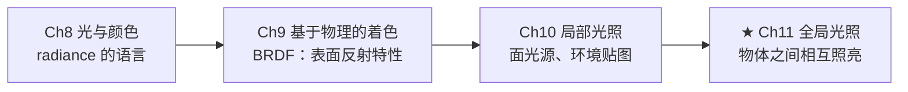
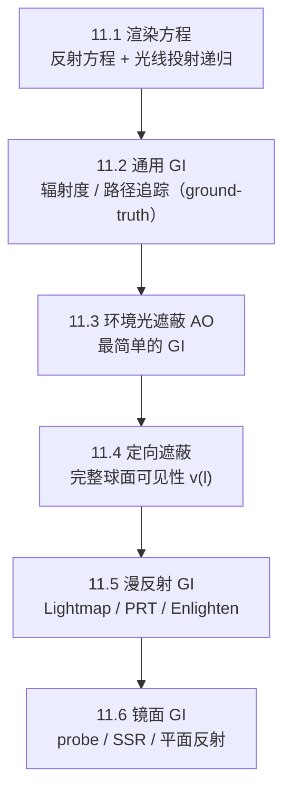
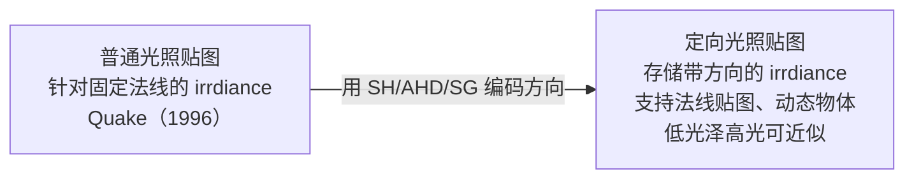
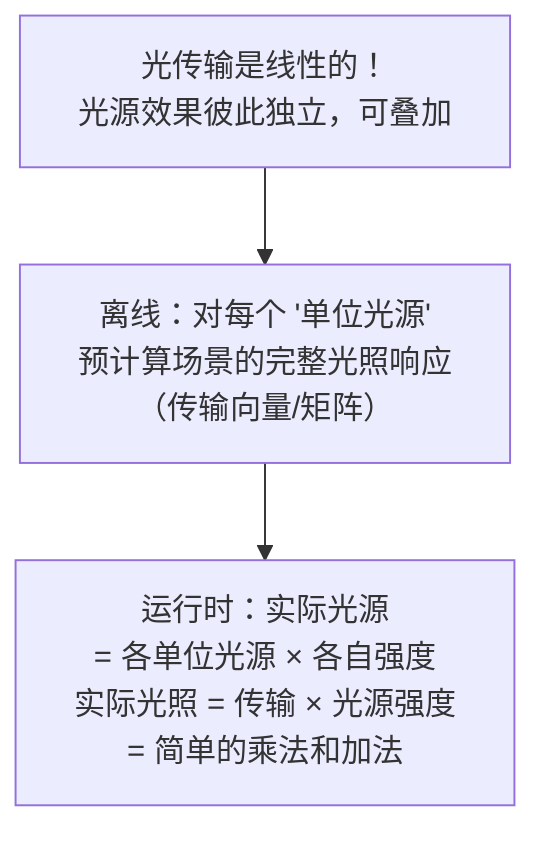
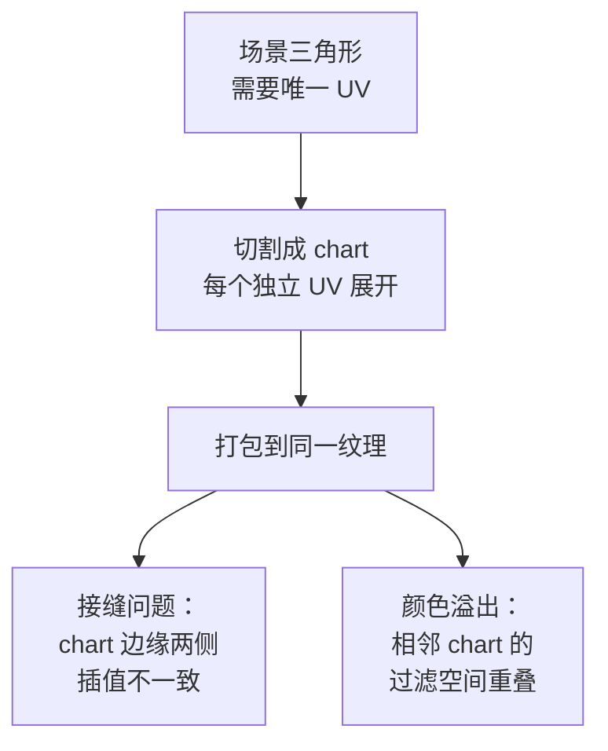
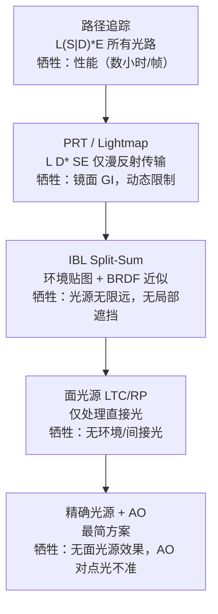

# 第11章 全局光照

> RTR4 第11章。当入射光不只来自光源，也来自其他表面——物体之间相互照亮。

---

## 本章在全书中的位置

**局部 vs 全局的分水岭**：Ch10 的 $L_i(\mathbf{l})$ 是"给定的"（从光源或
环境贴图来）。Ch11 的 $L_i(\mathbf{l})$ 是"从其他表面反射来的"——**递归的、
未知的**，需要光线投射才能确定。

---

## 知识结构

---

## 11.1 渲染方程

### 与反射方程的唯一区别

| | 反射方程（Ch9，方程9.4） | 渲染方程（Ch11，方程11.2） |
|---|----------------------|-------------------------|
| 公式 | $L_o = \int f L_i (\mathbf{n}\cdot\mathbf{l}) d\mathbf{l}$ | $L_o = L_e + \int f L_o(r(\mathbf{p},\mathbf{l}), -\mathbf{l}) (\mathbf{n}\cdot\mathbf{l})^+ d\mathbf{l}$ |
| 入射光 | $L_i(\mathbf{l})$ — **已知** | $L_o(r(\mathbf{p},\mathbf{l}), -\mathbf{l})$ — **递归** |

$r(\mathbf{p}, \mathbf{l})$ = 光线投射函数：从 $\mathbf{p}$ 向 $\mathbf{l}$ 发一条射线，
返回击中的第一个点。$L_o(r(\mathbf{p}, \mathbf{l}), -\mathbf{l})$ = **另一个表面
往反方向发出的光**。要算 A 需要知道 B → 需要知道 C → ... 无限递归。

现实世界能"实时计算"是因为每次反射都有能量损失，衰减极快。
实际只需追踪 1-4 次反弹就视觉收敛。

### 两个基本求解策略

**有限元法（辐射度）**：场景离散为面片 → 预计算面片间形状因子 → 求解
大型线性方程组。只能处理漫反射间的传输（$LD^{*}E$），扩展性差。
但面片间传输的思想启发了现代 PRT 和 Enlighten。

**蒙特卡罗法（路径追踪）**：随机采样方向 → 追踪光线路径 → 对多条路径求平均
= 积分的估计值。处理所有光路 $L(S|D)^{*}E$，但有噪声。路径太少 → 噪声高
（图11.6：8 spp vs 1024 spp）。电影级渲染用数千 spp/像素，一帧数小时。

### Heckbert 的光路符号

$L(D|S)^{*}E$。L=光源，E=眼睛，D=漫反射，S=镜面反射：

| 光路 | 含义 | 谁模拟 |
|------|------|--------|
| $LDE$ | 漫反射→眼睛 | 直接光照 |
| $LSE$ | 镜面→眼睛 | 环境映射（Ch10） |
| $LD^{*}E$ | 多次漫反射 | 辐射度 / Lightmap |
| $LSSE$ | 镜面→镜面→眼睛 | 反射中的反射 |
| $L(S\|D)^{*}E$ | **渲染方程** | 路径追踪 |

给任何 GI 技术标注它的光路类型，立刻能看出能力边界。

---

## 11.3 环境光遮蔽（AO）

### 理论推导

假设环境光 $L_A$ 均匀 → $E = \pi L_A$（每点都一样）。但现实中有遮挡：

$$E(\mathbf{p}, \mathbf{n}) = L_A \int_{\Omega} v(\mathbf{p}, \mathbf{l}) (\mathbf{n} \cdot \mathbf{l})^+ d\mathbf{l}$$

归一化 → **AO 系数**（方程11.8）：

$$k_A(\mathbf{p}) = \frac{1}{\pi} \int_{\Omega} v(\mathbf{p}, \mathbf{l}) (\mathbf{n} \cdot \mathbf{l})^+ d\mathbf{l}$$

$k_A \in [0,1]$：凸面=1（无自遮挡），裂缝处低（暗），接触点最低（接触阴影）。

**环境法线（bent normal）**：未遮挡方向的余弦加权平均——着色时用它替代
几何法线来采样环境贴图，结果更正确。

### Occlusion vs Obscurance

| 概念 | 可见性函数 | 遮挡距离 | 物理性 |
|------|-----------|---------|--------|
| **Occlusion** | $v(\mathbf{l}) \in \{0,1\}$ | 无限远 | 正确但封闭房间全黑 |
| **Obscurance** | $\rho(d) \in [0,1]$ | 有限 $d_{max}$ | 不正确但感知上可信 |

Obscurance 需要手动调 $d_{max}$，但在实际应用中往往产生更符合预期的结果
（图11.9 的对比非常直观）。

### 考虑相互反射

纯 AO 过暗——被遮挡方向也有反弹光。Stewart-Langer 近似（方程11.12）：
$$k_A' = \frac{k_A}{1 - \rho_{ss}(1 - k_A)}$$
对于 $\rho_{ss}$ 高的材质（白墙），修正明显。

### AO 计算方法的演进

| 代 | 方法 | 空间 | 特点 |
|----|------|------|------|
| 0 | 预计算光线追踪 | 物体空间 | 最高质量，静态场景，烘焙到纹理/顶点/体积 |
| 1 | Crytek SSAO | 屏幕空间 | 深度缓冲随机采样，非余弦加权 → 偏暗 |
| 2 | 体积 obscurance | 屏幕空间 | Loos-Sloan，z 轴解析积分 |
| 3 | **HBAO** | 屏幕空间 | 视界角 + 解析积分，不含余弦项 |
| 4 | **GTAO** | 屏幕空间 | 视界角 + 余弦项，与光线追踪方程完全匹配 |
| 5 | SDF 锥形追踪 | 物体/体积空间 | 解析几何体和体素 |

### GTAO：目前质量最高的 SSAO

Jimenez 的 GTAO（方程11.18）从深度缓冲构建高度场，沿观察方向搜索左右视界角：

$$k_A = \frac{1}{\pi} \int_0^{\pi} \int_{h_1(\phi)}^{h_2(\phi)} \cos(\theta-\gamma)^+ |\sin\theta| \, d\theta d\phi$$

$h_1$, $h_2$ 是左右视界角，$\gamma$ 是法线与观察方向的夹角。**内部积分有闭式解**，
外部积分数值计算。

与 HBAO 的关键区别：GTAO **包含了余弦项**，因此与光线追踪方程完全匹配。

**工程实践**：每个像素仅 1 个样本 + 空间方向抖动 → 联合双边滤波（不跨表面边界）
→ 时域超采样（指数平均上一帧）→ 60 FPS 可运行。

### AO 着色的重要限制

AO 只对**大面积光源和环境光照**有物理意义。对精确光源（点光/方向光），
可见性是二值的——应该用阴影贴图（Ch7），不是 AO。

---

## 11.4 定向遮蔽

AO 是标量，只知道"被挡了多少"。定向遮蔽编码整个球面可见性函数 $v(\mathbf{l})$：

| 方法 | 存储 | 精确度 |
|------|------|--------|
| 视界映射 | N 方位角 × 1 仰角 | 精确 |
| 环境圆锥 | 方向 + 锥角 | 近似但紧凑 |
| SH 可见性 | 4-9 系数/通道 | 平滑，会振铃和负值 |
| SG 可见性 | N 波瓣 | 中频 |

### 着色的三种情况

1. **遮挡精确光源**：$L_o = \pi f(\mathbf{l}_c, \mathbf{v}) \mathbf{c}_{light} v(\mathbf{l}_c) (\mathbf{n}\cdot\mathbf{l}_c)^+$。
   用于阴影贴图分辨率不足处（大地形、凹凸自阴影）。

2. **遮挡面光源**：$\int_{\Omega_l} v(\mathbf{l}) f(\mathbf{l}, \mathbf{v}) (\mathbf{n}\cdot\mathbf{l})^+ d\mathbf{l}$。
   视界映射 → 裁剪多边形光源 → Lambert 解析积分。环境圆锥 → 锥相交立体角 → Oat & Sander 解析近似。

3. **环境光照 + 光泽 BRDF + 定向遮蔽**（三重乘积积分）：三种简化策略——

| 策略 | 方法 | 代价 |
|------|------|------|
| SH 降维 | 先把余弦乘给 $L_i$ 或 $v$ → 退化为二重乘积 → 系数点积 | 丢失方向精度 |
| **SG 近似** | 用 SG 和近似 BRDF → 假设 $v$ 在每个 SG 内恒定 → 多次采样预过滤贴图 | 多次纹理采样 |
| 圆锥近似 | 用圆锥表示整个 BRDF 波瓣 → 锥相交计算 | 最简化，结果可信 |

---

## 11.5 漫反射全局光照

### Lightmapping 的演进

定向编码方式对比：

| 编码 | 参数 | 质量 | 使用案例 |
|------|------|------|---------|
| 二阶 SH | 4 系数/通道 | 低 | 低端平台 |
| **三阶 SH** | 9 系数/通道 | 好 | 通用标准 |
| **AHD** | 8 参数 | 中等，法线贴图增强好 | 使命召唤系列 |
| SG (5-9 波瓣) | 15-27 参数 | 高，支持镜面 | 《教团：1886》 |
| 环境立方体/骰子 | 6-12 值 | ≈ 二阶/三阶 SH | 《孤岛惊魂》《全境封锁》 |

### PRT（预计算 Radiance 传输）

#### 核心洞察

**三个显示器的类比**（图11.25）：房间三台单色显示器，亮度各自可调。离线预计算
每台在最大亮度时对房间的完整光照。运行时设置各亮度 → 三个预计算解加权相加
= 最终光照。**因为光传输是线性的，这个拆解是精确的（不是近似）**。

#### Sloan 原始 PRT（2002）→ PCA 压缩

用 SH 系数作为"单位光源"（三阶 SH = 9 个基光源）。预计算每个点对每个
基光源的响应 → 传输向量（标量 irradiance）或传输矩阵（完整 radiance）。
矩阵 $9\times9$ = 81 存储/点 → 存储爆炸。PCA 可以把 625 维（$25\times25$）
压缩到 256 维，但开销仍高。

#### 实战变体

不用 SH 全能基函数，用**少数离散方向**作基光源：
- 环境立方体的 6 个方向 →《孤岛惊魂3/4》
- 一天中不同时间的太阳角度 →《刺客信条4》
- 分散光源 + 运行时插值 → Kristensen 方法

### Enlighten 系统

不同于 PRT（预计算光源→场景的传输），Enlighten 预计算的是**场景表面之间**
的传输（类似辐射度的形状因子）。运行时把直接光照"注入"场景表面，预计算
传播矩阵每帧扩散一次能量。多帧累积 = 多次反弹收敛。支持任意位置光源。
Unity 早期版本内置。

### 光照贴图存储问题

修复接缝：放在不可见面 / 边缘纹素后处理修正 / grid-preserving parameterization。
修复溢出：正确计算过滤占用空间的"排水沟"。

---

## 11.6 镜面 GI

镜面 GI 通常不靠离线烘焙（依赖观察方向）。三种方法：

| 方法 | 原理 | 代表 |
|------|------|------|
| 局部 probe | 场景中放置采样点，动态渲染+预过滤 | 《极限竞速7》 |
| 平面反射 | 从反射平面另一侧渲染 | 水面、地板 |
| **屏幕空间反射 SSR** | 从深度+颜色缓冲区追踪 | 所有物体，受屏幕外限制 |

---

## 11.7 统一方法的未来

过去：漫反射 GI（Lightmap + PRT）和镜面 GI（probe + SSR）分两套管道。
现在/未来：GPU 光线追踪（RTX/DXR/Vulkan RT）+ AI 降噪 → 路径追踪
统一漫反射和镜面 GI。每像素 1-2 spp 即可实时。

---

## 工程降级链

从 ground-truth 到最简实时方案，每一步都清楚"牺牲了什么"：

每一步保留了上一步的核心结构——Split-Sum 虽然拆开了积分，但两个积分项
**都**包含 $D$，保留了微表面理论的核心。PRT 虽然简化了传输为矩阵，
但保留了光传输的线性可叠加性。

---

## 关键记忆点

- **渲染方程 = 反射方程 + 递归**：唯一区别是 $L_i$ 的来源
- **AO 系数**是半球的余弦加权可见部分，不适用于精确光源阴影
- **GTAO** 质量最高，含余弦项，与光线追踪方程完全匹配
- **定向遮蔽 = 对 $v(\mathbf{l})$ 的球面编码**，AO 只是其 0 阶系数
- **PRT = 预计算传输，不是预计算光照**：利用光传输的线性可叠加性
- **Heckbert 符号**给 GI 技术标注光路 → 立刻看清能力边界
- 光照贴图的**接缝**和**颜色溢出**是经典工程难题
- 未来：路径追踪 + AI 降噪 → 统一漫反射和镜面 GI

---

## 前后章衔接

- **承接 Ch9**：AO 的 $k_A$ 是 Ch9 反射方程在最简条件下的特例。PRT 编码了
  对 Ch9 BRDF 形状和菲涅尔的响应
- **承接 Ch10**：环境贴图（Ch10）用于远处的 radiance；本章的 probe +
  SSR 补充**近处**的反射和 GI
- **回看 Ch8**：GI 的 radiance 最终经 Ch8 的"场景→屏幕"管线变为像素
