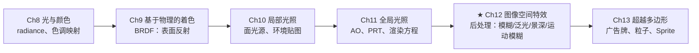
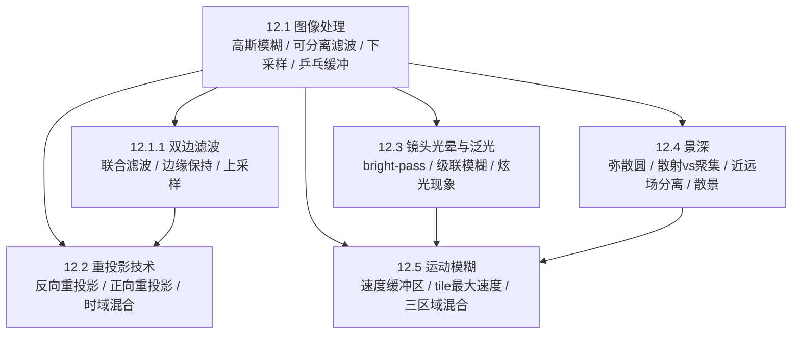

# 第12章 图像空间特效

> RTR4 第12章。渲染早已不是"画完就结束"——模糊、泛光、景深、运动模糊，把CGI变成"照片"。

---

## 本章在全书中的位置

Ch11 产出 radiance 图像后，Ch12 承担"暗房冲洗"角色——用图像处理手段让渲染结果看起来
像一张真实照片或电影画面，包括模拟镜头缺陷（泛光、光晕）和物理相机特性（景深、运动模糊）。

---

## 知识结构

整章围绕一个共同主题：**将图像视为纹理，用GPU对每个像素运行全屏pass进行滤波和采样**。
景深和运动模糊本质上是一类问题——把样本按规则扩散到邻域像素。

---

## 12.1 图像处理：GPU上的"滤镜引擎"

### 全屏pass：后处理的基本形态

场景先正常渲染到离屏缓冲区，然后将渲染结果作为纹理贴在填充屏幕的四边形（或**单三角形**）上，
为每个像素调用像素着色器。**单三角形比四边形更高效**：AMD GCN 架构上由于更好的
缓存一致性，速度提升近 10%[381, 146]。后处理也可用计算着色器（共享内存、分散写入等优势）。

《战地4》一帧有超过 50 种不同类型的渲染 pass[1313]，虽然不全部同时执行，但体现了
现代游戏后处理管线的复杂程度。

### 高斯模糊：最核心的滤波核

$$
\operatorname{Gaussian}(x)=\left(\frac{1}{\sigma \sqrt{2 \pi}}\right) e^{-\frac{r^{2}}{2 \sigma^{2}}}
\tag{12.1}
$$

- $r$：到中心像素的距离
- $\sigma$：标准差，越大则钟形曲线越宽、模糊越强
- 经验法则：滤波核宽度约 $3\sigma$
- 归一化时常数项无关紧要——每个纹素权重相加后除以总和即可

**$sinc$ 和高斯函数都无限延伸**，实践中直接 clamp 到特定直径或正方形区域，超出的部分视为 0。

### 可分离滤波器：二维变一维，$O(d^2) \to O(2d)$

这是所有实时模糊最通用的优化。高斯和 box 滤波器都是**可分离的**——一次二维滤波
可以用两次一维滤波（先水平后垂直）等效替代，如图 12.2 所示。

| 方式 | $5\times5$ 高斯 | $d\times d$ 通用 |
|------|:---:|:---:|
| 二维一次 | 25 样本 | $d^2$ |
| 分离两次 | 10 样本（5+5） | $2d$ |

越宽越省：节省了 $d^2 - 2d$ 次纹理访问。

**圆盘滤波器（散景用）不可分离**，但 Wronski[1923] 提出用复数打开可分离函数家族，
以近似实现。

### 双线性插值加速采样

利用 GPU 内置的双线性插值硬件，一次纹理访问最多可检索四个相邻纹素的加权和[1638]。
对于 $3\times3$ box 滤波器，只需 4 次纹理访问即可完成采样（而非 9 次）；对于
加权不均的滤波器，可以将样本点偏置于两个纹素之间来逼近理想权重。

### 下采样：缩小再模糊

将原图缩小到 1/4（半分辨率）甚至更小：

- 样本总量大幅减少
- 相同宽度的滤波核相对覆盖更大的画面范围（半分辨率下宽度 5 ≈ 原图宽度 9）
- 放大回全分辨率时双线性插值带来额外平滑
- 可扩展到图像 mipmap 链，从多层采样[937, 1120]
- 也可减少每像素 bit 数来降低带宽

粒子系统常以半分辨率渲染[1391]。

### 乒乓缓冲区（Ping-Pong Buffer）

两个离屏缓冲区交替作为输入/输出：pass 1 中 A→B，pass 2 中 B→A，如此往复。
中间结果在临时缓冲区中暂存。**架构上让每个独立 pass 执行特定效果很方便，
但为效率考虑，最好在一个 pass 中合并尽可能多的后处理效果**[1918]。

### 计算着色器在滤波中的优势

滤波核越大，计算着色器相比像素着色器的性能优势越明显[1102, 1710]：

- 线程组共享内存（不同像素共用图像访问，减少带宽[1971]）
- 分散写入：任意半径 box 滤波器只需常量开销
- "移动平均"（moving average）技术：滤波核在前端加新样本、后端减去旧样本，
  在常数时间内近似任意尺寸的高斯模糊[531, 588, 817]

---

## 12.1.1 双边滤波：有选择的模糊

### 核心思想

普通模糊会抹掉物体边缘。双边滤波检查邻居与中心的差异，差异过大则忽略或削弱其贡献，
**保持边缘**。

| 类型 | 判断依据 | 典型应用 |
|------|---------|---------|
| 基本双边 | 像素颜色 | 同色区域平滑 |
| **联合双边**（joint） / **交叉双边**（cross） | 深度、法线、物体ID、速度等额外数据 | SSAO降噪[1971]、软阴影过滤[1343] |

例如：检查邻域像素的深度和法线是否与中心相似——只在使用**深度和法线都匹配**的邻居
时，才能防止阴影从一个表面溢出到另一个表面（避免因深度相同但法线不同而误判为同一表面）。

### 应用场景

- **低分辨率着色 + 双边上采样 → 全分辨率**：Yang 等人[1944] 在低分辨率下着色，用深度+法线双边滤波上采样
- **最近深度滤波**（nearest-depth filtering）：检索低分辨率图像的四个样本，选深度最接近高分辨率的那个[816]
- **SSAO / 软阴影降噪**：滤波时跨越物体边界则丢弃
- **时域一致性增强**：Herzog 等人[733] 结合时间一致性和重投影进一步改善低分辨率渲染质量

### 性能代价

双边滤波**不可分离**——每个像素采样的邻居数量会变化（不确定哪些邻居被丢弃），
无法使用两pass分离滤波或双线性插值合并采样。Green[589] 指出将双边滤波
强制视为可分离引入的瑕疵可被其他着色效果掩盖。

---

## 12.2 重投影技术：借用前帧的"时间红利"

重投影的核心思想：**对前一帧已计算的样本进行重用，利用时间一致性分摊渲染成本**。

### 两种重投影方向

| 方向 | 工作方式 | 核心挑战 |
|------|---------|---------|
| **反向重投影**[1264, 1556] | 从当前帧出发，找到前一帧的对应位置，若可则复用颜色 | 缓存未命中（被遮挡区域重新暴露→必须重新着色） |
| **正向重投影**[350, 1952] | 从前一帧出发，将像素散射到当前帧 | 避免空洞填充，用自适应网格和深度测试处理遮挡 |

### 时域混合公式

$$
\mathbf{c}_{f}\left(\mathbf{p}^{t}\right)=\alpha \mathbf{c}\left(\mathbf{p}^{t}\right)+(1-\alpha) \mathbf{c}\left(\mathbf{p}^{t-1}\right)
\tag{12.2}
$$

- $\mathbf{c}(\mathbf{p}^t)$：当前帧新着色的颜色
- $\mathbf{c}(\mathbf{p}^{t-1})$：前一帧重投影的颜色
- $\mathbf{c}_f(\mathbf{p}^t)$：滤波器最终输出
- 典型值 $\alpha = 3/5$（Nehab 建议根据具体渲染内容尝试不同值）

这是一个**运行时平均滤波器**（running-average filter），逐步淘汰旧着色值。

### 缓存未命中（Cache Miss）与刷新策略

前一帧被遮挡、当前帧新出现的区域 → 没有可复用的颜色 → 必须重新着色。
为避免着色值被过度重用（与运动、光照变化脱钩），Nehab 等人[1264] 建议：

- 将屏幕划分为 $n$ 组，每组是伪随机选择的 $2\times2$ 像素区域
- 每帧刷新一个组，几帧后所有组轮换完毕
- 另一种实现：存储速度缓冲区，在屏幕空间执行所有测试，避免顶点双重变换

### 高级变体

- **Yang 和 Bowles[185, 1945, 1946]**：从 $t$ 和 $t+1$ 两帧向中间时刻 $t+\delta t$ 投影（$\delta t \in [0,1]$），
  利用两帧信息更好地处理遮挡。30→60 FPS 插帧，运行时间不到 1ms
- **Didyk 等人[350]**：正向重投影 + 自适应网格规避空洞，用于立体图像对生成
- **Didyk 等人[351]**：感知驱动时域采样，将帧率从 40Hz 提升到 120Hz

### 关键应用

1. **分摊渲染成本**：全局光照、软阴影等昂贵计算跨帧分摊
2. **插帧**：30→60 FPS（Yang & Bowles），VR 中至关重要——**避免模拟器眩晕症**
3. **时域抗锯齿（TAA）**：章节 5.4.2 的核心工具
4. **《杀戮区域：暗影坠落》**[1812]：用于加速渲染

---

## 12.3 镜头光晕和泛光：模拟"不完美的眼睛和镜头"

### 炫光现象（Glare）的物理根源

| 现象 | 物理成因 | 视觉效果 |
|------|---------|---------|
| **光晕（halo）** | 晶状体径向纤维结构 | 围绕光源的圆环，外缘红、内部紫，尺寸恒定 |
| **绒毛状光环（ciliary corona）** | 晶状体密度波动 | 从光源辐射出的射线，延伸至光晕外 |
| **泛光（bloom）** | 晶状体散射 / CCD 电荷溢出 | 光源周围辉光，降低整体对比度 |
| **鬼影** | 镜头内部多次反射/折射 | 多边形图案（光圈叶片形状）、挡风玻璃条纹[1303] |

数码相机中 CCD 的一个电荷位置饱和溢出到邻近位置 → 泛光。更好的镜头设计
可以减少这些瑕疵，但**现代摄影和电影反而会刻意用数字方式添加它们**——因为
显示器亮度有限，这些效果给人眼"场景更亮"的错觉[1951]。

### 镜头光晕的实现演进

| 方法 | 代表工作 | 核心技巧 |
|------|---------|---------|
| **纹理广告牌法** | King[899] | 一组正方形方块沿光源到屏幕中心的直线排布；光源远离中心→方块变小变透明 |
| **遮挡查询衰减** | Sekulic[1600] | 渲染光源为单多边形，GPU 遮挡查询计数可见像素，**结果延迟一帧使用**以避免流水线停滞 |
| **螺旋深度采样** | Gjøl & Svendsen[539] | 在光晕区域以螺旋模式采样 32 次，在顶点着色器中完成可见性评估 |
| **Steerable 滤波器** | Oat[1303] | 四分之一分辨率 + 乒乓缓冲两次 pass，沿给定方向对纹素求和产生条纹效果 |
| **自动炫光生成** | Mittring[1229] | 隔离明亮部分→下采样→多次模糊→复制/缩放/镜像/着色→合成回去。**任何明亮区域都可能产生光晕**（镜面反射、自发光、火花粒子） |
| **物理鬼影模型** | Hullin等人[598, 786] | 追踪一组光线计算鬼影，从物理镜头设计出发，精度-性能可权衡 |
| **变形镜头光晕** | Wronski[1919] | 1950年代电影摄像设备副产品的现代模拟 |
| **线性格鬼影** | Lee & Eisemann[1012] | 在 Hullin 工作之上用线性模型避免昂贵预处理 |

### 游戏实战：《巫师3》的太阳光晕

流程（图 12.8）：
1. 高对比度校正曲线 → 分离太阳未被遮挡的部分
2. 以太阳为中心的径向模糊，**级联执行**（每次基于前次输出 → 每个 pass 可用有限样本产生高质量平滑模糊）
3. **所有模糊在半分辨率下执行**
4. 最终光晕图像叠加回原始场景

### 泛光（Bloom）：标准流水线

1. **bright-pass**：保留超阈值的"过曝"像素，暗部变黑色（过渡处混合/缩放[1616, 1674]）
2. **下采样 + 级联模糊**：降到二分之一到八分之一分辨率 → 多次高斯模糊 → 可多层采样提供大范围模糊[832, 1391, 1918]
3. **合成**：加法混合回原图 → 饱和→白色，正是想要的过曝效果

**质量要点**：
- HDR 下用过滤而非硬阈值更好[512, 832]
- LDR/HDR 泛光可分开计算再组合[539]
- 模糊分布应更倾向于尖峰而非纯高斯（匹配参考镜头实测[512]）
- 单个亮像素闪烁问题：移动时可能某些帧未被采样
- Alpha 混合可用于艺术化控制[1859]

---

## 12.4 景深：失焦是一门高深的模拟

### 景深的物理本质

一个设置好的镜头有**一个聚焦范围**——超出此范围则模糊，越远越模糊。模糊程度取决于
光圈大小和焦距。减小光圈 → 增加景深 → 减少进光量。

景深与色调映射的关联：**光线越暗→光圈越大→景深越浅**。艺术家通常更喜欢手动控制，
因为近场、焦点场、远场的范围可以独立调整。

### 累积缓冲区法：Ground Truth

改变镜头上的观察位置（保持焦点固定）→ 多次渲染 → 求平均值。一次模拟中镜头的位置
变化决定了每点的弥散圆大小。**收敛到物理正确但每帧需多次渲染**，仅适用于生成
ground-truth 测试图像。光线追踪同样可以通过在光圈上改变观察光线来实现。

### 三区域划分

| 区域 | 距离 | 视觉效果 |
|------|------|---------|
| **近场**（near field） | 距离 < 焦距 | 前景模糊 |
| **焦点场**（focus field） | 距离 ≈ 焦距 | 清晰（弥散圆 < 0.5 像素） |
| **远场**（far field） | 距离 > 焦距 | 背景模糊 |

### 弥散圆（Circle of Confusion, CoC）

失焦表面上的一点 → 在不同观察位置下出现在不同像素中 → 极限情况下形成一个实心圆。
光圈的光线均匀分布（**不是高斯分布**）[1681]——模糊区域内光线倾向于均匀。

### 散景（Bokeh）与光圈形状

散景是焦点场之外的审美质量（bokeh，日语"模糊"，读作"bow-ke"）。

| 光圈类型 | 散景形状 | 实例 |
|---------|---------|------|
| 廉价相机 | 五边形 | 5 叶片 |
| 现代相机 | 七到九边形 | 7-9 叶片 |
| 高端/夜间相机 | 圆形 | 圆形叶片，大光圈 |
| **游戏中的显式六边形** | 六边形 | Barre-Brisebois[107]：可分离两pass后处理最易产生 |

### 散射（Scatter）vs 聚集（Gather）

| 方法 | 操作 | GPU适配性 | 问题 |
|------|------|----------|------|
| **散射**（scatter/前向映射） | 每个像素把颜色扩散到周围弥散圆内的邻居 | **不适合**像素着色器（并行写入冲突） | 需渲染 sprite → 开销不可预测[1517, 1681] |
| **聚集**（gather/反向映射） | 每个像素采样周围邻居，检查邻居的弥散圆是否覆盖自己 | **天然适合**纹理采样型着色器 | 单一视角缺失部分信息 |

### 2.5维方法（早期方案）

改变远近裁剪平面分三次渲染：近场/焦点场/远场三张图 → 远近图分别模糊 → 按前后顺序合成[1294]。
局限：物体跨区域时突变，所有失焦物体均匀模糊（不随深度渐变）[343]。

### Bukowski 方法：近远场分离

Bukowski, McGuire 等人[209, 1178] 的方案是多数现代景深实现的思想基础：

1. **生成有符号弥散圆半径缓冲区**：
   - $-0.5 < r < 0.5$ → 焦点场内
   - $r < -0.5$ → 近场，$r > 0.5$ → 远场
2. **分离近场图像和其他图像**：这是最关键的步骤——近场物体需要模糊且边缘扩散到外部
3. **两级可分离滤波**：分别对近场图和其他图模糊；近场图额外生成 alpha 混合因子（也需模糊）
4. **联合双边滤波测试**：远场模糊时丢弃比采样像素远得多的邻居；近场同理
5. **合成**：弥散圆半径越大→模糊远场结果越多（线性插值）→ 再用近场 alpha 融合

**为什么要分离近场？** 如果直接根据弥散圆半径模糊并输出到单张图，前景物体的模糊
会在焦点场边界处突然降为零 → 产生尖锐的边缘（图 12.13）。分离后近场像素的
模糊可以自然延伸到背景上。

### "聚集时散射"（Scatter-As-You-Gather）方法

Jimenez[832], Sousa[1681], Pettineo[1408], Sterna[1698] 等人发展的现代方法：

1. 对每个像素，在大弥散圆半径内查找所有邻居
2. 选择 $z$ 深度最近（最前方）的重叠邻居作为前景代表
3. 其他 $z$ 深度接近该前景的邻居 → 平均混合入"前景层"
4. 剩余邻居 → 平均混合入"背景层"
5. 前景层合成到背景层 → 自然的近场模糊效果

**无需排序**——通过深度比较直接分两层。

### 热扩散法（已少用）

Kass 等人[864]：将图像视为热分布，弥散圆半径代表热传导系数（焦点区是绝缘体）。
沿每个轴分解为一维三对角矩阵系统，常数时间求解。但无法处理弥散圆中的不连续性，
如今已很少使用。

### 高亮散景（Bright Bokeh）

光源/镜面反射的弥散圆即使在大面积扩散后依然比邻居亮得多 → 形状更引人注目。
只对这些高亮像素渲染为 sprite（用散射），其余像素用聚集——平衡质量和性能[1229, 1400, 1517]。
计算着色器可为聚集景深创建高质量 SAT 表用于高效散景溅射[764]。

---

## 12.5 运动模糊：时间是另一个维度

### 为什么需要运动模糊？

快速移动物体在没有运动模糊的帧序列中会"跳过"许多像素——**时间域上的走样**。
提高帧率不能完全消除对运动模糊的需求。**30 FPS + 运动模糊的体感
通常优于 60 FPS 无运动模糊**[51, 437, 584]。

电影以 24 FPS 放映，但快门开放约 1/40-1/60 秒 → 画面本身已经包含了
运动模糊。交互式图形默认生成的是没有运动模糊的瞬间快照。

### 累积法 → 运行累积法

累积法：快门开放时间内多次渲染（每次重新定位相机/物体）→ 求平均。实时渲染中
适得其反（大幅降低帧率），且独立图像可能产生可感知鬼影（图 12.7）。

运行累积法：已有 8 帧求和 → 每帧加最新帧、减最旧帧 → 保持 8 帧累积和 → 高度模糊效果。
代价：每帧渲染两遍场景[1192]。

### 运动来源与复杂度

| 来源 | 模糊方向 | 方法 |
|------|---------|------|
| **相机旋转** | 全局方向性模糊 | 线积分卷积（LIC）[219, 703]，或天空盒视角的立方体环境贴图[1221] |
| **相机平移** | 近处物体模糊更多（视差） | 利用深度缓冲区；Rosado[1509] 用前一帧观察矩阵求速度矢量 |
| **物体运动** | 每个物体独立 | 速度缓冲区 |
| **物体旋转** | 物体自身旋转模糊 | 几何扩展 / 速度缓冲区 |

### 速度缓冲区（Velocity Buffer）

**现代运动模糊和 TAA 的共同基础设施**。

顶点着色器使用两个模型矩阵（前一帧和当前帧）计算顶点在前后帧的屏幕空间位置，
二者之差 → 插值后即为每像素的屏幕空间速度向量（图 12.20）。

《毁灭战士（2016）》结合了速度缓冲区、运动模糊和 TAA[294]。

### 基于 Tile 的"聚集时散射"方法

McGuire 等人[208, 1173]、Sousa[1681]、Jimenez[832] 的方案（Pettineo[1408] 提供源码）：

**Pass 1**：屏幕分 $8\times8$ 瓦片（tile），找每瓦片内最大速度（大小+方向）

**Pass 2**：查每瓦片 $3\times3$ 邻域，找区域最大速度。确保快速物体对被相邻瓦片感知。

**Pass 3**：沿最大速度方向线性采样、混合。方法类似于景深：
- 只混合 $z$ 深度与当前像素"足够接近"的邻居 → 遮挡处理
- 采样位置**随机抖动半个像素** → 避免鬼影[1173]

### 运动模糊物体的三个区域（图 12.19）

| 区域 | 覆盖情况 | 颜色来源 |
|------|---------|---------|
| **不透明区域**（opaque） | 前景完全覆盖 | 前景颜色，无需混合 |
| **外部区域**（outer） | 前景部分覆盖 | 有正确的背景颜色 → 前景与真实背景混合 |
| **内部区域**（inner） | 前景覆盖但背景未同时出现 | **无真实背景** → 对邻域中非前景像素过滤来估计背景 |

内部区域中背景是估计值 → 对估计值做一点额外模糊可避免不连续性[832]。

### 运动模糊与景深的统一

将速度向量和弥散圆结合得到**统一的模糊滤波核**[1390, 1391, 1679, 1681]。
Munkberg 等人[1247] 用随机和交错采样在低采样率下同时渲染景深和运动模糊，
后续 pass 用快速重建技术[682]恢复平滑属性。

### 艺术控制：打破物理正确

《使命召唤：高级战争》提供了**选项移除摄像机旋转造成的运动模糊**——
在第一人称射击游戏中，视角旋转带来的模糊可能分散注意力甚至导致运动眩晕。
平移模糊仍保留（传达速度感），过场动画中旋转模糊重新打开。

**玩家眼睛追踪假设**：如果假设玩家注视某物体（即使摄像机未跟踪），算法可调整为
物体保持清晰、背景模糊——这是物理摄像机做不到的。

---

## 关键记忆点

1. **全屏pass = 后处理基础**：用填充屏幕的三角形/四边形 + 像素着色器逐个处理像素
2. **可分离滤波器**是关键性能优化：$O(d^2)\to O(2d)$，高斯和 box 都可用
3. **下采样多重优势**：减少样本 + 增大滤波核相对覆盖 + 双线性放大提供免费平滑
4. **乒乓缓冲区**是所有后处理管线的标准交替模式
5. **双边滤波 = 模糊 + 边缘保持**：联合/交叉双边用深度、法线等额外信息判断
6. **重投影公式** $\mathbf{c}_f = \alpha\mathbf{c}_t + (1-\alpha)\mathbf{c}_{t-1}$ 是 TAA、GI分摊、插帧的共同工具
7. **泛光标准流程**：bright-pass → 下采样 → 级联高斯模糊 → 加法混合
8. **弥散圆（CoC）** 是景深的核心概念：失焦 → 像素扩散成圆盘
9. **景深三区域**：近场 / 焦点场 / 远场。近场必须分离处理避免尖锐边缘
10. **速度缓冲区** 是运动模糊 + TAA 的共同基础设施
11. **景深和运动模糊本质同源**——把样本按规则扩散到邻域，可统一为同一个滤波核
12. **运动模糊的三个区域**：不透明 / 外部（有真实背景） / 内部（需估计背景）
13. **艺术控制不可忽略**：运动模糊在游戏中可能分散注意力 → 提供开关和差异化策略

---

## 前后章衔接

- **承接 Ch8**：泛光需要 HDR 和色调映射配合（bright-pass 阈值、过曝合成）
- **承接 Ch11**：双边滤波用于 SSAO 降噪和软阴影过滤；重投影用于分摊 GI 计算成本；
  速度缓冲区与 Ch9-11 的着色管线共享顶点数据
- **承接 Ch5**：时域抗锯齿（TAA）依赖重投影技术和速度缓冲区；Ch5 的滤波重建
  理论（$sinc$、高斯）是本章所有模糊操作的基础
- **通向 Ch13**：镜头光晕中的 sprite/广告牌、景深散景中的 sprite 溅射，
  都依赖 Ch13 的广告牌和粒子系统基础
