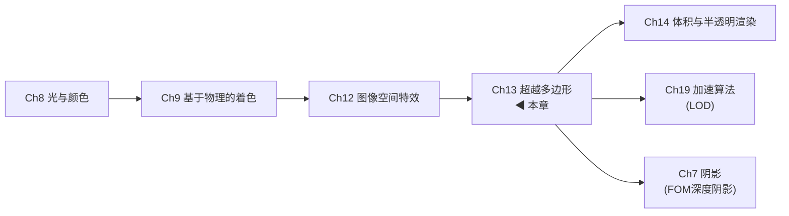

# 第13章 超越多边形 综合摘要

> 本文档将《Real-Time Rendering 4th》第13章（超越多边形）的核心内容提炼为一篇结构清晰、语言通俗、公式保留、注重对比的中文阅读指南。本章系统介绍三角形渲染的替代和补充技术——从图像、广告牌、粒子到点云和体素，构成了传统多边形渲染"右侧"的完整频谱。

---

## 本章在全书中的位置



本章位于全书渲染技术的**"超越传统三角形"分水岭**。前12章以三角形为基本图元展开所有技术；从本章开始，我们探索**用图像、粒子、点、体素来表示和渲染物体**的完整技术体系。本章既是第14章（体积渲染）和第19章（LOD技术）的前导，又在阴影（FOM）、环境贴图（天空盒是环境贴图直接显示）等方面与第7、10章深度交叉。

---

## 知识点总览

```
渲染频谱(13.1) → 固定视图(13.2) → 天空盒(13.3) → 光场(13.4)
                                      ↓
            Sprite/图层(13.5) → 广告牌技术(13.6)
                                      ↓
            ┌─ 屏幕对齐(13.6.1) ──→ 粒子系统(13.8)
            ├─ 面向世界(13.6.2) ──→ 软粒子、球形广告牌
            ├─ 轴向(13.6.3) ──────→ 树木、光束
            ├─ Impostor(13.6.4) ──→ polypostor
            └─ 广告牌云(13.6.5) ──→ 复杂模型简化
                                      ↓
            位移技术(13.7) → 粒子系统(13.8) → 点渲染(13.9) → 体素(13.10)
            RGB△/LDI/浮雕   着色/FOM/GPU模拟   QSplat/面元/EDL   SVO/锥形追踪
```

这是一条从**纯图像→混合图像-几何→纯离散采样**的递增频谱，越向右越远离三角形建模。

---

## 一、渲染频谱（13.1）

### 核心理念：几何→图像→体积的连续性

三角形渲染的致命弱点是：**渲染成本与顶点数成正比，而非像素数**。当一个远处物体只占屏幕上几个像素时，仍然要处理其全部三角形的顶点变换——这是巨大的浪费。

Lengyel提出的渲染频谱（图13.1）将所有渲染方法排列在一条连续轴上：

```
纯几何渲染 ──────→ 混合方法 ──────→ 纯图像渲染 ──────→ 体积渲染
 (三角形)      (广告牌/impostor)    (sprite/光场)      (体素/粒子云)
```

**核心优势**：基于图像的渲染（IBR），其成本与屏幕像素成正比——远处的小物体用小图像，成本自然降低。这与第19章的LOD技术殊途同归：LOD是"几何层面的简化"，IBR是"表示层面的替换"。

---

## 二、固定视图效果（13.2）

### 最极端的加速：相机不动

当场景中有静态物体时，可以**一次渲染、多次复用**：

- **静态场景存储**：将颜色缓冲和z-buffer存储为"预烘焙缓冲区"，每帧只需渲染动态物体（如移动的马）
- **Z遮挡复用**：存储的z-depth自动遮挡动态物体——不需重绘栅栏和牧场
- **CAD应用**：固定视图中反复标记/测量复杂模型，界面和交互元素每帧重绘即可

### Golden Thread（自适应细化）

相机和场景都静止时，计算机随时间**渐进提高图像质量**：

| 细化类型 | 方法 | 效果 |
|---------|------|------|
| 抗锯齿 | 每像素内分层增加采样数 | 边缘逐渐平滑 |
| 景深 | 在镜头和像素上随机分层采样 | 虚化逐渐自然 |
| 阴影 | 用更高质量算法替换初始阴影 | 阴影逐渐柔和 |
| 全局光照 | 光线追踪/路径追踪结果淡入 | 光照逐渐真实 |

**重光照（Relighting）**是将此思想推向极致的应用：用户选择视图后离线生成一组缓冲区，然后可实时调整光照（运动模糊、透明、抗锯齿、间接GI）——这是延迟渲染思想在多帧级别的体现（Ch20将讨论单帧内的延迟渲染）。

---

## 三、天空盒（13.3）

### 视差原则

**远距离物体几乎没有视差**。你移动1米，远处的山看起来不变。天空盒正是利用这一点——用一个包围场景的box网格渲染环境贴图，始终以观察者为中心移动。

### 分辨率公式

立方体贴图每个面的分辨率需要满足"每屏幕像素对应一个纹素"：

$$
\text {texture resolution} =\frac{\text { screen resolution }}{\tan (\text { fov } / 2)}
\tag{13.1}
$$

**推导直觉**：fov=90°时，立方体一个面正好覆盖整个屏幕，纹理分辨率=屏幕分辨率。视场角越小（如狙击镜），每个面看到的天空范围越小，需要的分辨率越高。

### 优化技巧

| 优化 | 原理 | 节省 |
|------|------|------|
| 不写z-buffer | 天空盒永远在最远处 | 带宽 |
| 先绘不透明物体 | 天空盒只在未被遮挡像素上执行 | 像素着色器调用 |
| 任意box大小 | 深度无关，近平面附近即可 | 灵活性 |

**绘制顺序**：不透明物体→天空盒→透明物体。这样可以最大程度减少天空盒的无效像素着色。

游戏应用：微软飞行模拟器中远处的云被渲染为8个全景纹理环绕场景，本质上是天空盒的扩展。圆顶天空也是替代box的几何选择，更适合头顶云层动画。

---

## 四、光场渲染（13.4）

### 从"一组照片"生成任意视角

光场渲染（Light-Field Rendering）和Lumigraph的做法是：**从一组离散观察点捕获物体，在新视角下对存储视图进行插值**。这本质上是一种"二维视图阵列"的表示方法，概念类似于全息摄影。

| 特性 | 说明 |
|------|------|
| 优势 | 物体无论多复杂，显示速率几乎恒定 |
| 代价 | 需要极大量数据来存储所需的全部视图 |
| 当前局限 | 在交互式渲染中的应用十分有限 |
| 新兴方向 | VR应用中用于让眼睛适当调整焦点 |

> 译者注：NeRF等神经渲染技术是该方向的现代延续。

---

## 五、Sprite和图层（13.5）

### Sprite = 屏幕上移动的图像

最简单的sprite就是鼠标光标——像素直接复制到屏幕。更通用的形式是将纹理渲染到**始终面向观察者的多边形**上，用alpha通道实现部分透明和边缘抗锯齿。

### 图层与画家算法

场景可组织为一系列深度不同的图层（类似二维cel动画）：

```
绘制顺序：后挡板 → 鸡 → 驾驶室 → 道路 → 树木（从后往前）
```

这就是**画家算法**——不需要z-buffer。每层sprite有对应深度，相机移动时：
- **前进/后退**：图层缩放
- **水平/垂直移动**：图层按深度比例移动（视差滚动，parallax scrolling）

### Talisman架构（微软，90年代末）

Talisman硬件架构的核心思想是用**一组sprite + 图像扭曲**来表示场景。虽然该硬件已消失，但其核心理念——**用图像替代多边形来分摊渲染成本**——已成为游戏和实时渲染的通用策略。《Chicken Crossing》动画用80层sprite构建了整个场景。

---

## 六、广告牌技术（13.6）

### 核心数学：构建标准正交基

所有广告牌技术共享同一套旋转矩阵构建流程。给定表面法线$\mathbf{n}$和up向量$\mathbf{u}$：

1. **right向量**：$\mathbf{r} = \mathbf{u} \times \mathbf{n}$（归一化）
2. **固定法线时**，调整up向量：

$$
\mathbf{u}^{\prime}=\mathbf{n} \times \mathbf{r}
\tag{13.2}
$$

3. **固定up时**，调整法线：

$$
\mathbf{n}^{\prime}=\mathbf{r} \times \mathbf{u}
\tag{13.3}
$$

4. **旋转矩阵**（固定法线情况）：

$$
\mathbf{M}=\left(\mathbf{r}, \mathbf{u}^{\prime}, \mathbf{n}\right)
\tag{13.4}
$$

该矩阵将$xy$平面上的四边形变换到正确方向，再平移至锚点位置。

### 三种广告牌对比

| 类型 | 固定向量 | 行为 | 典型用途 | 问题 |
|------|---------|------|---------|------|
| **屏幕对齐** | $\mathbf{n}$=指向视点，$\mathbf{u}$=相机up | 始终平行屏幕 | 粒子、HUD、文本标签 | 所有广告牌同一朝向 |
| **面向世界** | $\mathbf{n}$=指向视点，$\mathbf{u}$=世界up | 朝向视点但绕视线轴对齐世界up | 火焰、爆炸、烟雾、云 | 视场角大时边缘球体扭曲 |
| **轴向** | $\mathbf{u}$=世界up（树干轴），$\mathbf{n}$=尽量朝视点 | 绕世界轴旋转面朝观察者 | 树木、灌木、激光束 | 从上方俯瞰时错觉破裂 |

### 面向视点 vs 视平面对齐的区别（图13.6）

**视平面对齐**：所有广告牌法线相同，大视场角下边缘广告牌不会被透视扭曲——球体始终是圆形。但这与人眼预期不一致。

**面向视点**：每个广告牌法线从其中心指向观察者，透视扭曲与真实几何一致——边缘球体变椭圆。当虚拟相机的几何视场与人眼显示视场匹配时，效果最真实。

### 镂空纹理优化

Persson发现：将带大片透明边缘的sprite用**更紧致的多边形**（4-8个顶点）包围，可减少40%-48%的总面积（图13.8）。因为GPU必须处理透明纹素（即使alpha=0最终丢弃），减少无效处理面积直接提升性能。虚幻4引擎内置"粒子切割"工具。

### 云渲染技法演变

| 技术 | 方法 | 来源 |
|------|------|------|
| 同心半透明外壳 | 光圈效果 | Dobashi |
| impostor集合 | 图13.9 | Harris & Lastra |
| 5-400块广告牌 + 16种基础纹理 | 非均匀缩放+旋转组合 | 微软飞行模拟器 (Wang) |
| 嵌套椭球体 | 边缘渐透明 | Elinas & Stuerzlinger |
| 巨型粒子 | 模糊+屏幕空间扰动 | Bahnassi & Bahnassi |
| 程序化云层 + 天空圆顶动画 | 头顶网格 | Pallister |

### 软粒子（Soft Particles）

**核心问题**：半透明广告牌与固体物体相交时产生清晰的边线瑕疵（图13.10左）。

**解决方案**：像素着色器读取底层z-depth进行深度测试（但不写入z-depth），使广告牌在接近固体表面时**渐变为透明**。

- 使用S曲线淡出函数避免线性衰减的不连续性
- 淡出范围需根据观察者与粒子的距离调整（Persson）
- 《孤岛危机》使用box体积替代球体减少计算，并用广告牌代表体积前面（允许z-buffer测试跳过被遮挡部分）

### Impostor（顶替者）（13.6.4）

**定义**：将复杂物体从当前视点渲染成纹理，映射到面向视点的广告牌上。创建成本通过复用（同一物体多个实例，或跨多帧）分摊。

**创建流程**（图13.13）：
1. 将观察者设置在物体包围盒中心
2. 渲染物体到纹理（alpha=1有物，alpha=0透明）
3. 将纹理应用于面向视点的广告牌

**更新启发式**（何时需要重新生成impostor）：

| 方法 | 描述 |
|------|------|
| 距离/重要性 | 靠近观察者或鼠标光标的物体更频繁更新 (Forsyth) |
| 动画位移 | 预处理最大顶点移动距离$d$，已使用$n$帧→投影$d \cdot n / \text{frames}$到屏幕，超过阈值则更新 |
| 运动状态 | 移动时用几何，静止后切换到impostor |

**polypostor**（Kavan）：将人体模型拆分为四肢+躯干各一个impostor，在纯粹impostor和纯粹几何之间取平衡。Beacco对人群渲染技术进行了全面调查。

### 广告牌云（Billboard Cloud）（13.6.5）

**思想**：用一小组**重叠的镂空广告牌**（互相交叉）近似复杂模型。

**树木示例**（图13.15）：20610个三角形→78块广告牌，质量可接受（但有过度绘制代价）。

**Alpha覆盖**（Ch6.6）可帮助渲染无法严格排序的交叉alpha纹理。

**体积纹理替代方案**：将物体渲染为垂直于观察方向的一系列图层（Ch14.3）。

---

## 七、位移技术（13.7）

### 深度sprite / 钉板（Nailboard）

**RGB∆纹理**：在impostor的RGB图像上，每个像素额外存储一个$\Delta$参数——从广告牌平面到真实几何表面的观察空间偏差（高度场）。

**核心优势**（图13.16）：当广告牌穿透附近几何体时，像素着色器可**修改每个像素的z-depth**，使深度sprite与周围物体正确融合。8-bit深度偏差即可获得很好效果。

### 分层深度图像（LDI）

每个像素存储**多个深度信息**。目的：在扭曲变形以适应新视点时，当原先被遮挡的区域变为可见（去遮挡），可以使用第二层深度数据填充，避免出现空洞。Chang提出了LDI树的分层表示。

### 浮雕纹理映射（Relief Texture Mapping）

与深度sprite不同：浮雕纹理渲染在**世界空间四边形**上（非广告牌），高度场用光线步进渲染（Ch6.8.1）。多个高度场纹理可组合构建复杂模型——如同注塑模具的两半，模型最多需要与"任何像素重叠的表面最大数量"相等的高度场数。

### 浮雕impostor（Relief Impostor）

用于人群渲染（Beacco）：模型拆分为多个box，每个box的面关联颜色、法线、高度场纹理。渲染时对每个面执行光线步进，找到可见表面。box与骨骼关联可实现动画（但无蒙皮，适合远距离角色）。

### 几何图像（Geometry Image）

将不规则网格转换为**包含位置值的正方形图像**——四个相邻纹素构成两个三角形。关键特征：可mipmap处理，金字塔各层构成模型的简化版本。这模糊了顶点数据和纹素数据之间的界限。

---

## 八、粒子系统（13.8）

### 概述

粒子系统 = **独立微小物体的集合 + 运动控制算法**。每个粒子可以是单像素、轨迹线段、或广告牌（通常圆形的方向无关紧要）。

### 排序策略（半透明粒子的渲染顺序问题）

| 策略 | 说明 |
|------|------|
| 浓密镂空纹理 | 只用alpha test（0或1），不需要排序混合 |
| 叠加/减法混合 | 顺序无关 (Kaplanyan, Wronski) |
| 美术手动分层 | 不同效果人工指定渲染顺序 |
| 小粒子或低对比度 | 不排序也可接受 |
| 有序发射 | 粒子按某种排序顺序发射 |
| 加权混合透明度 | 无需排序 (Enderton, McGuire & Bavoil) |
| 九层深度缓冲+计算着色器排序 | 顺序无关透明 (Kohler) |
| 低分辨率缓冲区 | 烟雾在1/16屏幕分辨率渲染 (Tatarchuk) |

### 粒子着色（13.8.1）

**光照贴图tile方案**（Drobot, Schied）：每个可见粒子在光照贴图纹理中分配一个tile（分辨率$1\times1$到$32\times32$，按屏幕投影面积调整），渲染粒子并将世界位置写入二级纹理→计算着色器采样场景光源计算radiance→粒子渲染时通过tile映射一次纹理读取获得光照。

**其他着色方式**：
- 逐顶点/逐图元：快但大粒子质量低
- 四角发散法线：圆形粒子边缘法线插值 (Neubelt & Pettineo)
- 球谐函数/辐射度法线映射：烟雾更精细散射
- 曲面细分+域着色器：更大粒子累加光照

### 阴影（接收与投射）

**接收阴影**：小粒子在顶点位置对阴影贴图采样（非逐像素）。

**投射阴影**——**飞溅法**：将粒子飞溅到纹理中，乘入逐像素透光率$T_r=1-\alpha$，与阴影级联的不透明可见性相乘——提供一层"透明阴影"（Andersson & Tatarchuk）。缺点是粒子会错误地将阴影投射到粒子与太阳之间的不透明物体上。

**自阴影**——**傅里叶不透明度映射（FOM）**（Jansen & Bavoil）：从光源视角渲染粒子，将其透光率函数存储为傅里叶系数（不透明度贴图）。任意角度采样时重建透光率信号。适合平滑透光率，但系数个数有限时会产生振铃效应。

**替代方案对比**：

| 技术 | 特点 | 局限 |
|------|------|------|
| FOM | 表达平滑透光率好 | 系数有限→振铃效应 |
| 自适应体积阴影贴图 | 类似深度阴影贴图 | Ch14.3.2详述 |
| GPU粒子阴影映射 | 类似不透明度阴影贴图 | 仅适用面向相机粒子 |
| 体素化消光体积 | 粒子+参与介质统一评估 | 体素大→粗糙 |

### GPU粒子模拟（13.8.2）

使用流式输出或UAV缓冲区，整个粒子系统（创建、运动、碰撞、销毁）可在GPU上完成。关键游戏/研究参考：

- 《命运2》（Whitley）：粒子系统从设计到渲染的完整管线（图13.21）
- 《声名狼藉：私生子》（Vainio）：粒子效果深度解析
- 《野兽传奇》（Skillman & Demoreuille）：推至极限的粒子+图像效果
- Rain系统（Wronski）：高效生成与渲染雨水

---

## 九、点渲染（13.9）

### 从"一切用点表示"到现代点云系统

**QSplat**（2000，Rusinkiewicz & Levoy）：使用包围球层次树，在任何层级停止遍历并用与节点半径相同的splat渲染。帧率优先时提前终止，静止后渐进细化至叶子节点。首次证明了数亿点场景的交互渲染可行性。

**面元（Surfel）**（Pfister）：表面元素 = 点 + 法线 + 过滤纹理，使用八叉树存储，可见性飞溅算法填充空洞。

### 分层点云（Layered Point Cloud）

Gobbetti & Marton的方案更好地映射到GPU：
1. 从全部点中选$n$个间距均匀的点作为根节点（代表粗略模型）
2. 剩余点空间划分为两个子节点
3. 每个子节点递归选$n$个代表点
4. 重复直到每个子节点$\leq n$个点

**优势**：不引入人为"平均"数据点，内存与点数成正比（每个原始点只在树中出现一次）。

**劣势**：放大子节点时，所有父节点也必须发送到管线。

### EDL（眼穹光照，Eye-Dome Lighting）

当点云不含法线数据时的着色方案。先渲染所有点到深度缓冲（宽半径形成连续表面），然后对每个点：
1. 检查相邻像素中比当前像素更靠近观察者的像素
2. 对每个这样的相邻像素计算深度差并求和
3. 平均值×强度因子作为$\exp$输入，修正着色

效果（图13.25）：无数据法线时EDL > 屏幕空间环境光遮蔽，但都需要额外深度pass。

### 《Dreams》的点渲染系统（Evans）

实验性系统亮点：BVH聚类（每簇256个点）→ 符号距离函数生成点 → 计算着色器原子操作划分帧缓冲 → 随机透明度 + 景深抖动splat + 环境光遮蔽 + 不完美阴影贴图 + 时域抗锯齿。

---

## 十、体素（13.10）

### 体素 = 体积元素

每个体素代表均匀三维网格中的一个立方体空间。与点云的根本不同：**网格索引决定位置，无需存储坐标**；邻域关系明确定义。

### 存储挑战与稀疏体素八叉树（SVO）

数据量$O(n^3)$增长：$1000^3 = 10$亿个位置。

**SVO**：在八叉树上记录$2\times2\times2$体素块的相似性，只存储数据不同的节点。产生天然LOD——相当于三维mipmap（图13.28、13.29）。Laine & Karras提供了完整的SVO实现细节。

### 体素生成方法

| 方法 | 原理 | 适用 |
|------|------|------|
| 六正交视图 | 6个方向渲染→深度缓冲→判断内外 | 简单模型（可能遗漏不可见特征） |
| 视觉外壳 | 多相机捕获轮廓→切割体素 | 人体体素化 |
| 切片渲染 | 调整近/远裁剪平面逐层渲染 | 网格模型→体素 |
| 位标记slicemap | 32-bit渲染目标=32层体素，一个pass可高达1024层 | GPU高效 (Forest) |
| 保守光栅化 | 确定所有触及三角形的体素 | 现代GPU，高精度 (Crassin & Green) |

**三种体素化类型**（图13.30）：

| 类型 | 描述 | 特征 |
|------|------|------|
| 实体体素化 | 所有内部体素标记 | 完整体积信息 |
| 26-分离 | 内部与外部体素不共享面/边/顶点 | 最保守，无漏洞 |
| 6-分离 | 内部与外部可共享边和顶点 | 较轻量 |

### 体素渲染

**三角形外壳法**：移除相邻立方体之间的共享面→合并剩余四边形→贪心算法合并小面片为大面片（图13.31：102444面→2100面）。

**移动立方体（Marching Cubes）**：将体素视为点样本，8个相邻样本的"内/外"状态（256种组合）通过查表转换为三角形表面（图13.32）。若角上存储了符号距离值，顶点可插值到$f=0$处，两个相邻立方体在同一边的相同位置创建顶点，确保无裂缝。

**锥形追踪（Cone Tracing）**（Crassin）：利用体素的mipmap性质，用锥形区域代替单根光线采样——随距离增加在更高mip层级采样。可高效计算：软阴影、景深、抗锯齿、可变法线过滤。图13.33展示锥形追踪阴影（~20ms）与Maya离线光线追踪（20秒）的对比。

**VDB替代八叉树**（Hoetzlein）：基于VDB树（网格层次结构）的GPU光线追踪比八叉树性能更优，且更适合体素动态变化。

### 体素在全局光照中的应用

- 场景体素化后，所有光源的阴影光线可用同一个体素表示进行测试（比逐光源生成阴影贴图更高效）
- 人眼对阴影和间接光照等次要效果中的小错误容忍度更高→可用较低体素分辨率
- 有向无环图（DAG）复用自相似节点，大幅减少存储

---

## 关键公式速查

| 公式 | 内容 | 用途 |
|------|------|------|
| 13.1 | $\text{texture resolution} = \frac{\text{screen resolution}}{\tan(\text{fov}/2)}$ | 天空盒立方体贴图分辨率 |
| 13.2 | $\mathbf{u}^{\prime} = \mathbf{n} \times \mathbf{r}$ | 固定法线时调整up向量 |
| 13.3 | $\mathbf{n}^{\prime} = \mathbf{r} \times \mathbf{u}$ | 固定up向量时调整法线 |
| 13.4 | $\mathbf{M} = (\mathbf{r}, \mathbf{u}^{\prime}, \mathbf{n})$ | 广告牌旋转矩阵 |

---

## 关键记忆点

### 十个必须掌握的核心认知

1. **渲染频谱的本质**：三角形渲染成本∝顶点数，图像渲染成本∝像素数——远处小物体用图像是天然LOD
2. **天空盒的核心**：远距离无视差→以观察者为中心移动box→分辨率由式13.1给出→不写z-buffer+先绘不透明物体是标准优化
3. **广告牌的统一数学**：三种类型（屏幕/世界/轴向）共享同一条旋转矩阵构建流程——区别仅在于哪个向量固定、哪个可调
4. **Impostor ≠ 一次性操作**：创建成本需要通过复用分摊——更新启发式（距离/动画位移/运动状态）是实用关键
5. **软粒子解决了"薄片感"**：深度测试不写入+S曲线淡出=广告牌从"剪纸"变为"体积"
6. **粒子排序是性能重灾区**：叠加/减法混合可免排序；分辨率降低+加权混合透明度是高效方案
7. **FOM是粒子自阴影的工业方案**：将透光率函数编码为傅里叶系数，适合平滑介质但在锐利变化处振铃
8. **点云≠一堆点**：QSplat/分层点云的核心是层次结构→任何层级可终止→帧率与质量自动平衡
9. **EDL是"无法线点云"的着色救星**：屏幕空间深度差→$\exp$亮度修正→比单纯的SSAO更有立体感
10. **体素的爆发力在GI**：SVO天然mipmap→锥形追踪≈"用20ms做20秒光线追踪的事"；移动立方体将体素平滑转化为三角形

### 游戏中出现的具体案例

| 游戏/引擎 | 使用的技术 |
|-----------|-----------|
| 微软飞行模拟器 | 5-400块广告牌组成云、8全景纹理远云skybox |
| 《孤岛危机》 | box体积软粒子、广告牌代表体积前面 |
| 《命运2》 | 粒子系统完整管线 (Whitley) |
| 《声名狼藉：私生子》 | 粒子效果设计与渲染 |
| 《野兽传奇》 | 粒子+图像效果推至极限 |
| 《Dreams》 | 基于点的实验性渲染系统 (Evans) |
| 《我的世界》 | $16 \times 16 \times 256$体素块流式加载 |
| 虚幻4引擎 | 粒子切割工具、浮雕impostor |
| SpeedTree | 广告牌云/轴向广告牌树木LOD |
| Talisman架构 | sprite+图层+图像扭曲的场景表示 |

---

## 前后章衔接

### 向前对接（第1-12章）

| 前章 | 衔接点 |
|------|--------|
| Ch5 着色基础 | alpha通道→sprite透明抗锯齿；广告牌的基础纹理映射 |
| Ch6 纹理 | 镂空纹理、alpha覆盖→广告牌云的无序渲染；环境贴图→天空盒的源头 |
| Ch7 阴影 | FOM→粒子自阴影；深度阴影贴图→体素阴影；阴影级联+粒子透光率→透明阴影 |
| Ch10 局部光照 | 环境贴图表示入射radiance→天空盒可直接显示；球谐函数→粒子着色 |
| Ch11 全局光照 | 锥形追踪计算GI（11.5.7）；体素化场景用于间接光照（11.5.6） |
| Ch12 图像空间特效 | 屏幕空间环境光遮蔽用于无法线点云着色 |

### 向后启下（第14-20章）

| 后章 | 衔接点 |
|------|--------|
| Ch14 体积/半透明渲染 | 软粒子→体积渲染入门；体积纹理替代广告牌云（14.3）；自适应体积阴影贴图→粒子阴影；FOM与其他方法对比（14.3.2）；真实云层（14.4.2） |
| Ch16 多边形技术 | 三角形简化→广告牌/体素可视为"极端LOD"；QEM→体素多边形化 |
| Ch17 曲线曲面 | 符号距离函数→SVO生成；隐式表面多边形化→移动立方体 |
| Ch18 管线优化 | 状态切换成本→粒子共享着色器；透明纹素开销→镂空纹理优化 |
| Ch19 加速算法 | LOD→渲染频谱的自然延伸；八叉树/SVO（19.1.3）、BVH（19.1.2）→体素数据结构 |
| Ch20 高效着色 | 延迟渲染与重光照的技术同源性；tile光照→粒子光照贴图方案 |

### 终极认知

**三角形不是唯一正确的渲染方式——它只是频谱上经济性最优的一点。** 本章展示了从纯图像到纯采样的完整技术体系：当物体足够远→用sprite；当面向不重要→用impostor；当几何本身就是离散的→用粒子；当数据天生是空间的→用体素。选择哪种表示方法，取决于**物距、运动模式、数据来源**三者的平衡——这正是渲染频谱给予我们的最大自由。
