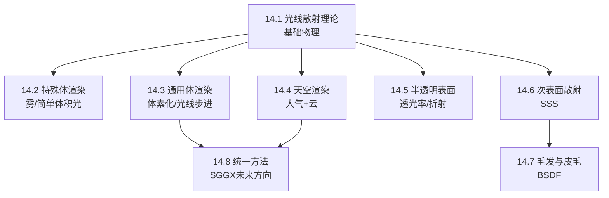
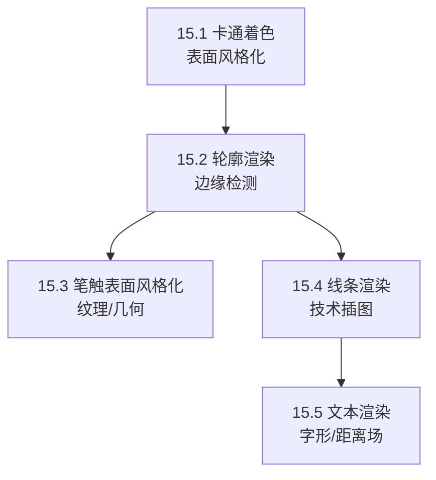

# RTR4 第14-15章综合总结：体积渲染与非真实感渲染

---

## 总览与章节关系

本书第14章和第15章分别代表了实时渲染中**背离标准不透明表面着色**的两个方向：

- **第14章（体积与半透明渲染）**：探索光线在介质**内部和穿过介质**时的传播行为，本质上是将渲染从二维表面扩展到三维体积。
- **第15章（非真实感渲染）**：探索如何**有意识地打破物理正确性**，以艺术表达为目的进行风格化绘制。

两章共享一条暗线——都是在BRDF（第9章）之外的扩展：第14章处理光在介质内部的散射（BSSRDF/BSDF），第15章处理如何将BRDF着色结果量化为卡通色块。

### 与前序章节（Ch8-11）的联系

| 前序章节 | 内容 | 与Ch14的关联 | 与Ch15的关联 |
|---------|------|-------------|-------------|
| Ch8 光照与颜色 | 辐射度量、颜色匹配函数、立体角 | 散射系数$\sigma_a,\sigma_s$的RGB转换；相位函数单位sr⁻¹ | 色调保持色彩空间的量化 |
| Ch9 基于物理的渲染 | BRDF、微表面理论、菲涅尔效应 | 散射理论根基；折射的菲涅尔项；SGGX统一框架 | 卡通着色是对BRDF结果的离散化 |
| Ch10 局部光照 | 环绕光照、面光源 | 环绕光照→最简单的SSS近似 | — |
| Ch11 全局光照 | 环境光照、光照传播体积 | LPV用于参与介质动态GI | — |

---

# 第14章：体积与半透明渲染

## 一、知识结构概览



## 二、核心概念白话解释

### 2.1 参与介质（Participating Media）

> **一句话：** 空气中不只有真空，还有灰尘、雾气、水滴——光线穿过它们时会被散射和吸收，这些东西就叫做"参与介质"。

介质中发生四种事件：

| 事件 | 含义 | 对应系数 |
|------|------|---------|
| **吸收（Absorption）** | 光子被介质"吃掉"，转化为热量 | $\sigma_a$ |
| **外散射（Out-scattering）** | 光子被弹飞，离开当前光路 | $\sigma_s$ |
| **内散射（In-scattering）** | 其他方向的光子被弹进当前光路 | $\sigma_s$ |
| **发射（Emission）** | 介质自身发光（如火焰） | - |

**消光系数** $\sigma_t = \sigma_a + \sigma_s$ 决定光线的总体衰减。

**反照率** $\rho$ 决定介质是偏亮还是偏暗：

$$\rho = \frac{\sigma_s}{\sigma_s + \sigma_a} = \frac{\sigma_s}{\sigma_t}$$

- $\rho \approx 0$：暗而浑浊（如黑烟）
- $\rho \approx 1$：亮而多散射（如牛奶、云、大气）

### 2.2 透光率（Transmittance）—— Beer-Lambert定律

> **一句话：** 光线穿过介质时，走得越远，剩下的光就越少，且衰减速度是指数级的。

$$T_r(\mathbf{x}_a, \mathbf{x}_b) = e^{-\tau}, \quad \tau = \int_{\mathbf{x}_a}^{\mathbf{x}_b} \sigma_t(\mathbf{x}) \|d\mathbf{x}\|$$

其中 $\tau$ 称为**光学深度**，$\tau = 1$ 意味着约60%的光线被消除。

**直观理解：** 如果你在水下看东西，红色光线衰减很快（$\sigma_t$大），蓝色衰减慢（$\sigma_t$小）。所以水下远处的东西都偏蓝绿色——这就是"大海为什么是蓝色"。

### 2.3 观察光线上的散射积分

从相机看出去，进入眼睛的光由两部分组成：

$$L_i(\mathbf{c}, -\mathbf{v}) = T_r(\mathbf{c}, \mathbf{p}) L_o(\mathbf{p}, \mathbf{v}) + \int_{t=0}^{\|\mathbf{p}-\mathbf{c}\|} T_r(\mathbf{c}, \mathbf{c}-\mathbf{v}t) L_{\text{scat}}(\mathbf{c}-\mathbf{v}t, \mathbf{v}) \sigma_s dt$$

- **第一项：** 表面颜色被沿途介质衰减
- **第二项：** 沿途每一点散射进来的光（积分），每次散射又被两点之间的介质衰减

### 2.4 相位函数（Phase Function）

> **一句话：** 描述光子在介质粒子身上弹射时，往各个方向弹的概率分布——类比BRDF，但BRDF管表面，相位函数管体积。

**各向同性的最简单形式：**

$$p(\theta) = \frac{1}{4\pi}$$

**瑞利散射：** 粒子远小于波长（$s_p \ll 1$），如大气分子。

$$p(\theta) = \frac{3}{16\pi}(1 + \cos^2\theta)$$

**关键特征：** 散射强度与波长四次方成反比——蓝光散射远多于红光。

$$\sigma_s(\lambda) \propto \frac{1}{\lambda^4}$$

这解释了：为什么天空是蓝色（蓝光被大气散射到各处）；为什么日落是红色（太阳角度低，蓝光全被散射走了，只剩红光穿透）。

**米氏散射（Henyey-Greenstein相位函数）：** 粒子大小与波长相当（$s_p \approx 1$），如雾、灰尘。

$$p_{hg}(\theta, g) = \frac{1 - g^2}{4\pi(1 + g^2 - 2g\cos\theta)^{1.5}}$$

- $g > 0$：前向散射为主（常见于雾中的聚光灯效果）
- $g < 0$：后向散射为主
- $g = 0$：各向同性

**Schlick近似（更快的替代方案）：**

$$p(\theta, k) = \frac{1 - k^2}{4\pi(1 + k\cos\theta)^2}, \quad k \approx 1.55g - 0.55g^3$$

## 三、技术方法与实战应用

### 3.1 大规模雾效

| 技术 | 公式/原理 | 应用 |
|------|----------|------|
| **深度雾** | $f = e^{-d_f z_s}$，然后 $\mathbf{c} = f\mathbf{c}_i + (1-f)\mathbf{c}_f$ | 几乎所有3D游戏 |
| **高度雾** | 根据观察射线穿过slab的距离计算衰减 | 《战地1》的山谷雾效 |

**雾效的三大作用：**
1. 增强氛围和戏剧感
2. 提供深度暗示（远处的物体更模糊→更远）
3. 遮挡剔除（太远的物体完全被雾遮住→可安全跳过渲染）

### 3.2 体积光（God Rays / Light Shafts）

- **后处理方案：** Mitchell的屏幕空间方法——在远平面渲染一个假太阳，然后定向模糊（可分离滤波），叠加到场景上。成本低、效果好。
- **解析积分方案：** 假设同质介质，对散射光线进行封闭形式求解（Sun等人）。
- **泛光（Bloom）：** 对帧缓冲模糊后叠加，近似短距离非遮挡散射。

### 3.3 通用体渲染框架

#### 体素化方法（Froxel Method）

Wronski / Hillaire 提出的**基于相机视锥体的体素化方案**：

- 将参与介质材质体素化到低分辨率三维纹理 $V_0$ 中
- 从近到远迭代每个切片：

$$V_f[x,y,z] = \left(L_{\text{scat}}' + \frac{L_{\text{scat}_{\text{in}}} - L_{\text{scat}_{\text{in}}} T_{r_{\text{slice}}}}{\sigma_t}, \; T_{r_{\text{slice}}} T_r'\right)$$

- 最终像素：$L_o = T_r L_s + L_{\text{scat}}$

| 引擎/技术 | 实现方式 |
|-----------|---------|
| **虚幻引擎** | 基于粒子的体积表示（球形体积代替box） |
| **寒霜引擎** | 基于物理的参与介质材质、3D LUT大气散射 |

#### 体积阴影的消光体积

Hillaire提出用clipmap分布方案构建**消光体积（extinction volume）**，实现：
- 粒子自阴影
- 粒子与粒子间相互投射阴影
- 粒子在不透明/透明物体上投射阴影

**效果对比：** 有体积阴影的场景比没有的场景暗处更深、亮处更亮，立体感大幅增强。

### 3.4 天空与大气渲染

#### 分析模型 vs 物理模型

| 方法 | 代表工作 | 特点 |
|------|---------|------|
| 分析天空模型 | Preetham模型 | 快速，仅支持地面视角，参数有限 |
| 预计算LUT | Bruneton & Neyret 4D LUT | 物理正确，可多次散射，可模拟外星大气 |
| 3D LUT | 寒霜引擎方案 | 忽略地球在大气中的阴影，但更高效 |

**寒霜引擎的实战应用：** 《极品飞车》《镜之边缘：催化剂》《FIFA》均使用3D LUT方法，艺术家可调整参数实现特定视觉效果，甚至模拟火星的蓝色日落。

#### 云的渲染

三种主流方法：

| 方法 | 代表技术 | 适用场景 |
|------|---------|---------|
| **粒子法** | Yusov体积粒子+4D LUT+ROV体积感知混合 | 层积云 |
| **参与介质法** | Schneider & Vos光线步进+Perlin-Worley噪声 | 动态积云，有体积光照和阴影 |
| **网格+超纹理** | Bouthors的网格表面+超纹理+多阶散射LUT | 高品质孤立云朵 |

**多重散射近似：**

$$L_{\text{multiscat}}(\mathbf{x}, \mathbf{v}) = \sum_{n=0}^{o-1} L_{\text{scat}}(\mathbf{x}, \mathbf{v}), \quad \sigma_s' = \sigma_s a^n, \; \sigma_e' = \sigma_e b^n, \; p'(\theta) = p(\theta c^n)$$

其中 $a,b,c \in [0,1]$ 且 $a \leq b$ 保证能量守恒。这个技巧让云内部不再死黑一片，光线能穿透云层。

**双HG相位函数：** 用于云的复杂相位函数实时近似

$$p_{\text{dual}}(\theta, g_0, g_1, w) = p_{\text{dual}_0} + w(p_{\text{dual}_1} - p_{\text{dual}_0})$$

**游戏应用：** 《最终幻想15》使用透光率函数映射（transmittance function mapping）来渲染云。

### 3.5 半透明表面

#### 覆盖率 vs 透光率

- **覆盖率混合**（织物等）：$\mathbf{c}_o = \alpha\mathbf{c}_s + (1-\alpha)\mathbf{c}_b$
- **透光率混合**（玻璃等）：$\mathbf{c}_o = \mathbf{c}_s + \mathbf{T}_r\mathbf{c}_b$
- **统一混合**：$\mathbf{c}_o = \alpha(\mathbf{c}_s + \mathbf{T}_r\mathbf{c}_b) + (1-\alpha)\mathbf{c}_b$

其中 $\mathbf{T}_r$ 是RGB向量（不同颜色衰减不同）。

#### 厚度与透光率

$$\mathbf{T}_r = e^{-\sigma_t d}, \quad d = \frac{t}{\max(0.001, \mathbf{n} \cdot \mathbf{v})}$$

艺术家友好参数化：给定目标颜色 $\mathbf{t}_c$ 和距离 $d$，反推消光系数：

$$\sigma_t = \frac{-\log(\mathbf{t}_c)}{d}$$

#### 折射

**Snell定律的实时应用：**

折射向量计算（Bec方法）：

$$\mathbf{t} = (w - k)\mathbf{N} - n\mathbf{l}, \quad w = n(\mathbf{l} \cdot \mathbf{N}), \quad k = \sqrt{1 + (w - n)(w + n)}$$

其中 $n = n_1 / n_2$（水1.33，玻璃1.5，空气1.0）。

**透射radiance与入射radiance的关系：**

$$L_t = (1 - F(\theta_i)) \frac{n_2^2}{n_1^2} L_i$$

**实时折射技巧：**
- **环境贴图法：** 计算折射方向后采样立方体贴图（天使雕像范例）
- **屏幕空间法：** 采样背景纹理+法线扰动偏移，用深度测试防止错误漏光
- **粗糙折射：** 《毁灭战士(2016)》根据粗糙度对mipmap降采样背景进行高斯模糊

### 3.6 次表面散射（SSS）

#### 六大技术阶梯（从简单到复杂）

| 技术 | 原理 | 适用场景 |
|------|------|---------|
| **环绕光照** | 将光照"包裹"到暗面，添加颜色偏移 | 大尺度粗略近似 |
| **法线模糊** | 漫反射用模糊法线、镜面反射用原始法线 | 小尺度散射（皮肤尺度） |
| **预积分皮肤着色** | 2D LUT索引 $(\mathbf{n} \cdot \mathbf{l}, 1/r)$ | 快速皮肤渲染（Penner） |
| **纹理空间扩散** | 渲染irradiance到纹理→多次模糊→叠加镜面 | 高品质皮肤（d'Eon & Luebke） |
| **屏幕空间扩散** | 屏幕空间双边模糊+模板测试限定区域 | 多角色批量SSS（Jimenez） |
| **深度贴图技术** | 光源深度贴图查找+半透明阴影映射 | 大尺度散射（树叶、手） |

**皮肤渲染的关键特征：** 不同波长散射范围不同——红色散射范围最大，所以阴影边缘偏红。

**Jimenez屏幕空间方法：** 
- 只对irradiance做模糊（不模糊反照率和高光）
- 使用模板缓冲标记需要SSS的像素
- 考虑观察深度+法线方向的双边滤波
- 可同时处理多个角色（图14.44）

**树叶SSS快速近似：**

$$t_{ss} \mathbf{c}_{ss} ((\mathbf{v} \cdot -\mathbf{l})^{+})^p$$

使用环境光遮蔽反推局部厚度 $t_{ss}$，$p$ 近似相位函数。

**游戏应用：** 
- NVIDIA皮肤渲染系统（d'Eon & Luebke）：多层扩散，6种模糊图像组合
- 屏幕空间SSS已被大量游戏引擎集成
- 皮克斯使用"软糖光源"（gummi light）技术

### 3.7 毛发与皮毛

#### 毛发的三层结构

| 层 | 特征 | BSDF分量 |
|----|------|---------|
| 角质层（Cuticle） | 粗糙表面，鳞片向根部倾斜约3° | $R$（无色镜面反射） |
| 皮层（Cortex） | 含黑色素，赋予颜色 | $TT$（透射）、$TRT$（次级高光） |
| 髓质（Medulla） | 人类可忽略，动物需考虑 | 更多光路分支 |

#### BSDF模型演进

| 模型 | 特点 |
|------|------|
| Marschner模型 | 开创性工作，测量真实毛发散射，引入$R$/$TT$/$TRT$分量 |
| d'Eon修正模型 | 能量守恒，考虑粗糙度，扩展$TR^*T$路径 |
| Chiang模型 | 参数化粗糙度+多重散射颜色，艺术家友好 |
| 实时BSDF（Karis） | 简化数学表达式，假法线+环绕漫反射近似多重散射 |

**偏心闪烁（Glint）：** 毛发截面为椭圆形，导致高光向两侧分散——这是区分CG毛发和真实毛发的关键视觉特征。

#### 双重散射（Dual Scattering）

多重散射的实时近似：

$$\Psi^G + \Psi^G \Psi^L$$

- $\Psi^G$：着色位置到光源之间所有毛发束的全局透光率
- $\Psi^L$：着色位置周围局部散射贡献

**皮毛的壳渲染：** 
- 8层嵌套壳，每层沿法线偏移→渲染体积纹理
- 轮廓处生成鳍片隐藏断裂
- 《失落的星球》使用几何着色器挤出真实折线毛发

**游戏应用：**
- TressFX（AMD）：GPU上实时头发物理模拟+渲染
- 《星球大战：前线》：Chewbacca的皮毛渲染
- 《古墓丽影》系列：TressFX头发

### 3.8 统一方法

**SGGX（Symmetric GGX）：** 将微表面理论推广为微片理论，统一表示固体材质和体积材质。未来可以在体素级别进行LOD切换，避免网格LOD的突兀跳变。

---

## 第14章核心公式汇总

| 公式编号 | 名称 | 公式 |
|---------|------|------|
| 14.1 | 反照率 | $\rho = \frac{\sigma_s}{\sigma_s + \sigma_a}$ |
| 14.2 | 观察光线散射积分 | $L_i = T_r L_o + \int T_r L_{\text{scat}} \sigma_s dt$ |
| 14.3 | 透光率 | $T_r = e^{-\tau}, \tau = \int \sigma_t dx$ |
| 14.4 | 散射事件 | $L_{\text{scat}} = \pi \sum p(\mathbf{v}, \mathbf{l}_{c_i}) v(\mathbf{x}, \mathbf{p}_{\text{light}_i}) c_{\text{light}_i}$ |
| 14.6 | 各向同性相位函数 | $p(\theta) = \frac{1}{4\pi}$ |
| 14.8 | 瑞利相位函数 | $p(\theta) = \frac{3}{16\pi}(1 + \cos^2\theta)$ |
| 14.9 | 瑞利散射波长关系 | $\sigma_s(\lambda) \propto 1/\lambda^4$ |
| 14.10 | HG相位函数 | $p_{hg} = \frac{1-g^2}{4\pi(1+g^2-2g\cos\theta)^{1.5}}$ |
| 14.11 | Schlick近似 | $p(\theta, k) = \frac{1-k^2}{4\pi(1+k\cos\theta)^2}$ |
| 14.16 | 体素化迭代 | $V_f = (L_{\text{scat}}' + \frac{L_{\text{scat}_{\text{in}}} - L_{\text{scat}_{\text{in}}} T_{r_{\text{slice}}}}{\sigma_t}, T_{r_{\text{slice}}} T_r')$ |
| 14.22 | 厚度透光率 | $\mathbf{T}_r = e^{-\sigma_t d}$ |
| 14.25 | 角度相关透光率 | $\mathbf{T}_r = e^{-\sigma_t d}, d = \frac{t}{\max(0.001, \mathbf{n}\cdot\mathbf{v})}$ |
| 14.28 | 折射向量 | $\mathbf{t} = (w-k)\mathbf{N} - n\mathbf{l}$ |

---

# 第15章：非真实感渲染（NPR）

## 一、知识结构概览



## 二、核心概念白话解释

### 2.1 NPR的哲学

> **一句话：** 真实感渲染追求"看不出是CG"，NPR追求"看得出是艺术"。

NPR的两大目标领域：
1. **技术插图（Technical Illustration）：** 只显示与任务相关的细节——看引擎内部结构时，简化线条图比照片有用
2. **艺术风格模拟（Artistic Media）：** 模拟钢笔、墨水、水彩、木炭等传统媒介的感觉

**核心思想：** McCloud提出的"通过简化来进行增强（Amplification through Simplification）"——去掉杂乱信息，增强核心表达。

### 2.2 卡通着色（Toon / Cel Rendering）

**三种实现方式：**

| 方法 | 原理 |
|------|------|
| **纯色填充** | 完全不接受光照 |
| **双色/硬着色** | $\mathbf{n} \cdot \mathbf{l} >$ 阈值→亮色，否则→暗色 |
| **色调分离（Posterization）** | 对最终颜色进行离散量化 |

**色调分离的关键建议：** 在HSV/HSL/YCbCr等色调保持色彩空间中做量化，避免RGB独立量化造成的色调偏移。

**二维Ramp纹理：** Barla等人用2D贴图（维度1=光照强度，维度2=深度/方向）实现与视角相关的效果变化。

### 2.3 五种类型的边缘

| 边缘类型 | 定义 | 是否依赖视角 |
|---------|------|-------------|
| **边界边缘（Boundary）** | 不被两个三角形共享的边（如纸的边缘） | 否 |
| **折痕边缘（Crease）** | 二面角 > 阈值（默认60°），如立方体棱 | 否 |
| **材质边缘（Material）** | 不同材质交界处 | 否 |
| **Contour边缘** | 相邻三角形一个面向观察者、一个背向 | **是** |
| **Silhouette边缘** | Contour的子集，将物体从背景分离 | **是** |

**Contour边缘的数学判定：**

$$(\mathbf{n}_0 \cdot \mathbf{v})(\mathbf{n}_1 \cdot \mathbf{v}) < 0$$

即两个相邻三角形的法线与视线方向的点积异号。

### 2.4 四大轮廓检测技术

#### 方案一：基于法线的着色检测

- **原理：** 当着色法线几乎垂直于视线（$\mathbf{n} \cdot \mathbf{v} \approx 0$），涂黑
- **优点：** 极简，像素着色器一行代码
- **缺点：** 对立方体失效（折痕处法线不连续），曲面远处也失效

#### 方案二：程序化几何（背面扩展）

| 子方法 | 原理 |
|--------|------|
| **背面边缘渲染** | 渲染背面边缘线在正面前方 |
| **Z偏移法** | 将背面整体向前平移→渲染为黑色 |
| **三角形扩展（Triangle Fattening）** | 每个背面三角形沿平面向外扩展→粗细均匀 |
| **外壳/光晕（Shell/Halo）** | 沿顶点法线外移→渲染为黑色 |

**游戏应用：**
- 《波斯王子》：三角形扩展法
- 《爆炸头武士》：三角形扩展法
- 《Cel Damage》：背面外壳扩展+显式折痕边缘
- 《军团要塞2》：2D ramp纹理实现卡通+现实融合

**三角形扩展的斜切角修复（图15.8）：** 对细长三角形，扩展三条边再重新连接形成斜切角，避免单角被过分拉长。

#### 方案三：图像后处理

- **核心工具：** G-buffer（法线缓冲、深度缓冲、对象ID）
- **检测算子：** Sobel、Roberts Cross、Scharr滤波器
- **形态学膨胀（Dilation）：** 搜索邻域最暗像素→加粗边缘

**游戏应用：** 《无主之地》使用改进的Sobel滤波器检测深度/法线不连续性

**优点：** 不要求网格连通性；平面曲面都能处理
**缺点：** 阶梯锯齿；可能漏检（纸上桌）或误检

**艺术风格化后处理：**
- 高斯差分（DoG）→ 铅笔画/蜡笔画
- 双边滤波/均值偏移/Kuwahara滤波 → 水彩/丙烯效果
- 噪声扰动 → 手绘感
- 纸张高度场 → 木炭/水彩模拟

#### 方案四：几何边缘检测（显式法）

**工作流程：**
1. 用方程15.1遍历边缘列表检测contour
2. 构建contour环（每条边上必须有偶数条contour edge）
3. 时间连贯性追踪（Markosian的随机搜索，Kalnins的投票算法）
4. 隐藏线移除 → 确定可见线段
5. 风格化渲染（渐窄、光晕、波浪、过冲、淡出）

**GPU加速方案：** 每个边发送为退化四边形，顶点着色器检测后扩为非退化鳍片渲染。

### 2.5 笔触表面风格化

**色调艺术贴图（Tonal Art Map, TAM）：**

- **核心思想：** 在每个mipmap层级绘制不同密度的笔触
- **效果：** 物体远近变化时保持屏幕空间笔触密度恒定
- **扩展：** 体积纹理版支持颜色；阈值方案改善抗锯齿

**嫁接（Graftal）：** 按需在表面添加几何装饰或贴花纹理，模拟画笔笔触。

**淋浴门效应（Shower Door Effect）：** 屏幕空间纹理在物体运动时看起来像透过花纹玻璃观察——需要通过图像变换匹配物体运动来解决。

## 三、线条渲染技术

| 线型 | 技术 |
|------|------|
| **线框** | 所有边可见 |
| **隐藏线** | 先渲染表面到Z-buffer，再绘制边 |
| **模糊线** | 被遮挡部分渲染为浅灰色（反转Z-buffer） |
| **光晕（Halo）** | 相交处擦除远处线条（粗光晕四边形+细黑线） |

**重心坐标法（Barentzen）：** 像素着色器中根据重心坐标判断到最近边的距离，接近边则着色为边缘色。**缺点：** 内部边是contour边的两倍粗。

## 四、文本渲染技术

| 技术 | 原理 | 应用 |
|------|------|------|
| **亚像素渲染** | 利用LCD的RGB亚像素矩形，水平分辨率×3 | ClearType, FreeType, Quartz 2D |
| **字形纹理缓存** | 预生成每字形小纹理 | FreeType, Anti-Grain Geometry |
| **符号距离场（SDF）** | 纹素存储到最近边带符号距离 | Valve《军团要塞2》，移动端字体库 |
| **GPU直接渲染曲线** | Loop-Blinn方法在像素着色器计算Bezier | Pathfinder库 |
| **字体微调（Hinting）** | 调整轮廓与像素网格对齐 | FreeType微调系统 |

**SDF的优势：** 双线性插值即可获得良好抗锯齿；可轻易添加轮廓、发光、阴影效果

---

## 第15章核心公式汇总

| 公式编号 | 名称 | 公式 |
|---------|------|------|
| 15.1 | Contour边缘判定 | $(\mathbf{n}_0 \cdot \mathbf{v})(\mathbf{n}_1 \cdot \mathbf{v}) < 0$ |

---

## 五、两章之间的内在联系

### 5.1 共同的"超越标准表面"主题

| 维度 | Ch14 体积/半透明 | Ch15 NPR |
|------|-----------------|----------|
| **空间维度** | 从2D表面扩展到3D体积 | 从3D物理世界压缩到2D艺术表达 |
| **物理正确性** | 追求物理正确（散射方程守恒） | 有意打破物理正确 |
| **材质模型** | BSDF / BSSRDF / 相位函数 | Ramp纹理 / 色调分离 |
| **视线穿透** | 光线穿透介质 | 视觉穿透物体（X光效果） |

### 5.2 实用互补关系

1. **深度暗示：** Ch14的雾效和Ch15的轮廓线都提供深度感知——雾用颜色渐变暗示距离，轮廓线用边界对比分离物体层次
2. **后处理技术栈共享：** 
   - Ch14体积光使用模糊后处理（类似Ch15的膨胀算子/高斯差分）
   - Ch14屏幕空间SSS使用双边滤波（Ch15的风格化滤波也用双边/均值偏移）
3. **分层渲染：** Ch14的深度剥离/体素切片与Ch15的壳渲染在概念上同源——都是通过多层pass构建体积感
4. **艺术控制vs物理控制：** Ch14中艺术家控制$\sigma_a/\sigma_s/g$参数化消光/散射；Ch15中艺术家控制ramp纹理/阈值/笔触密度——两者都面临"如何让艺术家直观调整"的设计挑战

### 5.3 与全书框架的关系

```
Ch8 (光照基础) ──→ Ch9 (BRDF/物理渲染)
                      │
        ┌─────────────┼─────────────┐
        ↓             ↓             ↓
   Ch14 (体积)   Ch10 (局部光)   Ch15 (NPR)
   散射/吸收      环绕光照=SSS     打破BRDF
        │                           │
        └──── SGGX统一框架 ←────────┘
              微片理论替代微表面
```

---

## 六、核心要点速查

### 第14章要点

1. **万物都在散射** —— 不透明表面只是高密度参与介质的特例
2. **Beer-Lambert定律**是体积渲染的根基：$T_r = e^{-\tau}$
3. **相位函数决定了散射方向分布**：瑞利（波长相关，蓝光散射多）、米氏/HG（前向散射为主）
4. **体积阴影是区分平面感和立体感的关键** — 有无体积阴影的对比（图14.21）极其明显
5. **SSS的技术选择取决于散射尺度**：环绕光照(最大尺度) → 屏幕空间扩散(中等) → 纹理空间扩散(高品质)
6. **毛发渲染的核心挑战**：偏心闪烁($TRT$分量) + 多重散射 + 体积自阴影
7. **天空渲染已成熟**：寒霜引擎的3D LUT+多次散射分摊方案被多款3A游戏采用

### 第15章要点

1. **NPR的目标不是"像照片"**，而是服务于特定表达目的
2. **卡通着色 = 表面量化 + 轮廓线**，看似简单但组合效果极强
3. **轮廓检测四大家族**：法线着色(最简单) → 背面几何(最可控) → 图像处理(最通用) → 显式边缘检测(最灵活)
4. **风格化的关键不在检测边缘**，而在如何将边缘渲染为笔触（渐窄、波浪、光晕、过冲）
5. **文本渲染有超乎想象的深度**：亚像素技术、SDF距离场、GPU直接计算曲线——都是为了"1"和"l"不能搞混

### 两章共同的实用教训

- **噪声是好朋友**：Ch14用蓝噪声掩盖欠采样，Ch15用噪声模拟手绘摆动
- **时域重投影是性能利器**：两章都在低分辨率渲染后用前一帧重投影+EMA平滑
- **分层的精妙**：先渲染底层再做模糊后处理叠加——体积光、SSS、NPR笔画都遵循此模式
- **从简单到复杂有清晰阶梯**：不会一上来就用光线步进——先用解析解、再用采样、最后才用完整的物理模拟

---

## 七、推荐延伸阅读

| 主题 | 推荐资源 |
|------|---------|
| 体渲染基础理论 | Fong等人的SIGGRAPH课程讲义 [479] |
| 天空与云渲染 | Hillaire的课程讲义 [743] |
| 透明效果统一框架 | McGuire & Mara [1185] |
| 毛发渲染全面教程 | Yuksel & Tariq在线课程 [1954] |
| NPR基础理论 | McCloud《Understanding Comics》[1157] |
| 笔触渲染综述 | Hertzmann [727], Benard等人 [130] |
| 艺术图像处理效果 | Kyprianidis等人综述 [949] |
| 游戏NPR案例 | 《军团要塞2》《无主之地》《大神》开发分享 |
| 文本渲染加速 | Pranckevicius调研 [1440] |
