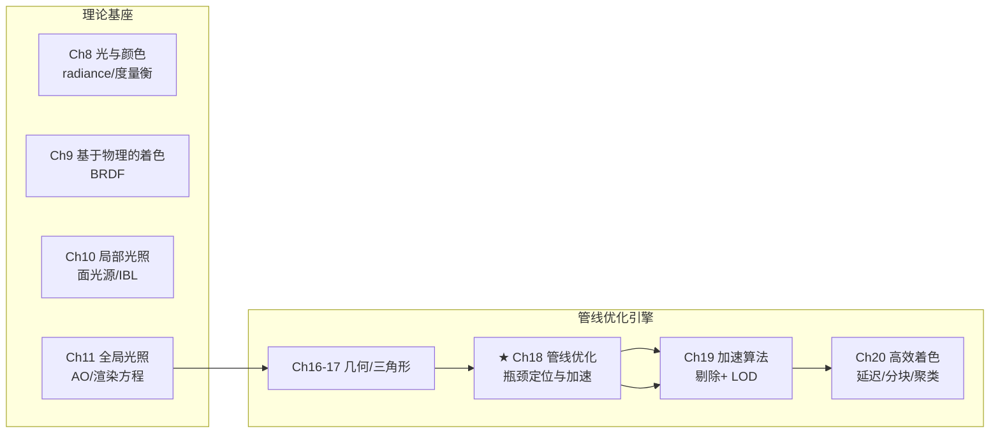
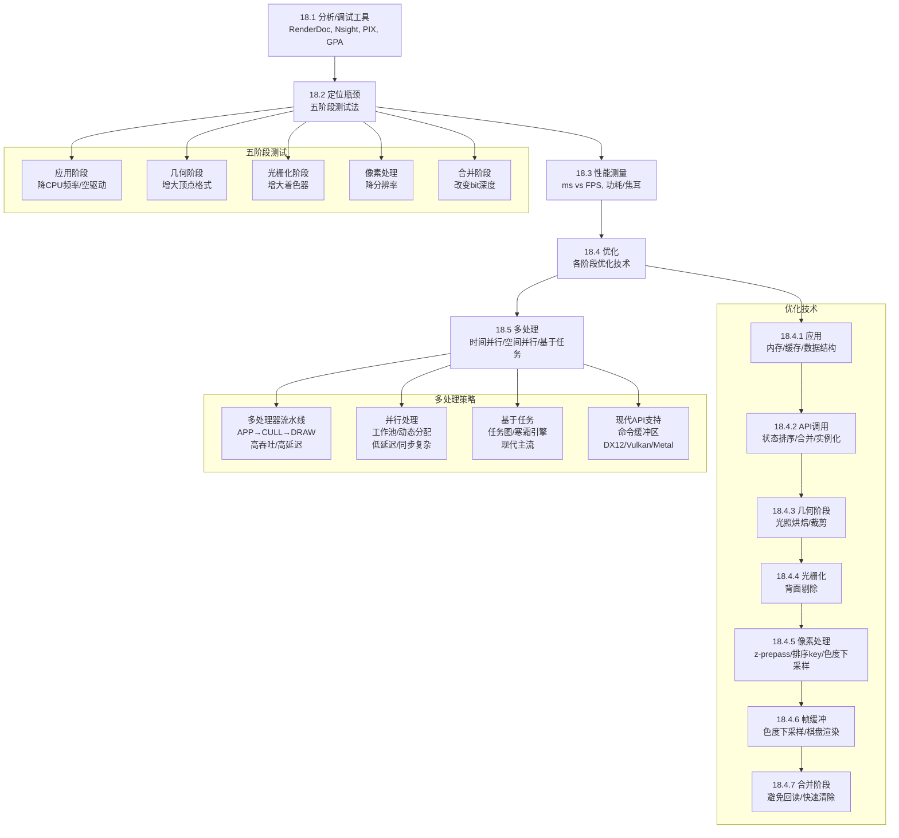
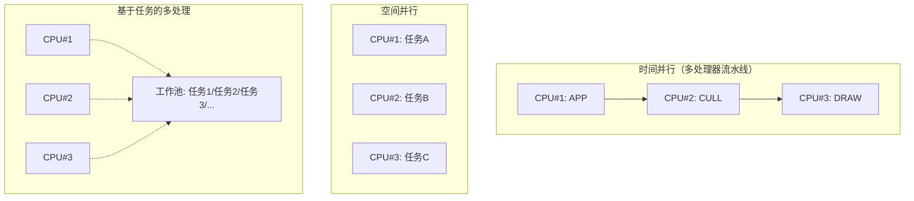

# 第18章 管线优化

> RTR4 第18章。渲染管线是流水线——最慢的一环决定总吞吐量。本章教你找到这一环并加速它。

---

## 本章在全书中的位置



- **Ch18 是全书的"性能工程"章**：前面章节教你"怎么渲染"，本章教你"怎么跑得快"。
- Ch18 与 Ch19 的关系：Ch18 是纵向优化（让管线本身更快），Ch19 是横向优化（减少送入管线的内容量）。
- Ch18 与 Ch20 的关系：Ch20 的延迟/分块着色本质上也是像素处理阶段的优化，其理论基础在本章。

---

## 知识结构



---

## 一、核心哲学：两条铁律

### 1.1 KNOW YOUR ARCHITECTURE

**不同的GPU架构，优化策略截然不同。** 例如：

| 架构差异 | 实际影响 |
|---------|---------|
| PowerVR 可编程混合 | 旧API固定功能混合 → 驱动需将混合状态打包进像素着色器，成本剧增 |
| Mali 基于tile的渲染器 | 几何着色器用软件实现，前后排序无收益，状态排序才是关键 |
| NVIDIA GPU Boost | 功耗/温度动态调频 → 同一基准测试速度因初始温度而异 |
| 统一着色器架构 (2006+) | 顶点/像素共享计算单元 → 很难确定瓶颈在 VS 还是 PS |

### 1.2 MEASURE, MEASURE, MEASURE

> **FPS 是陷阱。** FPS 是倒数度量，非线性——50 FPS + 50 FPS + 20 FPS 的平均不是 40 FPS，而是 33.3 FPS。

**正确做法：始终以毫秒为单位进行评价。** 每帧 20ms + 20ms + 50ms → 平均 30ms。

另外两条实用原则：
- 测量时关闭**垂直同步**（双缓冲），用单缓冲模式测量裸渲染时间
- 永远不要过早优化——**过早优化是万恶之源**（Knuth）

---

## 二、瓶颈定位——五阶段测试法

渲染管线四概念阶段 + 合并阶段，最慢的决定总吞吐量。瓶颈在一帧内可能漂移。

### 2.1 测试方法总览

| 管线阶段 | 测试方法 | 原理 |
|---------|---------|------|
| **应用阶段（CPU）** | ① 降CPU频率 → 帧率同比例下降<br/>② 使用空驱动（接受调用但不做任何事） | 如果CPU频率下降与帧率下降成正比 → CPU瓶颈 |
| **几何处理** | 增大顶点格式（每顶点加额外纹理坐标）<br/>加长顶点/几何/曲面细分着色器程序 | 帧时间增加 → 几何瓶颈 |
| **光栅化** | 增大 VS 和 PS 的程序大小（加无用指令） | 帧时间**不变** → 瓶颈在光栅化固定功能 |
| **像素处理** | ① 降屏幕分辨率 → 帧率明显上升<br/>② 简化/加长像素着色器<br/>③ 用 1×1 纹理替代原纹理 | 帧时间变化 → PS 瓶颈<br/>1×1 纹理更快 → 纹理带宽瓶颈 |
| **合并阶段** | 改变缓冲输出 bit 深度<br/>开关 alpha 混合 | 帧时间变化 → 合并/ROP 瓶颈 |

### 2.2 测试的关键注意事项

- **统一着色器架构**使 VS/PS 瓶颈测试变难——GPU 动态分配计算单元，降分辨率减少 PS 负载 → GPU 将更多单元分配给 VS → 几何阶段也跟着加速，导致误判。
- **声东击西**：Cebenoyan 建议从光栅化阶段反向回归测试，避免改变某一阶段工作负载时连带改变其他阶段。
- **编译器优化**：加长着色器程序时需确保编译器不会优化掉额外指令。
- **LOD系统干扰**：降分辨率可能导致引擎自动切换到简化模型，同时减轻几何阶段负载。

### 2.3 其他诊断手段

- **GPU计数器和线程追踪**：利用率百分比——已知某部分峰值性能但计数低 → 不太可能是瓶颈（最有用线索）
- **深度复杂度可视化**：`glBlendFunc(GL_ONE, GL_ONE)` 禁用深度测试，每个图元渲染颜色 `(1/255, 1/255, 1/255)` → 一像素上覆盖的表面数量由黑到白表示
- **时间戳**：GPU 上的 timestamp 查询了解一帧内各阶段用时分布

---

## 三、性能测量——超越 FPS

### 3.1 FPS vs 毫秒

| 度量 | 问题 |
|------|------|
| **FPS** | 非线性倒数度量，不能直接加/减/平均 |
| **毫秒** | 可加、可减、可平均——优化评估的正确单位 |
| **每瓦性能** / 每秒帧数 | 与FPS同病 |
| **每项任务的焦耳数**（如每像素焦耳） | 移动设备功耗优化的正确指标 |

### 3.2 频率波动的影响

- **NVIDIA GPU Boost**：GPU 根据功耗/温度动态调整频率——同一基准因 GPU 初始温度不同而速度不同
- **AMD PowerTune**：类似动态功耗优化
- **DirectX 12** 提供锁定 GPU 核心频率的机制以获得稳定计时
- **非移动设备**：峰值速率（顶点数/秒、像素数/秒）是营销数字，实际很难达到

---

## 四、核心优化技术

### 4.1 应用阶段——内存优先

> 30年前算法好坏看指令条数，现在看缓存命中率。

**冯·诺依曼瓶颈（内存墙）：** CPU性能每两年翻番，DRAM性能每六年翻番（1980–2005）。数据传输距离决定速度和功耗——不同缓存访问模式可导致**数量级**的性能差异（图18.1）。

#### 存储层次结构（自顶向下速度递减、容量递增）

```
寄存器 (1周期) → L1缓存 (几周期) → L2/L3缓存 → DRAM → SSD/HDD
```

#### 缓存友好编程清单

| 原则 | 具体做法 |
|------|---------|
| **数据布局** | 按顺序访问的数据按顺序存储在内存中（AoS vs SoA 选择） |
| **避免间接寻址** | 二叉树/链表 → 扁平化为数组（带跳跃指针），用高分支树代替二叉树 |
| **缓存行对齐** | 64字节对齐（Intel/AMD）；填充数据结构 |
| **数据结构实验** | `struct Vertex { float x[1000], y[1000], z[1000]; }` 更适合 SIMD；混合方案 `struct Vertex4 { float x[4], y[4], z[4]; }` 可能最优 |
| **内存池** | 启动时分配大块连续内存，自行管理（避免渲染循环中 alloc/free） |
| **垃圾回收语言注意** | C#/Java 中内存池反而可能降低性能 |

### 4.2 API 调用——减少和优化

#### 4.2.1 状态改变排序

> 状态改变的成本主要在 **CPU 端的驱动程序**。GPU 是计算机科学中最复杂的状态机。

**Everitt & McDonald (2014) 的 NVIDIA OpenGL 状态改变成本排序（从高到低）：**

| 状态改变类型 | 每秒可执行次数 |
|-------------|--------------|
| 渲染目标（FBO） | ~60k |
| 着色器程序 | ~300k |
| 混合模式（ROP） | — |
| 纹理绑定 | ~1.5M |
| 顶点格式 | — |
| 统一缓冲区绑定 | — |
| 顶点绑定 | — |
| 统一变量更新 | ~10M |

**最高成本操作：GPU 渲染模式 ↔ 计算着色器模式切换。**

#### 4.2.2 批处理（Batching）——按状态分组

按成本顺序对物体排序分组：
1. 先按着色器分组
2. 再按纹理分组
3. 再按混合状态分组

**减少状态改变的其他技术：**
- **纹理图集 / 纹理数组**：多纹理合并为一张大纹理
- **无绑定纹理**（章节6.2.5）：彻底消除纹理绑定状态改变
- **着色器内 if 分支**：用 if 替代多着色器程序的切换（前提：分支成本 < 状态改变成本，需实测）
- **统一缓冲区打包**：多个 uniform 变量打包进单个 UBO，效率高得多
- **驱动程序推迟状态设置**：直到第一个 draw call 才真正设置，但不依赖此行为——在应用层过滤冗余调用仍然有价值

#### 4.2.3 合并（Merging）与实例化（Instancing）——解决小批次问题

> **每个 draw call 都有固定成本——无论图元多小。**

| 时间 | draw call 上限 | 备注 |
|------|---------------|------|
| 2003年 | ~300/帧 | 每个物体仅130个三角形即达断点 |
| 2012年 | ~16,000/帧 | CPU更快了，但复杂场景仍不够 |
| 现代（DX12/Vulkan） | 驱动开销最小化，大幅提升 | GPU 侧仍有每个网格的固定成本 |

**Wloka 的发现（2003）：** 每批次仅绘制2个小三角形时，效率距 GPU 最大吞吐量差 **375倍**。CPU 处理 draw call 的时间 > GPU 实际渲染时间 → GPU 空闲。

**两种解决方案：**

| 方案 | 做法 | 适用场景 | 代价 |
|------|------|---------|------|
| **合并** | 多个静态物体合并为一个大 mesh，一次 draw call | 相同状态、静态的几何体 | ① 降低剔除效率 ② 物体选择困难（需顶点存对象ID） |
| **实例化** | 同一物体多次绘制，实例数据（位置/颜色/朝向等）由单独的数据流提供 | 植被、人群、重复对象 | 需 API 支持，每个实例的数据流管理 |

**合并实例化（merge-instancing）：** 先合并网格，再对各合并组实例化——两种技术的结合。

**几何着色器不可行：** Mali 基于 tile 的渲染器用**软件**实现几何着色器。ARM 最佳实践指南："为你的问题找一个更好的解决方案，几何着色器不是你想要的答案。"

### 4.3 几何处理阶段

- **光照烘焙**：静态光源的漫反射/环境光照预计算并存储为顶点色或光照贴图（章节11.5.1）
- **CPU 端剔除**：视锥体剔除、遮挡剔除（第19章）——在 GPU 执行之前丢工作是最有效的
- **GPU 端剔除**：用计算着色器执行各类剔除（不常见但值得注意）
- **光源管理**：前向渲染中减少/禁用局部光照，用环境贴图替代（章节10.5）

### 4.4 光栅化阶段

- **背面剔除**：封闭实体的背面永远不可见，开启后减少约一半三角形光栅化量
- 小三角形问题：2×2 四边形为光栅化单位 → 小三角形产生大量辅助像素（四边形过度渲染，章节23.1）

### 4.5 像素处理阶段——过度绘制与排序

#### 4.5.1 过度绘制的调和级数

假设不透明三角形随机顺序渲染，平均绘制次数为调和级数：

$$
H(n) = 1 + \frac{1}{2} + \frac{1}{3} + \ldots + \frac{1}{n}
\tag{18.1}
$$

**直觉：** 第一个三角形必然绘制1次；第二个有 50% 概率在第一个前面；第三个有 1/3 概率在最前面……

当 $n \rightarrow \infty$ 时：

$$
\lim_{n \rightarrow \infty} H(n) = \ln(n) + \gamma
\tag{18.2}
$$

其中 $\gamma = 0.57721\ldots$ 为 Euler-Mascheroni 常数。

**关键洞察——过度绘制远不如直觉可怕：**

| 深度复杂度 | 平均过度绘制 |
|-----------|------------|
| 4 | 2.08 |
| 11 | 3.02 |
| 12,367 | 10.00 |

#### 4.5.2 z-prepass

1. 第一遍：只渲染几何到 z-buffer（无颜色输出、极简着色器）
2. 第二遍：正式渲染——使用 `early-z`（章节23.7）丢弃所有被遮挡片元，像素着色器完全不执行

**代价：** 多渲染一遍所有几何。**收益：** 完全消除过度绘制的着色计算浪费。

**实际判断：** Pettineo 团队在游戏中使用 z-prepass 主要就是为了消除过度绘制。但 McGuire 指出在他的系统上完整 prepass 并未提升性能——**始终实测**。

**替代方案：** 不透明物体按距离粗略排序（近→远），后绘制的被遮挡物体 early-z 丢弃 → 不发像素着色器 → 可用较低代价获得类似效果。或先识别几个大型简单遮挡物进行单独预处理。

#### 4.5.3 排序 Key——化解状态排序与深度排序的矛盾

**核心矛盾：** 按状态分组（减少状态改变）与按深度排序（减少过度绘制）给出不同的绘制顺序。

**解决方案——整数排序 Key（图18.6）：**

```
┌────────┬───────────┬──────────────┬───────────┐
│ 透明bit │ 深度(低精度) │ 着色器ID     │ 纹理ID    │
└────────┴───────────┴──────────────┴───────────┘
```

- **透明bit**：透明物体在所有不透明物体之后渲染
- **深度**：对不透明物体存最近距离（近→远排序），对透明物体存负距离（远→近排序）
- 限制深度 bit 数 → 在给定深度范围内允许按着色器分组
- 常用做法：将绘制分成 2-3 个深度分区

**架构差异：** 移动设备基于 tile 的 GPU 从前后排序中不获得性能收益——状态排序是唯一需要优化的元素。

### 4.6 帧缓冲技术——色度下采样

人类视觉系统对亮度敏感，对色度不敏感 → 可对色度下采样以减少带宽。

**Mavridis & Papaioannou 的棋盘色度下采样（图18.7，方程18.3）：**

每像素以棋盘格交替存储亮度 $Y$ 和色度分量 $C_o$ 或 $C_g$ ——颜色存储需求减半（不含 alpha）。

**重建滤波器**（边缘感知）：

$$
C_{o} = \sum_{i=0}^{3} w_{i} C_{o, i}, \enspace 
\text{where} \enspace w_{i} = 1.0 - \operatorname{step}\left(t - |L_i - L|\right)
\tag{18.3}
$$

- $C_{o,i}$ 和 $L_i$ 分别为当前像素左、右、上、下像素的值
- $L$ 为当前像素亮度，$t = 30/255$ 为边缘检测阈值
- 亮度梯度 $|L_i - L|$ 超过阈值 → 权重归零（避免跨边缘模糊）

**其他帧缓冲优化：**
- **色深选择**：精度足够时 8-bit float 替代 16-bit float（访问更快）
- **棋盘渲染**：多个系统使用（VR 视图周边、$2 × 2$ 四边形减少为 1-3 样本）
- **寒霜引擎**：后处理中应用色度下采样降低每通道 16-bit 图像带宽

### 4.7 合并阶段

- **快速清除**：始终清除颜色和深度缓冲（GPU 有硬件快速清除机制，增加内存传输效率，章节23.5）
- **避免 GPU→CPU 回读**：CPU 访问帧缓冲 → 强制刷新整个 GPU 管线 → 失去所有并行性
- **明智使用混合模式**：不透明物体用 replace 而非 over（成本不同）
- **阴影缓存与重用**：不移动的阴影区域可缓存

---

## 五、多处理——利用多核 CPU

### 5.1 三种多处理策略



| 策略 | 延迟 | 吞吐量 | 同步复杂度 | 适用场景 |
|------|------|--------|----------|---------|
| **时间并行** | 高（N阶段≈N帧延迟） | 高（理想N倍加速） | 低 | 对延迟不敏感的应用 |
| **空间并行** | 低（理想=1帧） | 高（理想N倍加速） | 高 | FPS、VR等低延迟场景 |
| **基于任务** | 灵活 | 高 | 中 | **现代引擎主流** |

### 5.2 时间并行详解——APP/CULL/DRAW 三阶段模型

以三个 CPU 核心为例：

```
CPU#1: APP[n+2] → APP[n+1] → APP[n]    (当前帧)
CPU#2:     CULL[n+1] → CULL[n]
CPU#3:         DRAW[n]
```

- **APP**：碰撞检测、视角更新、用户输入
- **CULL**：场景图遍历、视锥体剔除、LOD 选择、状态排序 → 生成渲染列表
- **DRAW**：遍历列表执行所有图形 API 调用

**减少延迟的技巧：**
1. 在 APP 结束时更新视角（减少约一帧延迟）
2. CULL 和 DRAW 之间用 FIFO 缓冲重叠执行（CULL 产出即送入 DRAW）

### 5.3 空间并行详解

- **静态分配**：将工作包均匀划分给 N 个核心（需高度可预测的工作负载）
- **动态分配**：所有核心共享工作池——空闲核心从队列中取任务
- **作业粒度**：太小 → 队列管理开销过大；太大 → 负载不均衡 → 有核心饥饿
- **理想加速**：N 倍线性加速（实际很少达到，但可接近）

### 5.4 基于任务的多处理——现代引擎主流

**寒霜引擎的任务图（图18.11）**：确定系统中哪些任务依赖于其他任务，构建有向无环图（DAG）。

**适合成为任务的代码特征：**
- 有明确的输入和输出
- 运行时独立、无状态、总能完成
- 工作量不会大到成为唯一的运行进程

**工具：** C++11 内置多线程、Intel TBB（线程构建模块）——简化任务生成、池化和同步。

**滞后与同步**：过度的任务同步/停滞可能导致效率比单线程更低。

**GPU 空闲利用**：阴影贴图生成、深度 prepass 等期间 GPU 计算单元空闲 → 用异步 compute shader 执行模拟、碰撞检测等任务。

### 5.5 现代图形 API 的多处理支持——DX12 / Vulkan / Metal

| API 世代 | 驱动开销 | 多线程支持 |
|---------|---------|----------|
| DX9/DX10/OpenGL(旧) | 高——驱动映射成本大 | 仅单线程访问驱动 |
| DX11/OpenGL(新) | 中——状态映射仍昂贵 | 延迟上下文 + 即时上下文 |
| **DX12/Vulkan/Metal** | **低——精简、最小化** | **原生多线程命令缓冲区** |

#### 命令缓冲区（Command Buffer）

```
每个CPU核心 ──→ 延迟上下文 创建命令缓冲区
                     ↓
              主提交线程 ──→ 即时上下文 向GPU提交执行
```

- **旧API问题**：DX9/10 只允许单线程访问驱动；DX11 的延迟上下文开销大，API→GPU 映射仍是瓶颈
- **新API突破**：命令缓冲区创建时验证一次 → 可重复回放 → 验证成本极低
- **应用程序职责转移**：内存分配、同步决策、状态验证 → 从驱动转移到应用程序 → 应用程序有更高层次的知识可做更好决策
- **资源创建可并行**：纹理、缓冲区创建是纯 CPU 操作→天然可并行
- **粒度选择**：每个视图？每个物体？每个材质？——按需生成、存储、组合命令缓冲区

---

## 六、分析调试工具速查

| 工具 | 平台 | 适用API | 特色功能 |
|------|------|---------|---------|
| **RenderDoc** | Win/Linux/Android | DX, OpenGL, Vulkan | 开源，帧捕获回放，状态/资源可视化 |
| **GPU PerfStudio**（AMD） | Win/Linux | AMD GPU | 静态着色器分析器，不运行程序即可评估性能 |
| **Radeon GPU Profiler**（AMD） | Win | AMD GPU | 独立分析工具 |
| **NVIDIA Nsight** | Win(VS)/Mac/Linux(Eclipse) | NVIDIA GPU | 全面调试+性能分析，集成IDE |
| **PIX**（Microsoft） | Win | DX12 | Xbox传统工具回到PC |
| **Visual Studio Graphics Diagnostics** | Win | 早期DX | 帧捕获与着色器调试 |
| **GPUView**（Microsoft） | Win | DX | 基于ETW，CPU/GPU交互可视化，定位瓶颈 |
| **GPA**（Intel） | Win | 跨厂商GPU | 帧分析不限于Intel芯片 |
| **Xcode Instruments** | OSX | OpenGL ES, Metal | OpenGL ES Analysis（检测正确性问题）、Metal System Trace |

---

## 七、关键公式汇总

| 公式编号 | 名称 | 公式 | 说明 |
|---------|------|------|------|
| 18.1 | 过度绘制调和级数 | $H(n) = 1 + \frac{1}{2} + \frac{1}{3} + \ldots + \frac{1}{n}$ | 随机顺序N个三角形覆盖同一像素的平均绘制次数 |
| 18.2 | 调和级数极限 | $\lim_{n \rightarrow \infty} H(n) = \ln(n) + \gamma$ | $\gamma = 0.57721\ldots$ |
| 18.3 | 色度重建边缘感知滤波 | $C_{o} = \sum_{i=0}^{3} w_{i} C_{o, i}, \enspace w_{i} = 1.0 - \operatorname{step}(t - \|L_i - L\|)$ | $t=30/255$，跨边缘权重归零 |

---

## 八、核心要点速查

1. **渲染管线 = 流水线**：四个概念阶段（应用→几何→光栅化→像素），最慢阶段决定总吞吐量
2. **瓶颈是会漂移的**：一帧内、甚至一次draw call内瓶颈位置可能变化
3. **瓶颈不白找**：如果最慢阶段（如CPU 50ms）无法再优化，让其他阶段"多干活"——不增加帧时间但提高画质
4. **状态改变成本主要在CPU驱动端**：按成本排序分组（着色器→纹理→混合状态）
5. **小批次是杀手**：2003年每个批次仅2个小三角形效率比峰值差375倍——合并+实例化是解法
6. **过度绘制远不如直觉可怕**：深度复杂度4平均仅2.08次绘制——调和级数增长很慢
7. **z-prepass 要实测**：消除所有过度绘制着色浪费，但多渲染一遍几何，不一定总有效
8. **排序Key是工程技巧**：将状态排序和深度排序的矛盾用一个整数Key统一——1次排序解决两个矛盾
9. **毫秒而非FPS**：FPS=倒数度量，不能相加平均；毫秒可加可减可平均
10. **缓存是新的算术**：现代性能瓶颈在内存访问模式而非指令条数——面向数据设计
11. **异步计算着色器**：GPU空闲期（阴影map生成等）可并行执行其他计算任务
12. **DX12/Vulkan 的战略意义**：精简驱动、将控制权交还给应用程序——本质上是对旧API"过度抽象负担"的止损

---

## 九、跨章节连接

| 关联章节 | 连接方式 |
|---------|---------|
| **Ch2 图形管线** | 本章的优化对象——四阶段流水线架构源于Ch2 |
| **Ch6 纹理** | 无绑定纹理（6.2.5）、纹理压缩（6.2.6）→ 减少状态改变/带宽的优化手段 |
| **Ch11 全局光照** | 光照烘焙（11.5.1）→ 几何阶段优化中预计算光照的方法 |
| **Ch16 三角形/几何** | 高效的网格存储、顶点压缩、顶点缓存 → 几何阶段带宽优化 |
| **Ch19 加速算法** | 视锥体剔除、遮挡剔除 → "不进管线的几何就是最快的几何"——与Ch18纵向优化互补 |
| **Ch20 高效着色** | 延迟渲染 → 彻底消除过度绘制（先可见性再着色）；分块/聚类 → 像素处理阶段光源裁剪 |
| **Ch23 图形硬件** | Early-z（23.7）→ z-prepass 的硬件基础；快速清除（23.5）→ 合并阶段优化；寄存器压力/线程占用率（23.3）→ 像素着色器瓶颈深度原因 |
| **Ch24 未来** | SGGX 统一框架（章节14.8）、光追 vs 光栅化的性能权衡——管线的演进方向 |

---

## 十、推荐延伸阅读

| 主题 | 推荐资源 |
|------|---------|
| 现代游戏引擎架构 | Wiesendanger [1882] |
| DirectX 12 最佳实践 | Coombes [291] |
| 何时使用 Vulkan | Kubisch [946] |
| 移动 GPU 优化 | Merry [1200], Pranckevicius & Zioma [1433] |
| 虚拟现实管线优化 | Hughes 等人 [783]（GPUView 深度讲解） |
| C++ 优化指南 | Fog [476], Isensee [801]（免费在线资源） |
| 着色器底层优化 | Persson [1383, 1385] |
| 寒霜引擎任务图 | Andersson [45] |
| 《命运》多线程架构 | Tatarchuk [1749, 1750] |
