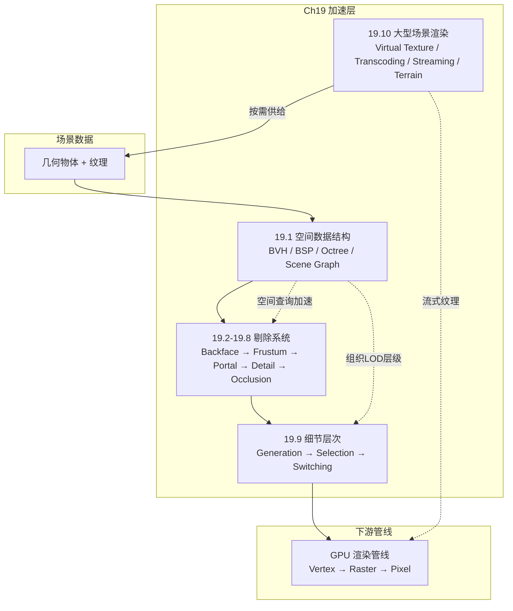

# 第19章 加速算法 综合摘要

> 本文档将《Real-Time Rendering 4th》第19章（加速算法）的核心内容梳理为一份结构清晰、语言通俗、公式保留、注重跨章连接的中文阅读指南。

---

## 全景俯瞰：第19章在渲染管线中的位置



第19章回答的核心问题：**面对数亿三角形的场景，如何只把"必须渲染"的几何体高效送进GPU？** 答案是三层漏斗——先用空间数据结构组织场景，再通过多层剔除滤掉不可见图元，最后对幸存者按重要性降级（LOD），超大世界再叠加流式传输。

---

## 第一部分：知识结构总览

```
空间数据结构(19.1) → 剔除技术(19.2-19.8) → LOD(19.9) → 大型场景渲染(19.10)
     ↓                    ↓                    ↓                ↓
  组织空间           滤掉不可见           降低复杂度         突破内存上限
 BVH/BSP/Octree     Backface/Frustum/    离散/混合/CLOD/    虚拟纹理/转码/
 Scene Graph/vEB     Portal/Detail/       地貌/Alpha/限时     Clipmap/Chunked LOD
                     Occlusion(HZB)
```

这是一条**从"组织"到"过滤"到"降级"到"流式"**的完整加速流水线。

---

## 第二部分：核心概念通俗解读

### 2.1 空间数据结构（§19.1）

空间的层次组织是几乎所有加速技术的基石。四种核心结构的对比：

| 结构 | 划分方式 | 是否空间细分 | 规则性 | 主要用途 |
|------|---------|------------|--------|---------|
| **BVH** | 包围几何体 | 否（包围物体而非空间） | 不规则 | **光线追踪、视锥体剔除** |
| **k-D树** | 轴对齐平面二分空间 | 是 | 不规则 | 相交测试、粗略排序 |
| **八叉树** | 三轴中点一次八分 | 是 | 规则 | 遮挡剔除、空间查询 |
| **场景图** | 按模型关系组织 | 否 | 不规则 | 动画、变换层次、实例化 |

#### BVH（层次包围体）

核心思想：**用简单几何体（球/AABB/OBB）包裹复杂物体，相交测试先在简单包壳上进行**。

- **$k$叉树**：$k=2$（二叉树）简单通用；$k=4$或$k=8$可降低树深度和间接引用数
- 平衡树高度约为$\lfloor\log_k n\rfloor$
- 光线相交查询：从根节点开始——未命中父BV则跳过整棵子树；命中则递归测试子节点，在遍历过程中用当前最近距离"剪枝"
- **动态场景**：物体移动后检查是否仍在其父BV内→是则保持，否则移除/重插或扩展父BV
- **时域包围体（temporal BV）**：对运动物体用包围其完整运动轨迹的BV，避免频繁更新

> **一句理解**：一个大盒子说"如果光线连我都没打到，更不可能打到我里面的小东西"——这就是BVH加速的本质。

#### BSP树（二叉空间划分树）

两类截然不同的形式：

**(1) 轴对齐BSP树（k-D树）**
- 用AABB包围场景，递归选取一个轴并用垂直平面将包围盒一分为二
- 平面位置可固定（均匀细分）或可变（非均匀细分，树更平衡）
- 遍历可提供**粗略从前到后排序**——对遮挡剔除和减少过度绘制极有价值
- 跨分割平面的物体可存储在本层、放入两子节点或分割为两半

**(2) 多边形对齐BSP树**
- 选择一个多边形所在平面作为分割器，将空间一分为二
- 跨分割的多边形沿交线劈成两半
- 最值钱的特性：**精确的前后遮挡顺序**——可用于画家算法（无需z-buffer）
- 构建昂贵，通常预计算后存储重用；曾经是《毁灭战士》等早期游戏的核心

#### 八叉树与松散八叉树

**八叉树**：同时沿三个轴在包围盒中心切割→8个子盒，递归执行。

- 比BSP树更规则→划分平面位置隐式已知→存储更紧凑→遍历访存更少
- 缺点：物体可能跨分割平面→需存储在多个叶子节点，编辑困难

**松散八叉树**（Ulrich）：将每个盒子的边长放大$k$倍（$k>1$）而中心保持不变。

- $k=2$时插入和删除为$O(1)$：已知物体大小即可确定能容纳它的级别
- 减少跨分割平面的物体→每个物体只存一个节点
- 非常适合动态场景，但BV效率略降
- 计算每个节点内物体的最小AABB后，松散八叉树实质上变成了BVH

#### 缓存无关的vEB布局（公式19.1）

**缓存感知**：知道缓存块大小（如64字节），针对性优化。Ericson用32 bit表示一个k-D树节点（30 bit存储分割值或指针，2 bit编码节点类型），一个64字节缓存块可装15个节点+1个控制节点。

**缓存无关（vEB布局）**：对所有缓存大小均友好的平台无关方案。核心思想——将树在高度一半$\lfloor h/2\rfloor$处切分，递归分解为越来越小的块，使缓存数据有效时间更长。定义如下：

$$
v(\mathcal{T})=\left\{\begin{array}{ll}\{\mathcal{T}\}, & \text { 如果 } \mathcal{T} \text { 中只有一个节点 } \\ \left\{\mathcal{T}_{0}, \mathcal{T}_{1}, \ldots, \mathcal{T}_{n}\right\}, & \text { 否则 }\end{array}\right.
\tag{19.1}
$$

#### 场景图与实例化

场景图是面向用户的树结构，节点可附带变换、材质、光源、LOD等。内部节点的变换会递归作用于其子树→**分层动画**。

多节点指向同一个子节点→**有向无环图（DAG）**→支持**实例化**（一个模型多处出现而不复制几何体）。空间化（spatialization）思想：场景图本身记录模型关系，另外构建BVH/BSP作为加速结构，两者共享叶子节点。

---

### 2.2 背面剔除（§19.3）

#### 单三角形背面剔除

三种等价测试：

| 方法 | 操作 | 判定条件 |
|------|------|---------|
| 屏幕空间 | 计算二维三角形带符号面积 | 面积为负→背面 |
| 观察空间 | 三角形法线·(相机−顶点) | 点积为负→背面（距离为正→正面） |
| 裁剪空间 | 计算行列式$d=|\mathbf{\bar v}_0,\mathbf{\bar v}_1,\mathbf{\bar v}_2|$ | $d\le 0$→背面 |

Blinn指出三者几何等价。屏幕空间测试通常更安全（浮点舍入误差可能导致倾斜三角形在屏幕空间变为稍微朝前）。

> **常见误解**：背面剔除并非总能减少一半三角形。室内场景的墙/地板/天花板大多朝前，地形中的绝大多数三角形也朝前——只有山丘峡谷等处才较理想。**平均收益远不到50%。**

#### 集群背面剔除——法线锥

用一个截锥体（法线$\mathbf{n}$+半角$\alpha$+锚点$\mathbf{c}$+截断距离）包含一组三角形的所有法线和空间位置。

**(1) 非截断法线锥——点背面测试**（假设几何体集中于点$\mathbf{c}$）：

$$
\mathbf{n} \cdot(\mathbf{c}-\mathbf{e})>\sin \alpha
\tag{19.2}
$$

条件成立→法线锥背对观察点$\mathbf{e}$→整组三角形可安全剔除。

**(2) 几何体分布在半径为$r$的球内时**：

$$
\mathbf{n} \cdot(\mathbf{c}-\mathbf{e})>\sin (\alpha+\beta)
\tag{19.3}
$$

其中$\sin\beta=r/\|\mathbf{c}-\mathbf{e}\|$。一次测试即可判定整组三角形的可见性。

**(3) Haar和Aaltonen的立方体掩码法**：在包围立方体的每个面上以$r\times r$像素划分，每个像素存$n$位掩码（$n$个三角形）。相机在立方体外时→查掩码立即知哪些三角形朝后。用于《刺客信条：大革命》。

---

### 2.3 视锥体剔除（§19.4）

**分层视锥体剔除**：从BVH根节点前序遍历，对每个节点的BV测试与视锥体的关系：

| 关系 | 操作 |
|------|------|
| BV完全在外 | **剪枝**——子树全部丢弃 |
| BV完全在内 | **立即渲染**——子树无需再测试视锥体 |
| BV与视锥体相交 | 递归遍历子节点，继续测试 |

**平面遮挡（plane masking）**：用位掩码记录BV完全位于哪些视锥体平面的内侧。子节点仅需与"尚未被完全包含"的平面对比，逐步减少每节点的测试平面数。可利用**时间一致性**——上一帧最后测试的平面，在下一帧优先测试。

> 有些游戏引擎只用线性BV列表（一物体一BV），便于SIMD和多线程——但在CAD等大部分场景在视锥体内的应用中，分层方案由于可"完全在内时立即绘制"而更优。

---

### 2.4 入口剔除（§19.5）

**建筑场景专用**。预处理将场景划分为单元格（房间），连接门/窗称为入口（portal）。邻接图记录单元格间的portal连通关系。

渲染过程：从观察者所在单元格开始→通过可见入口"缩小"视锥体→递归穿过更多入口→仅渲染穿过入口后可见的单元格内容。

**优化**：
- **帧号标记**：每个物体记录上次渲染的帧号，避免多入口通向同一房间时重复渲染
- **模板缓冲区**：入口的AABB高估实际门/窗范围——用stencil屏蔽实际入口外的渲染
- **裁剪矩形（scissor）**：进一步限定渲染区域
- 入口剔除也可用于**平面反射裁剪**（见第11章）

> 入口剔除本质上是一种**特殊的遮挡剔除**——墙壁是大遮挡物，入口定义可见锥。

---

### 2.5 细节剔除与小三角形剔除（§19.6）

#### 细节剔除（屏幕尺寸剔除）

将物体的BV投影到屏幕，以像素估算投影面积。低于用户定义阈值→丢弃该物体。通常在观察者运动时启用，停止时禁用以保质量。

#### 小三角形剔除（公式19.4）

在GPU计算着色器中，对三角形的屏幕空间AABB进行测试：

$$
\operatorname{any}(\operatorname{round}(\min )==\operatorname{round}(\max ))
\tag{19.4}
$$

若AABB的$x$或$y$坐标舍入到整数后相等→三角形不覆盖任何像素中心→可安全剔除。Wihlidal在寒霜引擎中应用了此方法。

---

### 2.6 遮挡剔除（§19.7）

**问题本质**：z-buffer能正确解决可见性，但被遮挡的物体仍然经历了光栅化和像素着色——白白浪费。10个排成直线的球体→深度复杂度为10→9次着色是徒劳的。

**算法分类**：

| 分类维度 | 类型 | 说明 |
|---------|------|------|
| 可见性基础 | 基于点（point-based） | 从单一视点判断；即通常渲染所用的 |
| | 基于单元格（cell-based） | 从空间区域判断；预处理后可跨帧复用 |
| 计算空间 | 图像空间 | 二维投影后测试；最常用 |
| | 物体空间 | 三维原始场景中测试 |
| | 光线空间 | 对偶空间中测试 |

**通用遮挡剔除算法**（伪代码思路）：
1. 维护遮挡表示$O_R$（初始为空）
2. 对通过视锥体剔除的物体，按粗略从前到后顺序处理
3. 每个物体先测试是否被$O_R$遮挡→是则丢弃
4. 否则渲染物体，并将其加入潜在遮挡物集合$P$
5. 当$P$足够大时，将$P$合并进$O_R$

> **小物体也能成为强遮挡物**——近处的火柴盒可遮挡远景的金门大桥。

#### GPU遮挡查询（§19.7.1）

GPU通过特殊渲染模式查询一组三角形（通常为物体的BV）在z-buffer中是否有可见像素。可见像素数$n=0$且BV不在近裁剪平面内→物体被完全遮挡→可剔除。

- `ANY_SAMPLES_PASSED`（OpenGL 3.3+/DX11+）：发现第一个可见片元即终止→更快
- `ANY_SAMPLES_PASSED_CONSERVATIVE`（OpenGL 4.3+）：可用粗深度缓冲区代替逐像素测试→更快但保守
- **断言/条件渲染**：遮挡查询与draw call的ID同时提交，GPU自动决定是否执行draw→消除CPU轮询延迟
- GPU查询是**异步**的→CPU可边发查询边做其他工作

**应用策略**：对最可能被遮挡的物体优先查询；可见物体降低查询频率（时间一致性）；隐藏物体每帧都查。

#### 层次Z缓冲（HZB）（§19.7.2）

核心思想：将z-buffer构建为**z金字塔**——每粗一级取对应$2\times2$区域的最远深度值（取最大值）。

**mip层级选择**（公式19.5）：

$$
\lambda=\min \left(\left\lceil\log _{2}(\max (l, 1))\right\rceil, n-1\right)
\tag{19.5}
$$

其中$l$为BV投影后的最长边（像素数），$n$为金字塔总层级数。目的是让投影BV最多覆盖$2\times2$个深度值，保证每次测试只需读4个值。

**遮挡测试流程**：
1. 用"最佳遮挡物"（最近$n$个物体/艺术家生成的遮挡网格/上一帧可见集）渲染并构建z金字塔
2. 将待测物体的BV投影到屏幕，按公式19.5选mip层级
3. 计算BV的最小深度$z_{min}$，与z金字塔中（最多）4个深度值比较→$z_{min}$更大则被遮挡
4. 若不明确，可用更精细层级继续测试；或借助存储最小深度的辅助z金字塔，用BV的$z_{max}$测试是否肯定可见

**双pass方法**（Haar和Aaltonen）：
- Pass 1：用上一帧的z金字塔剔除并渲染"可见"物体
- Pass 2：用Pass 1的深度构建新z金字塔，重测Pass 1中被剔除的物体→补偿因快速运动漏掉的物体→总是生成正确图像

**软件光栅化HZB**：Collin在CPU/SPU上用$256\times144$软件z-buffer光栅化艺术家遮挡网格，再用其剔除物体。Hasselgren等的**掩码层次深度缓冲区（MHDB）**每个$8\times4$ tile用每像素1 bit+两个$z_{max}$值表示（总3 bit/像素），在软件光栅化三角形的同时进行遮挡测试和缓冲区更新。

---

### 2.7 剔除系统（§19.8）

现代剔除系统在**多粒度**上同步运作：

```
物体级(Object) → Cluster级(64-256三角形) → 三角形级(Triangle)
   ↓                  ↓                         ↓
视锥体+遮挡+细节   同上+集群背面剔除        视锥体/背面/退化/
                                              小三角形/可能的遮挡
```

**GPU驱动的三角形剔除管线**（见图19.25）：
1. 计算着色器对所有三角形执行多种剔除测试
2. 幸存三角形**压缩**为紧凑列表
3. GPU用**间接绘制命令（indirect draw）**渲染压缩后的列表——无CPU/GPU往返

寒霜引擎（Wihlidal）、《刺客信条：大革命》（Haar和Aaltonen）、角色AI（Shopf等）均采用了GPU端剔除+LOD管理的方案。

---

### 2.8 LOD细节层次（§19.9）

LOD三段论：**生成（Generation）→ 选择（Selection）→ 切换（Switching）**。

#### LOD的生成

- **网格简化**（第16章边坍缩/QEM）：自动生成不同细节级
- **人工建模**：艺术家手动制作各LOD
- **纹理降级**：低LOD同时使用低分辨率纹理
- **着色器降级**：远处使用简化光照模型
- **广告牌/impostor**：极远处用2D代理
- **多技术接力**（皮毛渲染为例）：近→真实几何体 → 中→alpha混合折线 → 中远→体积纹理壳 → 远→纹理贴图

#### LOD切换方法

| 切换方式 | 原理 | popping程度 | 额外成本 |
|---------|------|------------|---------|
| **离散几何LOD** | 直接替换不同三角形数的静态网格 | **最严重** | 零额外 |
| **混合LOD** | 短时间内线性混合两LOD（旧淡出、新淡入） | 平滑 | 过渡期渲染两个模型 |
| **Alpha LOD** | 物体透明度随距离逐渐增加至完全消失 | 连续无popping | 物体始终在渲染直到完全消失 |
| **CLOD（连续LOD）** | 边坍缩/顶点分裂动画化→三角形数逐帧增减 | 几乎无popping | 模型动态变化，难以GPU并行化 |
| **地貌LOD（Geomorph）** | 高LOD顶点向其低LOD对应位置插值过渡 | 平滑 | 所有顶点都需插值 |
| **分数曲面细分** | 曲面细分因子可为浮点数 | 平滑 | 需要硬件曲面细分支持 |

#### LOD选择

**(1) 基于范围**：不同LOD对应不同距离区间。为解决边界附近的循环切换（hysteresis），在阈值附近引入**延迟切换**——距离增大用一行阈值，距离减小用更宽松的另一行。

**(2) 基于投影面积**——球体估计（公式19.6）：

$$
p=\frac{n r}{\mathbf{d} \cdot(\mathbf{c}-\mathbf{v})}
\tag{19.6}
$$

投影面积$\approx\pi p^2 w h$（$w\times h$为屏幕分辨率）。距离加倍→投影尺寸减半。

**(3) 几何平均值辅助选择**（公式19.7）：

$$
g=\sqrt[n]{t_{0} t_{1} \cdots t_{n-1}}
\tag{19.7}
$$

用三角形大小的几何平均值（而非算术平均）预计算首次切换距离——大量小三角形的模型更早切换到低LOD，避免四边形过度渲染造成的性能损失。

**(4) 其他因素**：物体重要性、运动状态、用户注视焦点（VR眼动追踪）、可见度（被树叶遮挡→可用更低LOD）、纹理颜色感知指标等。

#### 限时渲染（§19.9.3）

硬实时系统必须在规定时间内（如16ms）完成渲染。Funkhouser和Sequin的启发式算法：

**目标函数**——在成本不超预算的前提下最大化总效益：

$$
\sum_{S} \operatorname{Benefit}(O, L) \quad\text{最大化，同时满足}\quad \sum_{S} \operatorname{Cost}(O, L) \leq T
\tag{19.8, 19.9}
$$

其中$S$为视锥体内物体集合，$T$为目标帧时间。

- 为每个物体定义最低LOD（零三角形）→允许完全不渲染不重要物体
- 问题本质是NP完全→用**贪心算法**近似：按$\text{Value} =\text{Benefit}/\text{Cost}$降序选择→至少是最优解的一半好
- 时间复杂度$O(n\log n)$，可利用帧间一致性加速

---

### 2.9 大型场景渲染（§19.10）

#### 虚拟纹理（§19.10.1）

**核心思想**：分配巨大的"虚拟纹理"（可达$128\text{k}\times128\text{k}$≈64 GB），但GPU物理内存中只驻留当前可见的tile（通常64 KB/块）。

```
虚拟mipmap金字塔 → 页表翻译 → 物理纹理内存（仅当前需要的tile）
```

**反馈渲染（feedback rendering）**：用一个低分辨率pass（或z-prepass）记录每个片元需要访问哪些纹理tile→CPU分析→加载缺失tile、解除不再需要的tile的映射。

**放宽mipmap**：如果低分辨率mipmap tile尚未加载，先用更粗糙的mipmap层级放大过渡，加载完成后平滑混合。

**《毁灭战士（2016）》**：Barb的方法——离线预计算每种材质在标称分辨率下覆盖玩家周围的立体角，运行时动态调整每个mipmap层级的重要性度量。

#### 纹理转码（§19.10.2）

磁盘上用高压缩比格式（如JPEG的变体Malvar→60:1），加载到内存后解码，再压缩为GPU硬件支持的格式（如BCn/ETC）。

- **crunch/basis库**：将已压缩纹理再压缩→每个纹素1-2 bit，可快速转换为各种GPU压缩格式
- 转码系统的优势：磁盘占用小（可变压缩比） + GPU端访问快（硬件解压格式）
- 法线贴图用YCoCg变换后压缩比可达$40:1$

#### 通用流式传输（§19.10.3）

将游戏世界用正多边形（三角形/正方形/六边形）平铺→每个tile关联所有资产（模型、纹理、AI、粒子）。观察者在深蓝色tile时，其邻居tile的资产被加载到内存。

#### 地形渲染（§19.10.4）

**(1) 几何Clipmap**：类似纹理clipmap——地形高度采样被过滤成金字塔。观察者周围$n\times n$样本缓存在内存，窗口随观察者移动。层级间用过渡区域插值→避免裂缝。顶点着色器从顶点纹理采样获取高度。Asirvatham和Hoppe的GPU实现在远处叠加分形噪声位移。

**(2) 分块LOD（Chunked LOD）**（Ulrich）：每个精细LOD被分割为父LOD的4倍→四叉树组织。遍历时按屏幕空间误差选择渲染的LOD级别：

$$
s=\frac{\epsilon w}{2 d \tan \frac{\theta}{2}}
\tag{19.10}
$$

其中$\epsilon$为几何误差（Hausdorff距离），$w$为屏幕宽度，$d$为相机到tile距离，$\theta$为水平视场角。

- 当$s$低于像素误差阈值$\tau$→渲染当前节点；否则递归访问四个子节点
- **裂缝修复**：相邻不同LOD tile边缘的裂缝，用额外带状几何修复；或限制相邻tile LOD差异不超过一级（受限四叉树），预先计算所有可能的过渡索引缓冲区

**(3) Strugar的无裂缝方案**：逐顶点变形+单独LOD选择，在顶点着色器中通过插值消除裂缝，无需额外几何或屏幕空间pass。

**(4) 地形数据压缩**：预测编码+残差编码+有损量化→GPU解压→压缩比从$3:1$到$12:1$。

---

## 第三部分：与前后章节的关键连接

### 与第22章（相交测试方法）的关系
- 第19章定义了BVH/BSP/八叉树等结构→**第22章提供BV-视锥体/BV-光线/BV-BV的具体相交公式**
- 法线锥的构造依赖第22章的最小包围圆/球算法
- OBB与视锥体的相交测试（19.4中提及的更精确替代方案）的细节在22章

### 与第16章（多边形技术）的关系
- 第16章的**网格简化（QEM/边坍缩）**直接生成第19章的LOD模型
- 第16章的**顶点缓存优化**提升第19章剔除后幸存三角形的渲染效率
- 第16章的**合并/定向/法线平滑**是构建有效BV和法线锥的前提

### 与第23章（图形硬件）的关系
- **Early-Z与HiZ**（23.7）：第19.7.2的HZB是GPU硬件z-culling（23.7）的理论基础
- **遮挡查询的延迟**（23.3）：为什么断言/条件渲染对GPU遮挡查询至关重要（23.3中详细解释流水线气泡）
- **HTILE**（23.10.3）：AMD GCN的HTILE结构用于加速z金字塔构建（19.7.2中提及）

### 与第18章（管线优化）的关系
- **GPU驱动的剔除**（19.8）与**多重间接绘制/间接执行**（18.4.2的实例化渲染API）紧密协作
- **四边形过度渲染**（18.2）是小三角形剔除（19.6）和LOD几何平均值选择（19.9.2）的纠正目标

### 与第20章（高效着色）的关系
- 第19章确保只有可见几何体进入管线→第20章对进入管线的几何体进一步优化着色计算
- **深度预pass（z-prepass）**（20章技术）可作为第19章反馈渲染和z金字塔构建的数据来源

### 与第25章（碰撞检测）的关系
- 相同的空间数据结构（BVH/BSP/八叉树）第19章用于渲染剔除，第25章用于物理碰撞→**数据结构代码可复用**
- 屏幕外的物体可降低物理计算精度→第19章的剔除结果直接服务于第25章的性能优化

---

## 第四部分：关键公式速查

| 公式编号 | 内容 | 用途 |
|---------|------|------|
| 19.1 | vEB布局递归定义 | 缓存无关的树节点内存排序 |
| 19.2 | $\mathbf{n}\cdot(\mathbf{c}-\mathbf{e})>\sin\alpha$ | 法线锥点背面测试（几何体集中于$\mathbf{c}$） |
| 19.3 | $\mathbf{n}\cdot(\mathbf{c}-\mathbf{e})>\sin(\alpha+\beta)$ | 法线锥点背面测试（几何体在半径$r$球内） |
| 19.4 | $\operatorname{any}(\operatorname{round}(\min)==\operatorname{round}(\max))$ | 小三角形剔除判定 |
| 19.5 | $\lambda=\min(\lceil\log_2(\max(l,1))\rceil,n-1)$ | HZB mip层级选择 |
| 19.6 | $p=n r/(\mathbf{d}\cdot(\mathbf{c}-\mathbf{v}))$ | 球体投影半径估计（LOD选择） |
| 19.7 | $g=\sqrt[n]{t_0 t_1\cdots t_{n-1}}$ | 三角形大小几何平均值（LOD选择辅助） |
| 19.8 | $\max\sum_S\text{Benefit}(O,L)$ | 限时渲染——最大化总效益 |
| 19.9 | $\sum_S\text{Cost}(O,L)\le T$ | 限时渲染——成本约束 |
| 19.10 | $s=\epsilon w/(2d\tan(\theta/2))$ | 分块LOD屏幕空间误差公式 |

---

## 第五部分：实际应用速查

| 技术 | 哪些游戏/引擎在用 |
|-----|-----------------|
| BVH | 所有现代光线追踪引擎（DXR/Vulkan RT/ OptiX） |
| BSP树（多边形对齐） | 经典：《毁灭战士》《雷神之锤》的渲染核心 |
| 松散八叉树 | 动态物体管理、物理引擎 |
| vEB布局/cache-friendly树 | 光线追踪加速结构的低层级优化 |
| 场景图+DAG实例化 | 几乎所有3D引擎（Unity/Unreal/Godot）；glTF节点层次 |
| 法线锥集群背面剔除 | 各AAA引擎的GPU端剔除系统 |
| 分层视锥体剔除+平面遮挡 | 所有现代渲染引擎的标准配置 |
| 入口剔除 | 建筑可视化；《半条命》《传送门》系列 |
| GPU遮挡查询（断言渲染） | 所有支持DX11+/OpenGL 3.3+的引擎 |
| HZB遮挡剔除 | 《刺客信条：大革命》；寒霜引擎；Frostbite系列 |
| 软件光栅化MHDB | Neu Rungholt场景渲染（Hasselgren等） |
| GPU多级剔除+间接绘制 | 寒霜引擎（Wihlidal）；《刺客信条：大革命》 |
| 离散LOD+混合切换 | 绝大多数AAA游戏的静态场景物体 |
| CLOD/Geomorph LOD | 部分地形和角色LOD系统 |
| Alpha LOD/点阵剔除半透明 | 植被淡出（Whatley）；Unity/Unreal |
| 限时LOD贪心调度 | VR应用；主机游戏帧率保障 |
| 极限法线+位移插入 | SpeedTree |
| Impostor+多技术LOD接力 | 植被皮毛渲染管线 |
| 虚拟纹理（megatexture） | 《狂怒》《毁灭战士（2016）》；寒霜引擎；id Tech |
| 虚拟纹理+反馈渲染 | 《毁灭战士（2016）》（Barb）；id Tech引擎 |
| 纹理转码（crunch/basis） | glTF生态；Web端3D传输；移动游戏 |
| 几何Clipmap | 《巫师3》（Gollent变体）；谷歌地球；Cesium |
| 分块LOD（Chunked LOD） | Cesium开源引擎；《文明5》（Kloetzli） |
| 受限四叉树地形 | Cesium（Andersson）；《寒霜2》引擎 |
| GPU地形解压 | Lindstrom和Cohen的流式编解码器 |
| 投影到相机空间的均匀海洋网格 | 《神秘海域3》水面；Bowles的海洋渲染 |

---

## 第六部分：核心要点速记

### 十个关键takeaway

1. **"没有足够的处理能力"是持久战**。分辨率（4k→8k）、帧率（60→120+）、着色复杂度、几何复杂度四个维度的需求增长远超摩尔定律——加速算法不是可选的优化，而是渲染系统的必需品。

2. **空间数据结构是加速的根**。BVH/BSP/八叉树/场景图的选择取决于：场景是静态还是动态、查询是光线相交还是可见性测试、硬件缓存特性如何。没有"最佳"只有"最合适"。

3. **缓存布局的影响经常被低估**。vEB布局或Yoon等人的概率聚类可以让相同的遍历算法获得大幅度性能提升——只因改变了节点在内存中的排列顺序。

4. **法线锥让背面剔除从三角形级跃升到cluster级**。一次公式19.2/19.3测试即可判定整组三角形是否全部朝后。Haar和Aaltonen的立方体掩码法进一步将其简化到查表操作。

5. **"从前往后排序"是遮挡剔除的第一性原理**。无论是BSP树的粗略排序、还是CPU软件光栅化器的排序遍历——先渲染离相机近的物体→建立深度的"阻挡墙"→后续物体更容易被提前剔除。

6. **HZB是现代遮挡剔除的实用标准**。完整的原始HZB（八叉树+动态z金字塔更新）开销过大，但简化版——预渲染最佳遮挡物构建z金字塔+公式19.5选mip层级+$2\times2$深度比较——在GPU和CPU上均高效实用。

7. **GPU驱动的多层次剔除正在成为主流**。物体级→cluster级→三角形级，结合间接绘制命令，可以在完全没有CPU往返的情况下完成全流程剔除——Shopf、Haar和Aaltonen、Wihlidal的方案代表了这一趋势。

8. **LOD选择不仅是距离和投影面积**。几何平均值（公式19.7）让小三角形密集的模型更早降级；限时渲染（公式19.8/19.9）将LOD提升到全局优化框架；眼动追踪和用户注意力焦点是未来的方向。

9. **虚拟纹理+转码+流式是超大世界的标准方案**。128k×128k纹理→只有当前可见的tile在GPU显存中；磁盘上60:1压缩→加载解码→压缩为GPU格式；配合几何流式tile→突破内存上限。

10. **地形渲染的永恒敌人是裂缝**。几何Clipmap用层级间过渡区域插值，Chunked LOD用Hausdorff距离+屏幕空间误差（公式19.10）控制切换时机，Strugar用逐顶点变形——三套方案的核心目的都是让不同LOD之间的交界无缝。

---

## 第七部分：Ch19在全书中的独特位置

```
Ch1-2  渲染管线基础
Ch3    GPU硬件
Ch4    数学变换
  ↓
Ch16   多边形处理（生产三角形）
Ch17   曲线曲面（生产三角形）
  ↓
【Ch19 加速算法】← 决定哪些三角形真正需要被渲染
  ↓
Ch18   管线优化（如何高效发送）
Ch20   高效着色（如何高效着色幸存三角形）
Ch22   相交测试（提供BV相交的具体公式）
Ch23   图形硬件（实现HZB/遮挡查询的硬件支持）
  ↓
Ch21   VR/AR（对帧率和延迟的极致要求→更需要加速算法）
Ch25   碰撞检测（复用相同的空间数据结构）
Ch26   实时光线追踪（复用BVH进行光线-场景相交）
```

Ch19是全书**唯一专注于"减少工作量"而非"提高工作效率"的章节**——它决定哪些三角形根本不值得进入管线。其他章节关心"怎么画得又快又好"，这一章关心"把不该画的提前扔掉"。

