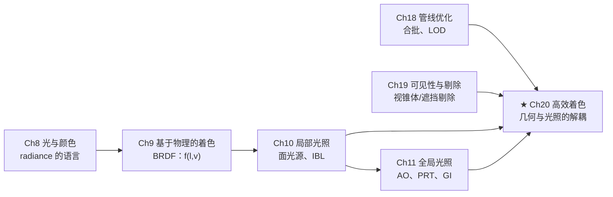
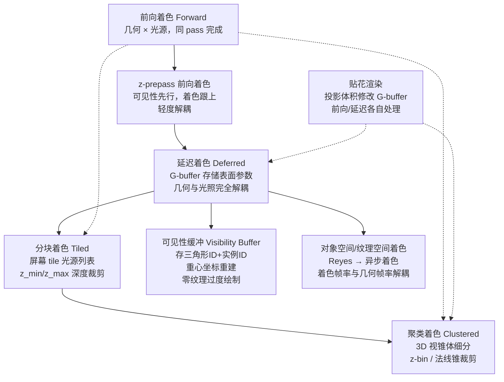
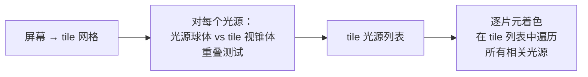
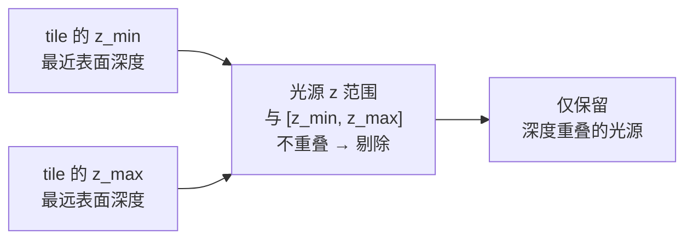
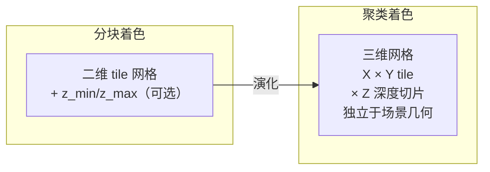
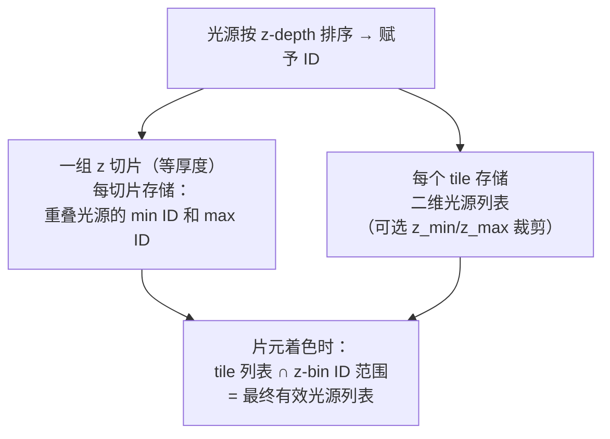
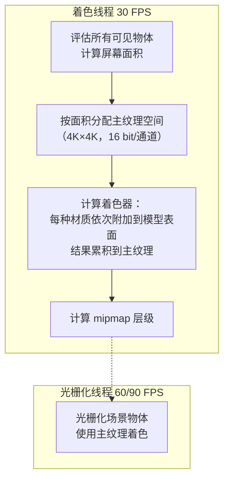

# 第20章 高效着色

> RTR4 第20章。当光源和材质激增到前向渲染无法承受——从延迟着色到可见性缓冲，在计算与带宽之间权衡的进化史。

---

## 本章在全书中的位置

Ch18 处理"画哪些图元"，Ch19 处理"哪些图元可见"，Ch20 回答核心问题：**确定了可见图元后，如何在成百上千个光源和复杂材质下高效着色？** 本章是 Ch10-11 光照理论在工程效率维度上的展开——当光源从个位数暴增到上万，必须重新设计管线的数据流。

---

## 知识结构：着色管线的演化路径

**核心趋势**：每一步都在**进一步解耦**——几何与光照解耦（延迟着色），光源与像素解耦（分块/聚类），纹理访问与光栅化解耦（可见性缓冲），着色帧率与几何帧率解耦（纹理空间着色）。每一次解耦的目标都是：在计算能力和带宽之间找到新的平衡点。

---

## 20.1 延迟着色：革命性的解耦

### 核心思想

前向着色中，每个三角形进入管线，着色器同时处理材质参数检索和光照计算。z-prepass 是第一步解耦——先确定可见性，再对着色。**延迟着色将这一逻辑推到极致**：第一个几何 pass **只提取和存储表面参数**到 G-buffer 中，后续 pass 中**完全不再需要几何体**。

### G-buffer：表面的"身份证"

G-buffer（几何缓冲区）存储完成后续光照计算所需的一切：

| 典型内容 | 通道数 | 用途 |
|----------|--------|------|
| 深度 z-depth | 1 × 24/32 bit | 位置重建 |
| 法线 | 2~3 分量 | 光照计算 |
| 反照率 / 纹理颜色 | 3 × 8 bit | 漫反射基底 |
| 粗糙度 | 1 × 8 bit | 镜面波瓣宽度 |
| 金属度 | 1 × 8 bit | $F_0$ 确定 |
| 材质 ID 或遮罩 | 1 × 8 bit | 材质变体选择 |
| GI 法线偏置 | 1 × 8 bit | 环境遮挡补偿 |

典型系统使用 3~5 个渲染目标（RT），极端系统可达 8 个 [134]。每个 G-buffer 占用带宽，带宽可能成为性能瓶颈。

### 光源体积优化

基本延迟着色效率极低——每个光源逐像素访问 G-buffer。改进步骤：

1. **屏幕空间包围框**：为光源球体计算屏幕空间矩形 → 只处理覆盖区域的像素
2. **球体网格光栅化**：绘制代表光源体积的粗糙球体网格，利用 z-test 剔除被遮挡的光源
3. **深度重叠测试**：球体的 $z_{min}^{light}$ / $z_{max}^{light}$ 与 G-buffer 中的最近表面比较——不重叠则跳过

**关键问题**：光线在某个像素上的贡献仅当光源体积的前后深度与表面深度交叉时才存在。

### 优势

| 维度 | 前向着色 | 延迟着色 |
|------|---------|---------|
| 着色器复杂性 | 必须覆盖材质 × 光源组合 | 提取 pass 极简，光照 pass 专用 |
| 寄存器压力 | 高（所有功能在一个着色器） | 低（短着色器，高占用率） |
| 着色器切换 | 频繁（不同材质/光源组合） | 少（材质提取一次完成） |
| 阴影贴图管理 | 所有阴影贴图同时驻留 | 逐光源处理，每次一个阴影贴图 |
| 过度绘制成本 | 昂贵（每个丢弃片元都完整着色） | 便宜（提取参数远轻于完整着色） |
| 四边形浪费 | $2\times2$ 四边形中无效像素仍完整着色 | 提取成本低，浪费小 |

### 核心缺陷

**1. 透明度**：G-buffer 每个像素只能存储一个表面。解决：不透明表面延迟着色 + 透明表面前向着色。或使用逐像素透明表面链表 [1575]（纯延迟方式，但复杂）。

**2. MSAA 抗锯齿**：前向渲染中 $N\times$ MSAA 只需每像素 $N$ 个深度+颜色样本。延迟着色若同样处理 → 内存 × N、填充率 × N、计算 × N，成本不可接受。替代方案：
- **边缘检测**：只对边缘像素执行多样本着色 [1631]
- **时域抗锯齿 TAA**：不依赖 G-buffer MSAA [1387]
- **模板标记**：标记需要多样本处理的像素 [1681]
- **计算着色器流式处理**：将边缘像素紧凑打包到线程组内存 [1407]
- **Crassin 方法**：深度+法线 prepass → 相似子样本分组 → 统计分析每组最优值 → 针对组着色 [309]（高质量但不实时）

**3. 材质多样性**：基础延迟着色只支持单一材质。解决：
- 在 G-buffer 中存储材质 ID 或遮罩 → 着色器根据 ID 分支 [414, 667, 992, 1064]
- 同一 G-buffer 字段按材质类型重载含义（32 bit 对材质A存储副法线，对材质B存储混合因子）
- 代价：着色器变复杂，占用率下降

### G-buffer 压缩

带宽是延迟着色的阿喀琉斯之踵。压缩策略：

**《彩虹六号：围攻》G-buffer 布局**（图20.3）：

| RT | 内容 |
|----|------|
| RT0 | RGB：反照率，A：GI 法线偏置 |
| RT1 | RGB：世界空间法线（八面体编码），A：天空可见性 |
| RT2 | RGB：自发光，A：粗糙度 |
| RT3 | R：金属度，G：材质 ID，B：曲率，A：AO |

**八面体法线映射**：将单位球面法线投影到八面体→正方形纹理，仅需 2 分量编码世界空间法线。解码简单、精度高、无奇点——是工业标准 [1394]。

Pesce [1394] 比较了压缩屏幕空间坐标 vs 压缩世界空间法线的权衡。Shishkovtsov [1631] 使用 YCbCr 编码反照率来降低存储成本。

### 光照 Prepass 变体

传统延迟着色存在大量中间方案（光照 prepass / 预照明 / L-buffer）：

核心思想：将渲染方程中的常量项分解出来，先按光源累积漫反射和镜面强度 → 存储到 L-buffer → 最后一次性乘以纹理颜色。

$$L_o = \mathbf{c}_{diff} \cdot \sum L_{diff}^k + \sum L_{spec}^k$$

- 每个光源只访问少量 G-buffer 数据（不需检索纹理颜色）
- 叠加混合（additive blending）写入输出缓冲区
- 局限：基于物理的材质需要存储 $F_0$ 计算菲涅尔 → 更倾向于完整的 G-buffer [1589]

---

## 20.2 贴花渲染：投影体积的艺术

### 贴花的本质

贴花是将设计元素（图片/纹理）应用到表面上的技术——轮胎印、弹孔、玩家标签、logo 等。它可以：
- 仅修改颜色（如纹身，不改变凹凸贴图）
- 部分替代凹凸贴图（如浮雕 logo）
- 定义完全不同的材质（如车窗贴纸）
- 跨越多个模型（如地铁车厢涂鸦）

### 投影体积方法

**工业标准做法**：将贴花视为通过有限体积的正投影纹理 [447, 893, 936]。

可以使用定向包围盒、体积纹理或模板 bit 选择性应用。

### 延迟着色中的贴花：完美契合

延迟着色让贴花渲染大幅简化——贴花效果直接修改 G-buffer：
- 轮胎印 → 修改 G-buffer 中对应位置的法线
- **之后的光照计算自动应用这些修改**，无需额外 pass
- 避免了前向着色中"贴花 pass 的过度绘制 × 光源数量"的爆炸

这正是寒霜 2 引擎从前向切换到延迟着色的主要因素之一 [43]。

### 贴花的难点

| 问题 | 描述 |
|------|------|
| 混合操作限制 | 延迟着色中仅能使用合并阶段的混合操作 [1680] |
| 法线贴图混合 | 材质的法线贴图 + 贴花的法线贴图 → 可能产生黑白条纹瑕疵（§6.5） |
| mipmap 梯度误差 | 屏幕空间反向投影到世界空间 → 轮廓边缘梯度不准 → 限制/忽略贴花 mipmap [1920] |
| 凹凸纹理过滤 | 符号距离场等技术可精准分割材质，但可能产生锯齿 [263, 580] |

### 聚类前向着色中的贴花突破

《DOOM（2016）》[294, 1682] 将贴花像光源一样插入聚类单元格：
- 前向着色器中遍历所在单元格的所有贴花
- **混合操作不受合并阶段限制**——可以使用任何想要的混合方式
- 贴花也可以渲染到**透明表面**上
- 着色时应用该单元格所有相关的光源

这弥补了延迟着色相比前向着色的主要优势，同时保留了前向渲染的 MSAA 和透明度优势。

---

## 20.3 分块着色：一张列表，一次调用

### 核心创新

**Balestra & Engstad（2008）**为《神秘海域》提出：将屏幕划分为方形 tile（如 $32\times32$ 像素），为每个 tile 构建一个可能影响该 tile 的光源列表。在着色时，**tile 中的所有片元在单次着色器调用中访问同一个光源列表**，而不是像基本延迟着色那样：为每个光源单独调用一次着色器，每次都读写 G-buffer。

### 分块延迟着色（Tiled Deferred）

在建立 G-buffer 之后，计算着色器按 tile 分类光源 → 全屏四边形或计算着色器应用光源列表。

**单次着色的优势**：

- G-buffer 每个像素**只读一次**（vs 每个光源读一次）
- 输出缓冲区**只写一次**（vs 每个光源累加一次）
- 常量项（如漫反射颜色）**只计算一次**
- tile 内所有片元评估**相同的光源列表** → GPU warp 执行一致性（无分支发散）
- 透明物体可复用相同的光源列表
- 单 pass 累积 → 帧缓冲精度要求降低

### 深度边界裁剪（z-bounds Culling）

z-prepass 不仅避免过度绘制，还为每个 tile 提供 $z_{min}$ 和 $z_{max}$ 几何深度边界 [43, 1701, 1768]。

**深度不连续性问题**（图20.8）：附近角色 + 远处山脉 → $z_{min}$ 到 $z_{max}$ 覆盖整个视锥体 → 几乎无法剔除任何光源。这是分块着色的最大弱点。

**HalfZ（双峰聚类）**[992, 1701, 1768]：在 $z_{min}$ 和 $z_{max}$ 之间取中点，将光源分为更近、更远、全范围三类。

**2.5D 剔除（Harada）**[666, 667]：将深度范围分割为 $n$ 个单元格（$n=32$）：

- 创建几何位掩码：存在于该单元格中的所有几何体 → bit = 1
- 创建光源位掩码：光源覆盖的单元格 → bit = 1
- **几何位掩码 & 光源位掩码 = 0 → 光源不影响 tile 中任何几何体**

Stewart & Thomas [1700] 的基准测试：
- 光源 < 512 个：基础分块延迟着色最优
- 512~2300 个光源：HalfZ 开始占优
- > 2300 个光源：2.5D 剔除开始占优（但不显著）

### 光源/视锥体相交测试

tile 视锥体又长又细且不对称 → 简单球体/视锥体测试产生大量假阳性（图20.7）。

**改进方法**：
- 视锥体平面测试后，再测试球体/包围盒 [1701, 1768] → 大幅减少假阳性
- 投影球体替代测试（Mara & McGuire [1122]）
- 聚光灯不适用于投影球体法 → 需分层剔除、光栅化或代理几何体 [1968]

### 分块前向着色（Forward+）

在 z-prepass 之后，使用计算着色器按 tile 分类光源 → 第二个几何 pass 执行前向着色，每个片元根据屏幕位置查询 tile 光源列表。

**Forward+ vs Tiled Deferred 对比**（Pettineo [1401] 开源测试套件）：

| 条件 | 优胜者 |
|------|--------|
| 无 MSAA，光源增至 1024 | 延迟着色（多数 GPU） |
| MSAA 开启 | 前向渲染（MSAA 几乎无额外开销） |
| 小三角形（四边形浪费） | 延迟着色 |
| 透明度 | 前向渲染 |

Forward+ 已在《教团：1886》[1267, 1405] 等游戏中使用。

### 着色器特化

tile 中所有像素的材质位掩码按位或 → 确定 tile 需要的最小着色器功能集。位掩码按位与 → 确定所有像素的共同特征（无需 if 测试）。为 tile 生成满足这些要求的特化着色器 [273, 414, 1877] — 指令减少 + 寄存器减少 + 占用率提升。

---

## 20.4 聚类着色：三维细分

### 从二维到三维

分块着色按 $xy$ 屏幕空间 + 可选的 $z$ 深度边界 → **聚类着色直接将视锥体划分为三维单元格**。

### 指数深度切片

$x,y$ 均匀细分 + $z$ **指数细分** → 聚类更接近立方体而非长薄片 [1328, 1329]。例如：《正当防卫3》使用 64×64 tile + 16 深度切片；虚幻引擎使用类似 tile 大小 + 32 深度切片 [38]。

**优势**：
- 对相机移动的稳定性远高于分块着色（分块着色中一条街上的一排路灯偶然对齐一个 tile → 相机微移导致列表大幅变化）
- 深度不连续的 tile 不再成为问题
- 单个列表中的光源数量更少
- **不依赖场景几何的预处理**（虽然可有）

### 优化技术

| 技术 | 说明 |
|------|------|
| **法线锥剔除** | 将表面法线分类为 6 面 × 3×3 = 54 方向；剔除聚类中所有表面背后的光源 [1328, 1329] |
| **稀疏聚类** | 从 z-prepass 确定哪些聚类包含几何体 → 只处理非空聚类 |
| **紧密 AABB** | 聚类中几何体实际只占小部分 → 用紧密 AABB 进一步裁剪光源 [1332] |
| **远裁剪平面** | 为光源聚类设置最大距离 → 远处光源降级为粒子/光晕/烘焙 [293, 432, 1768] |
| **近裁剪偏移** | 强制设置近裁剪平面到合理距离 → 近距离光源归类到第一片 [1387] |

高度优化的聚类系统可处理 **100 万个以上的光源**，对少量光源同样高效。

### 光源网格构建方法

**CPU 端**：光源球体/包围盒与聚类 AABB 重叠测试——简单快速。可在 CPU 上并行，因为不依赖场景几何 [390, 1387]。

**GPU 壳+填充**（Ortegren & Persson [1340]）：
1. **壳 pass**：保守光栅化每个光源到一个低分辨率网格 → 记录重叠的最小/最大聚类
2. **填充 pass**：计算着色器将光源加入包围体之间的每个聚类链表

使用网格而非包围球 → 为聚光灯提供更紧密的边界表示。场景几何可以直接遮挡光源 → 进一步剔除。

**烘焙光源网格**（Drobot，《使命召唤：无限战争》[385]）：
- 静态聚光灯的阴影贴图 → 转换为低分辨率网格 → 作为光源的有效体积
- 比原始圆锥体重叠更少的聚类 → 更精确的光源分类

### z-bin 方法：存储革命

不对每个三维聚类存储光源列表，而是 [385]：

**优势**：不需要为每个三维聚类存储完整光源列表 → 存储量和带宽大幅减少。代价：每个像素需要多做一次交集计算。Drobot 发现人造环境（《使命召唤》系列）中，$xy$ 和 $z$ 重叠同时发生的情况很少 → 近乎完美的剔除效果。

### 表20.1 总结

| | 单 pass 前向 | 单 pass 延迟 | 分块延迟 | 聚类延迟 | 分块前向 | 聚类前向 |
|---|---|---|---|---|---|---|
| 过度绘制成本 | 高 | 低 | 低 | 低 | 中 | 中 |
| 透明度支持 | 好 | 差 → | 差 → | 差 → | 好 | 好 |
| MSAA 支持 | 好 | 差 | 差 | 差 | 好 | 好 |
| 小三角形效率 | 差 | 好 | 好 | 好 | 差 | 差 |
| 多材质着色器 | 简 | 复杂 | 复杂 | 复杂 | 中 | 中 |
| 寄存器压力 | 高 | 中-低 | 中 | 中 | 中-高 | 中-高 |

---

## 20.5 延迟纹理与可见性缓冲：计算换带宽

### 问题：G-buffer 的隐形成本

延迟着色虽然避免了材质与光照的耦合，但**建立 G-buffer 时仍有过度绘制**。每个被随后遮挡的表面都浪费了：
- 纹理采样带宽
- 顶点数据读取带宽
- G-buffer 写入带宽

GPU 计算能力的增长速度 > 带宽增长速度 → **未来方向是用计算换带宽**[217, 1332]。

### 虚拟延迟纹理化（《刺客信条：大革命》）

Haar & Aaltonen [625] 仅存储 **64 bit 的 G-buffer**：
- 16 bit $(u, v)$ 纹理坐标（13 bit 区分 8192 个位置 + 3 bit 亚纹素精度）
- 32 bit 切线基底（编码为四元数 [498]，§16.6）
- 无纹理访问、无法线、无颜色存储

G-buffer 建立后 → 着色时访问虚拟 $8192×8192$ 纹理图集（由 $128×128$ tile 组成）
→ 材质 ID 由纹素所在的图集 tile 位置隐式确定。

**mipmap 梯度**不存储，而是运行时检查相邻像素的 $(u, v)$ 值动态计算。

**四分之一分辨率 MSAA**：利用 GCN 的 4× MSAA 网格采样模式，使每个 MSAA 样本正好对应全屏像素中心 → 以四分之一分辨率渲染，$(u, v)$ 和切线基底无精度损失地跨表面插值。树叶等严重过度绘制场景 → 显著减少着色器调用和 G-buffer 带宽。

### 可见性缓冲（Visibility Buffer）

**Burns & Hunt [217] 的极端方案**：第一个几何 pass 只存储两个 ID：

| 字段 | bit 宽 | 含义 |
|------|--------|------|
| 三角形 ID | 16-32 bit | 识别具体三角形 |
| 实例 ID | 16-32 bit | 识别实例化模型 |

**零纹理访问的几何 pass** → 着色器极快 → 过度绘制成本极低。

延迟着色 pass 时：
1. 从屏幕像素发射观察射线
2. 射线与三角形相交 → 计算重心坐标
3. 用重心坐标插值三角形的顶点数据（位置、法线、颜色、材质等）
4. 计算纹理梯度（基于相邻像素，而非插值）
5. 执行材质着色和光照计算

如果场景网格 < 64k 且三角形 < 64k → **每个像素仅 32 bit G-buffer**。

### Stachowiak 变体：预存重心坐标

在 GCN 架构上，片元着色器可以极低成本计算重心坐标并在第一个 pass 中存储 [1685]。优点：
- 动画网格的顶点位置不需要事后再次流式传输（原始可见性缓冲需要额外的动画后网格缓冲区）
- 缺点：额外的 G-buffer 存储空间；需要单独存储像素到相机距离

### Engel 的分析 [433]

DirectX 12 / Vulkan 的 `ExecuteIndirect` → 计算着色器剔除后直接生成优化索引缓冲区 → 只光栅化未剔除的三角形 → 与可见性缓冲结合，在 **San Miguel 场景的所有分辨率和抗锯齿设置下均优于延迟着色**。分辨率越高，差距越大。

### Deferred+（Doghramachi & Bucci [363]）

集成激进剔除 + 略大的 G-buffer（深度、纹理坐标、切线空间、梯度、材质 ID）→《杀出重围：人类分裂》场景中比聚类前向着色更快、GPU warp 利用率更好、微小三角形问题更少。

---

## 20.6 对象空间和纹理空间着色：解耦的最高境界

### Reyes 渲染器：第一个解耦方案

Pixar 的 Reyes 渲染器（"Renders Everything You Ever Saw"）[289] 以**微多边形**为核心：

- 每个表面切割为约半像素大小的微多边形
- 在对象空间中**先着色，再可见性测试**
- 着色后插入抖动 $4×4$ 采样网格 + 超采样 z-buffer

**优势**：
- 微多边形与纹素直接对应 → 精确 mipmap
- 纹理访问缓存一致性（微多边形顺序访问）
- 运动模糊和景深天然支持（微多边形沿时间/弥散圆分布）

**缺点**：被遮挡的表面仍然被着色（过度绘制）；GPU 上的微小三角形效率极低（四边形渲染 → 每三角形 4 个着色器调用）。

### 纹理空间着色

Burns [216] 分离"多边形网格"（确定可见性）和"着色网格"（确定着色分辨率）。两种网格可以有不同分辨率 → 低频表面使用更少的着色样本。

Andersson [48] 的纹理空间着色：
- 可见三角形按 $(u, v)$ 参数化绘制到输出纹理
- 几何着色器计算每个三角形的屏幕覆盖率
- 覆盖率决定该三角形插入哪个 mipmap 层级
- 最终 pass 从纹理采样着色结果
- 着色结果可跨帧重复用于运动模糊和景深

### 异步着色：《奇点灰烬》

**Baker [94]（Oxide Games）的突破**：

**关键数字**：着色 30 FPS，光栅化 60（普通）/ 90（VR）FPS → **人眼感知不到着色帧率下降**。

任意数量的材质都可以叠加在同一模型上（如地形：泥土 + 道路 + 草地 + 水 + 雪 + 冰，每种有自己的 BRDF）→ 像素级材质抗锯齿 → 高镜面反射率的模型稳定渲染。

**代价**：
- 约两倍的绘制批次（材质四边形 + 光栅化）
- 屏幕空间效果（SSAO 等）难以实现
- 动画网格需要处理两次
- 深度复杂度高的场景浪费严重（着色后被遮挡）

**适合 RTS 类**（深度复杂度低），不适合 FPS。

---

## 游戏案例对照

| 游戏 | 技术 | 关键细节 |
|------|------|---------|
| **《彩虹六号：围攻》** | 延迟着色 | 4 RT G-buffer 布局（图20.3），八面体法线编码，GI 法线偏置 |
| **《神秘海域：德雷克的宝藏》** | 分块着色（首创） | Balestra & Engstad 2008 |
| **《教团：1886》** | Forward+ | MSAA 支持 + 分块光源列表 |
| **《正当防卫3》** | 聚类延迟着色 | CPU 端 64×64 tile + 16 z切片，不透明延迟+透明前向 |
| **《DOOM（2016）》** | 聚类前向着色 | z-prepass → clip-space 体素化光源/探针/贴花 → 贴花可应用于透明表面 |
| **《使命召唤：无限战争》** | 聚类着色 | 烘焙阴影贴图→低分辨率网格→光源体积，z-bin 方法 |
| **《刺客信条：大革命》** | 虚拟延迟纹理化 | 64 bit G-buffer，四分之一分辨率渲染 |
| **《奇点灰烬》** | 纹理空间异步着色 | 着色 30 FPS，光栅化 60 FPS，受 Reyes 启发 |
| **《杀出重围：人类分裂》** | Deferred+ | 激进剔除 + 延迟纹理，比聚类前向更快 |
| **寒霜引擎** | 延迟着色（贴花驱动切换） | 贴花修改 G-buffer 的简洁性是前向→延迟切换的关键因素 |

---

## 关键记忆点

- **解耦是本章主线**：几何与光照（延迟）→ 像素与光源（分块/聚类）→ 纹理与光栅化（可见性缓冲）→ 帧率（异步着色）
- **G-buffer 是"双刃剑"**：解耦了几何和光照，但带来了带宽瓶颈
- **分块着色 = 二维 tile × z-bounds**，深度不连续 tile 是其核心弱点
- **聚类着色 = 三维网格细分**，对相机移动更稳定，可处理百万光源
- **HalfZ 和 2.5D 剔除**分别通过取中点和位掩码解决深度不连续问题
- **z-bin** 不给每个三维聚类存完整列表 → 存储 + 带宽大幅减少 → 运行时交集计算
- **法线锥剔除**按 54 方向分类表面法线 → 剔除聚类中所有表面背后的光源
- **可见性缓冲只用 32 bit**（三角形ID + 实例ID） → 零纹理访问的几何 pass → 重心坐标重建
- **计算能力增速 > 带宽增速** → 未来管线用计算换带宽
- **异步着色**：着色 30 FPS + 光栅化 60 FPS → 人眼不可区分的帧率解耦
- 延迟着色不直接支持透明度和 MSAA → 前向着色的回归（Forward+、聚类前向）
- 贴花在延迟着色中直接修改 G-buffer；在聚类前向中可以应用到透明表面

---

## 前后章衔接

- **承接 Ch9 BRDF**：G-buffer 中存储的粗糙度、金属度、$F_0$ 直接驱动微表面着色模型
- **承接 Ch10 局部光照**：本章的光源分类（分块/聚类）就是 Ch10 中面光源/点光源的"工程化管理层"——如何高效地将正确的光源集合分配给每个像素
- **承接 Ch11 全局光照**：环境探针和光照探针可像光源一样插入聚类单元格 [1682]；可见性缓冲中重建的位置和法线可驱动 SSAO
- **承接 Ch18 管线优化**：合批 vs 光源列表的权衡——合批越大 → 光源列表越长 → 分块/聚类解决
- **承接 Ch19 可见性与剔除**：z-prepass 不仅解决可见性，还为分块着色提供 $z_{min}/z_{max}$；激进剔除（GPU 剔除 + ExecuteIndirect）与可见性缓冲天然配合
- **关联 Ch23 GPU 架构**：寄存器压力影响占用率，短着色器 = 高占用率 = 延迟着色的核心优势；warp 执行一致性是分块/聚类的隐藏优势；基于 tile 的 GPU 渲染（移动端）与本章技术有特殊互动
