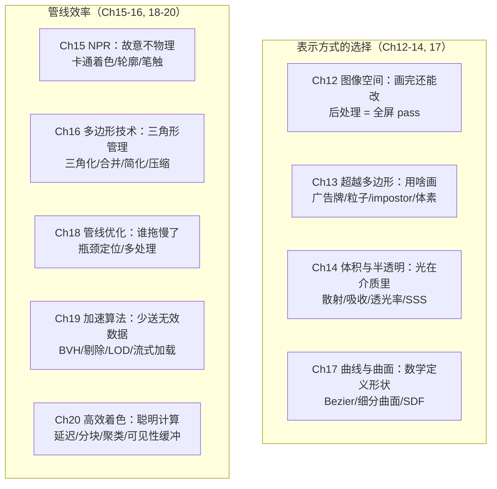

# RTR4 Ch12-20 知识脉络

> Ch12-20 覆盖了渲染的"后半程"——从产出图像到管线优化。核心主题：**如何在不同表示之间做权衡，以及如何让整个系统跑得更快。**

---

## 两大知识板块



---

## 核心公式递推

### Ch12 公式

$$
G(x)=\frac{1}{\sigma\sqrt{2\pi}}\,e^{-r^{2}/(2\sigma^{2})}
\tag{12.1}
$$

高斯模糊核——全屏滤波的基础，$\sigma$ 控制模糊宽度（$3\sigma$ 为推荐滤波核宽度）。

$$
\mathbf{c}_{f}(\mathbf{p}^{t})=\alpha\mathbf{c}(\mathbf{p}^{t})+(1-\alpha)\mathbf{c}(\mathbf{p}^{t-1})
\tag{12.2}
$$

时域混合——重投影复用上一帧，$\alpha=3/5$ 为典型值。$\mathbf{p}^{t-1}$ 是上一帧的对应位置。

### Ch13 公式

$$
\mathbf{u}^{\prime}=\mathbf{n}\times\mathbf{r}
\tag{13.2}
\qquad
\mathbf{n}^{\prime}=\mathbf{r}\times\mathbf{u}
\tag{13.3}
$$

广告牌正交基构造：固定法线时修正 up 向量（13.2），固定 up 时修正法线（13.3）。

$$
\mathbf{M}=(\mathbf{r},\ \mathbf{u}^{\prime},\ \mathbf{n})
\tag{13.4}
$$

广告牌旋转矩阵——三列分别为 right / up / normal 向量。然后将平移矩阵右乘，将锚点移至目标位置。

$$
\text{纹理分辨率}=\frac{\text{屏幕分辨率}}{\tan(\mathrm{fov}/2)}
\tag{13.1}
$$

天空盒分辨率估算。视场角越小，所需纹理分辨率越高（因为立方体表面的一小部分将占据整个屏幕）。

### Ch14 公式

$$
\rho=\frac{\sigma_{s}}{\sigma_{s}+\sigma_{a}}=\frac{\sigma_{s}}{\sigma_{t}}
\tag{14.1}
$$

介质反照率——散射相对于吸收的重要程度。$\rho\approx 1$ 为白色（如牛奶），$\rho\approx 0$ 为暗色（如浓烟）。

$$
T_{r}(\mathbf{a},\mathbf{b})=\exp\!\left(-\int_{\mathbf{a}}^{\mathbf{b}}\sigma_{t}(s)\,ds\right)
\tag{Beer-Lambert}
$$

Beer-Lambert 透光率——光线沿路径的指数衰减。$\sigma_t(s)$ 为沿途各点的消光系数。

$$
L_{i}(\mathbf{c},-\mathbf{v})=T_{r}\cdot L_{o}(\mathbf{p},\mathbf{v})+\int_{0}^{\|\mathbf{p}-\mathbf{c}\|}T_{r}\cdot L_{\mathrm{scat}}\cdot\sigma_{s}\,dt
\tag{14.2}
$$

体积渲染方程——进入相机的 radiance = 表面反射（经透光率衰减）+ 沿观察射线各点内散射的积分。

### Ch17 公式

$$
\mathbf{p}(t)=(1-t)\mathbf{p}_{0}+t\mathbf{p}_{1}
$$

线性插值——Bezier 曲线的基础构件（一阶 Bezier = 直线）。

$$
\mathbf{p}(t)=\sum_{i=0}^{3}B_{i}^{(3)}(t)\,\mathbf{p}_{i}
$$

三次 Bezier 曲线——4 个控制点配合 3 次 Bernstein 多项式 $B_i^{(3)}(t)$ 定义光滑曲线。

$$
f(\mathbf{p})=0
$$

隐式表面定义——SDF（符号距离函数）的基础形式。满足等式的所有点构成曲面。

### Ch18 公式

$$
H(n)=1+\frac{1}{2}+\frac{1}{3}+\cdots+\frac{1}{n},\qquad
\lim_{n\to\infty}H(n)=\ln(n)+\gamma
\tag{18.1, 18.2}
$$

调和级数——随机顺序渲染不透明物体的过度绘制期望。$\gamma=0.57721$ 为 Euler-Mascheroni 常数。深度复杂度为 4 时平均仅 2.08 次过度绘制（远低于直觉）。

### Ch19 公式

$$
\mathbf{n}\cdot(\mathbf{c}-\mathbf{e})>\sin\alpha
\tag{19.2}
$$

法线锥背面剔除——给定法线锥（中心 $\mathbf{c}$，半角 $\alpha$，法线 $\mathbf{n}$），一次测试剔除整组三角形。

$$
p=\frac{n\,r}{\mathbf{d}\cdot(\mathbf{c}-\mathbf{v})}
\tag{19.6}
$$

球体屏幕投影半径——$r$ 为球体世界空间半径，$n$ 为近平面到屏幕的缩放因子，$\mathbf{c}$ 为球心，$\mathbf{v}$ 为视点。LOD 选择的核心依据。

$$
\lambda=\min\!\bigl(\lceil\log_{2}(\max(l,1))\rceil,\ n-1\bigr)
\tag{19.5}
$$

HZB mip 层级选择——$l$ 为包围体投影的最长边（像素），$n$ 为 z-金字塔总层级数。最多只需读取 $2\times2$ 个深度值即可完成遮挡测试。

$$
s=\frac{\epsilon\,w}{2d\tan(\theta/2)}
\tag{19.10}
$$

地形 LOD 屏幕误差——$\epsilon$ 为 Hausdorff 距离（简化网格与原始网格的最大几何偏差），$w$ 为屏幕宽度（像素），$d$ 为观察距离，$\theta$ 为视场角。$s>1$ 像素时切换到更粗糙的 LOD。

---

## 三条贯穿主线

### 主线一：表示方式的选择谱

```
纯几何 ──→ 图像表示 ──→ 体积表示
（三角形）   （广告牌/粒子）  （体素）

Ch17：数学表示曲面（Bezier、细分曲面）→ 细分后变三角形
Ch13：三角形不够用 → 图像（广告牌/impostor）+ 体积（体素）+ 点
Ch14：介质内部 → 体积渲染方程（不是 BRDF，是 BSDF/BSSRDF）
```

**选择逻辑**：
- 近 + 重要 → 三角形（Ch16 简化 + Ch17 曲面细分）
- 远 + 不重要 → 图像（Ch13 impostor）+ LOD（Ch19）
- 体积现象 → 参与介质（Ch14）

### 主线二：管线效率的梯级

```
Ch18（找到瓶颈）→ Ch19（少送数据）→ Ch20（聪明计算）

层1（Ch18）：CPU 瓶颈 → 多看 GPU；GPU 瓶颈 → 降着色复杂度
层2（Ch19）：背面→视锥体→遮挡→细节→LOD
             越早剔除越便宜
层3（Ch20）：前向→延迟→分块→聚类→可见性缓冲
             越来越彻底地分离"确定可见"和"计算颜色"
```

### 主线三：带宽 vs 计算的权衡

贯穿 Ch18-20 的核心矛盾：

```
GPU 算力增长 >> 显存带宽增长

→ 延迟着色：存更多中间数据（G-buffer），省着色重算
→ 分块着色：每 tile 只读一次 G-buffer，不是每光源读一次
→ 可见性缓冲区：存最少数据（32bit），着色时重建一切
→ Ch18 色度下采样：亮度+色彩分离压缩，重建滤波器补回
→ Ch19 虚拟纹理：磁盘/内存只存当前可见 tile
```

---

## 跨章节关联矩阵

| 概念 | Ch12 | Ch13 | Ch14 | Ch17 | Ch18 | Ch19 | Ch20 |
|------|------|------|------|------|------|------|------|
| **深度缓冲** | 景深/运动模糊必须 | 软粒子需要 | 体渲染步进 | — | z-prepass | HZB | G-buffer |
| **双边滤波** | 上采样/降噪 | — | — | — | — | — | — |
| **法线** | — | 广告牌正交基 | 散射相位函数参照 | PN 三角形/Phong 细分 | — | 法线锥剔除 | G-buffer |
| **LOD** | mipmap（模糊带宽） | impostor 更新 | 体积分辨率自适应 | 曲面细分级数 | — | 核心主题 | 着色 LOD |
| **光源** | 泛光 source | 粒子光照 | 体积光 | — | — | 阴影剔除 | 分类核心 |
| **延迟思想** | — | 固定视图复用 | — | — | z-prepass | — | 全部基于此 |

---

## 数值锚点

| 数值 | 含义 | 章节 |
|------|------|------|
| $\sigma$（标准差） | 高斯模糊宽度，$3\sigma$ ≈ 滤波核推荐宽度 | Ch12 |
| $\alpha=3/5$ | 时域混合推荐系数 | Ch12 |
| $4\times4\times4=256$ | 移动立方体单个体素内可能的等值面配置数 | Ch13 |
| $\sigma_a,\ \sigma_s$ | 吸收/散射系数，单位 $\mathrm{m}^{-1}$ | Ch14 |
| $T_r\in[0,1]$ | 透光率——光线穿过介质后剩余的比例 | Ch14 |
| $\ln(n)+0.57721$ | 随机顺序过度绘制期望的极限近似 | Ch18 |
| $32\times32$ | 分块着色标准 tile 大小 | Ch20 |
| $64\times64\times32$ | 虚幻引擎的 cluster 配置 | Ch20 |

---

## 工程实践对照

| 技术 | 在哪章 | 谁在用 |
|------|--------|--------|
| 全屏 pass + ping-pong | Ch12 | 所有引擎，50+ pass（《战地4》） |
| 双边滤波 | Ch12 | SSAO 降噪（所有 AAA 游戏） |
| 重投影插帧 | Ch12 | VR（Oculus ASW） |
| 软粒子 | Ch13 | 几乎所有引擎（《孤岛危机》首创） |
| SVO 锥形追踪 | Ch13 | UE 实验版、VXGI |
| Beer-Lambert 衰减 | Ch14 | 所有体积雾实现 |
| 预积分皮肤 | Ch14 | 《教团：1886》 |
| 体素 GI | Ch14 | 《孤岛危机3》、UE LPV |
| 卡通着色 + shell 描边 | Ch15 | 《大神》《Cel Damage》《崩坏》系列 |
| QEM 简化 | Ch16 | MeshLOD 生成的标准方法 |
| PN 三角形 | Ch17 | 《使命召唤：高级战争》法线贴图的替代 |
| Catmull-Clark + 自适应四叉树 | Ch17 | 《使命召唤：高级战争》面部渲染 |
| SDF 渲染 | Ch17 | UE5 Nanite 的软件光栅化 |
| RenderDoc | Ch18 | 行业标准图形调试器 |
| HZB 遮挡剔除 | Ch19 | 寒霜引擎、《刺客信条：大革命》 |
| 虚拟纹理 | Ch19 | 《狂怒》《毁灭战士2016》 |
| 几何 Clipmap | Ch19 | 《巫师3》地形 |
| 延迟着色 | Ch20 | 《彩虹六号：围攻》、寒霜引擎 |
| 聚类着色 | Ch20 | 《DOOM 2016》《使命召唤：无限战争》 |
| 可见性缓冲区 | Ch20 | 《刺客信条：大革命》虚拟延迟纹理化 |

---

## 一句话串 Ch12-20

> Ch12-14 告诉你**场景里还有什么可以表示、渲染完之后还能怎么修改**；
> Ch15 告诉你**怎么故意不物理**；Ch16-17 告诉你**从原始数据到 GPU 可以吃的三角形流**；
> Ch18-20 告诉你**怎么让这一切在 16ms 内跑完**——从找瓶颈到少送数据到聪明着色。
