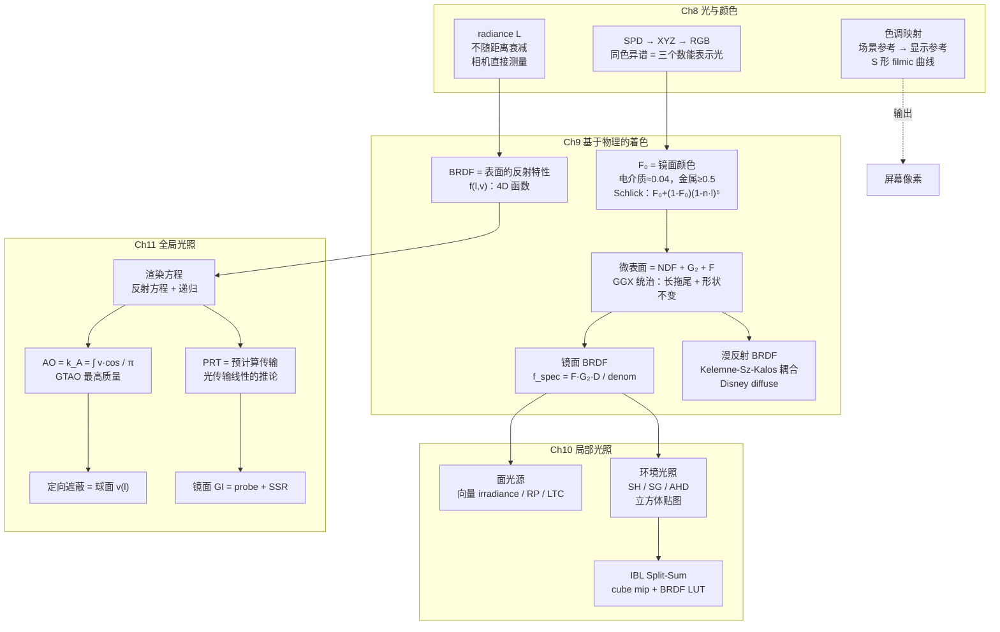

# RTR4 Ch8-11 知识脉络

> 一条线索串起四章——从"光是什么"到"如何渲染全局光照"的完整推导链。

---

## 核心公式递推

整个 PBR 管线从一个公式开始，逐步展开：

$$
L_o(\mathbf{p}, \mathbf{v}) = \int_{\Omega} \underbrace{f(\mathbf{l}, \mathbf{v})}_{\text{Ch9 BRDF}} \; \underbrace{L_i(\mathbf{p}, \mathbf{l})}_{\text{Ch10 光源}} \; (\mathbf{n} \cdot \mathbf{l}) \; d\mathbf{l}
\tag{反射方程}
$$

$$
L_o(\mathbf{p}, \mathbf{v}) = L_e(\mathbf{p}, \mathbf{v}) + \int_{\Omega} f(\mathbf{l}, \mathbf{v}) \; \underbrace{L_o(r(\mathbf{p}, \mathbf{l}), -\mathbf{l})}_{\text{Ch11 递归}} \; (\mathbf{n} \cdot \mathbf{l})^+ \; d\mathbf{l}
\tag{渲染方程}
$$

两个方程差一项：$L_i$ 从"已知"变成"从其他表面发来的 recurisve 未知量"。
这是一个点上的光照变成整个场景光传输的分水岭。

---

## 知识依赖图



---

## 关键概念关联矩阵

| 概念 | 出处在 Ch8 | 定义在 Ch9 | 应用在 Ch10 | 扩展在 Ch11 |
|-------|-----------|-----------|-----------|-----------|
| **radiance $L$** | 辐射度量学定义 | 反射方程的输出 | 面光源/IBL 的输入 | 渲染方程的核心 |
| **$F_0$** | 折射率→RGB 转换 | 镜面颜色，Schlick 近似 | Split-Sum 提取为 LUT | PRT 传输矩阵编码 |
| **$D(\mathbf{m})$（NDF）** | — | GGX/Beckmann 模型 | IBL 预过滤波瓣 | probe 卷积 |
| **$G_2$** | — | Smith 高度相关 | Split-Sum BRDF LUT | 定向遮蔽积分 |
| **$\rho_{ss}$** | — | Lambertian $f = \rho_{ss}/\pi$ | 环境光照漫反射 | AO 相互反射修正 |
| **$v(\mathbf{l})$** | — | — | —（隐含为 1） | AO/定向遮蔽显式计算 |
| **反射方程** | — | 定义（方程9.4） | 代入 $L_i$ 做积分 | 推广为渲染方程 |

---

## 三条贯穿主线

### 主线一：微表面 BRDF 的传递

```
Ch9 §9.6-8：构建微表面理论
  D(m) = 法线分布  →  GGX 最流行（长拖尾 + 形状不变）
  G₂  = masking-shadowing  →  Smith 高度相关形式
  F   = 菲涅尔  →  Schlick：F₀ + (1-F₀)(1-n·l)⁵

Ch10 §10.5：代入环境贴图积分
  Split-Sum = 把 D 径向对称化 → cube mip 预过滤
            + 用 BRDF LUT 补回方向依赖部分
            + 提取 F₀ 让 LUT 复用

Ch11 §11.4-6：扩展为全局光照
  定向遮蔽 = v(l) 与 micro-BRDF 做三重乘积积分
  镜面 GI  = 动态 probe 与 micro-BRDF 卷积
```

### 主线二：$L_i$ 从"已知"到"递归"

```
Ch9：L_i(l) 是抽象概念——只知道"入射光来自某个方向"
     ↓
Ch10：L_i(l) 有了具体的值
     面光源：积分得到
     环境贴图：查表得到
     ↓
Ch11：L_i(l) 的来源被发现是另一个表面的 L_o
     L_i(p,l) = L_o(r(p,l), -l)  →  递归！
     解决路径：AO（最简） → directed AO → PRT（预计算） → path tracing（ground-truth）
```

### 主线三：金属 vs 电介质的全管线分叉

```
           电介质                         金属
           ──────                       ────
F₀         低（0.02-0.06）              高（≥0.5）
颜色来源    ρ_ss（漫反射）               F₀（镜面反射）
漫反射     有（次表面散射）             无（全部吸收）
菲涅尔效应 明显（0.02→1 变化极大）      较弱（已经很高了）
多次反弹   不重要（能量小）             重要（是漫反射唯一来源）
IBL        高光 + 漫反射都重要           高光主导
AO         效果明显                      不重要（无漫反射）
GI 计算     漫反射 GI（Lightmap/PRT）     镜面 GI（probe/SSR）
```

---

## 数值锚点

这些数字在四章中反复出现，记住它们能串联起分散的知识点：

| 数值 | 含义 | 章节 |
|------|------|------|
| $\pi$ | 半球余弦积分结果；BRDF $1/\pi$ 因子；光照 $\pi$ 抵消 | Ch8→Ch9 |
| $1/\pi$ | Lambertian BRDF 归一化因子 | Ch9 |
| 0.04 | 电介质 $F_0$ 默认值 | Ch9 |
| 0.5 | 金属 $F_0$ 下限 | Ch9 |
| $4\pi$ | 全球立体角 | Ch8 |
| $2\pi$ | 半球立体角 | Ch8 |
| 0.18 | 18% 灰卡（曝光参考） | Ch8 |
| 0.2126 | $Y$ 的 R 系数（绿色权重最大） | Ch8 |
| $r^2$ | GGX 粗糙度映射（$r$ 是用户滑条） | Ch9 |
| 1μm | 薄膜干涉的相干长度（超过即不可见） | Ch9 §9.11 |

---

## 工程降级链

从物理正确到实时可行，每一步降级都知道牺牲了什么：

| 层级 | 方法 | 能处理的光路 | 牺牲 |
|------|------|------------|------|
| 0 | 路径追踪 | $L(S\|D)^{*}E$ | 性能（数小时/帧） |
| 1 | PRT / Lightmap | $LD^{*}SE$ | 镜面间反射；动态场景受限 |
| 2 | IBL Split-Sum | $L(S\|D)E$ | 光源无限远假设；无局部遮挡 |
| 3 | 面光源 LTC/RP | $LDE$ | 无环境光/间接光 |
| 4 | 精确光源 + AO | $LDE$ + 伪遮挡 | 无面光源效果；AO 对点光不准 |

每步保留上一步的核心结构。Split-Sum 虽然拆开了积分，但两项都保留了 $D$。
PRT 虽然把传输简化为矩阵乘法，但保留了光传输的**线性可叠加性**。

---

## 从公式到工业实践

| 理论概念 | 工业落地 |
|---------|---------|
| Schlick 菲涅尔 + 金属度参数 | 虚幻/寒霜的 metalness workflow |
| Split-Sum | 所有引擎的 IBL 标准实现 |
| Karis BRDF LUT | 一张 RG16F 2D 纹理，同时服务 IBL 和耦合漫反射 |
| AHD（8 参数） | 使命召唤系列的光照贴图 |
| 方差映射 | UE/寒霜的高光抗锯齿 |
| GTAO | 当前 AAA 游戏的标准 SSAO |
| ACES 色调映射 | 虚幻默认、Unity 支持 |
| PRT | 《孤岛惊魂》《刺客信条》的动态昼夜 GI |

---

## 一句话串四章

> **Ch8** 定义了光的语言（radiance、RGB），**Ch9** 用 BRDF 描述了表面如何
> 反射光，**Ch10** 给 BRDF 配上了真实的光源（面光源、环境贴图、IBL），
> **Ch11** 发现光源本身也是被其他表面照亮的——于是从反射方程走向渲染方程，
> 从局部光照走向全局光照。
